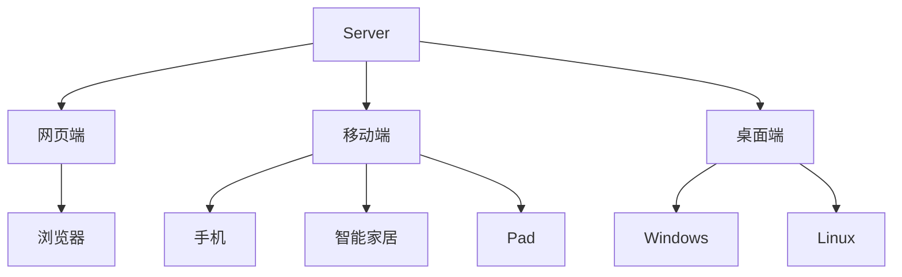

## 概述

在Android中，总共有四大组件

- Activity-屏幕组件
- Service-服务组件
- 广播接收者
- 内容提供者

其他三者之后会说明，先由Activity开始，因为它是四大组件中最重要也是使用最频繁的组件

## 活动Activity

### 启动和结束(跳转页面)

> 要从当前页面跳转到新页面，跳转代码如下

- `startActivity(new Intenet(源页面.this,目标页面.class))`

> 从当前页面返回到上一个页面，相当于关闭当前页面，返回代码如下

- `finish()`结束当前的活动页面

例子：

我们首先新建两个activity


start

>  xml

```xml
<?xml version="1.0" encoding="utf-8"?>
<LinearLayout
        xmlns:android="http://schemas.android.com/apk/res/android"
        xmlns:tools="http://schemas.android.com/tools"
        xmlns:app="http://schemas.android.com/apk/res-auto"
        android:layout_width="match_parent"
        android:layout_height="match_parent"
        tools:context=".ActStartActivity"
        android:gravity="center"
        >

    <Button
            android:id="@+id/goNextPage"
            android:layout_width="wrap_content"
            android:layout_height="wrap_content"
            android:text="点击跳转到下一个页面"
            tools:ignore="MissingConstraints"/>

</LinearLayout>
```

> 逻辑代码

```kotlin
package com.example.activitydemo

import android.content.Intent
import androidx.appcompat.app.AppCompatActivity
import android.os.Bundle
import android.widget.Button

class ActStartActivity : AppCompatActivity() {
    override fun onCreate(savedInstanceState: Bundle?) {
        super.onCreate(savedInstanceState)
        setContentView(R.layout.activity_act_start)
        findViewById<Button>(R.id.goNextPage).setOnClickListener {
            // 需要传入一个意图对象，需要传入源页面的对象和目标页面的javaClass
            startActivity(Intent(this, ActFinishActivity::class.java))
        }
    }
}
```

finish

> xml

```xml
<?xml version="1.0" encoding="utf-8"?>
<LinearLayout
        xmlns:android="http://schemas.android.com/apk/res/android"
        xmlns:tools="http://schemas.android.com/tools"
        xmlns:app="http://schemas.android.com/apk/res-auto"
        android:layout_width="match_parent"
        android:layout_height="match_parent"
        tools:context=".ActFinishActivity"
        android:gravity="center"
        >

    <Button
            android:id="@+id/goBackPage"
            android:layout_width="wrap_content"
            android:layout_height="wrap_content"
            android:text="返回上一个页面"
            />

</LinearLayout>
```

> 逻辑代码

```kotlin
package com.example.activitydemo

import androidx.appcompat.app.AppCompatActivity
import android.os.Bundle
import android.widget.Button

class ActFinishActivity : AppCompatActivity() {
    override fun onCreate(savedInstanceState: Bundle?) {
        super.onCreate(savedInstanceState)
        setContentView(R.layout.activity_act_finish)
        findViewById<Button>(R.id.goBackPage).setOnClickListener {
            finish()
        }
    }
}
```

### Activity的生命周期

和React，Vue这些前端框架一样，在Android开发中，Activity也有生命周期，如下


大体流程是：

- 启动一个页面的时候
  1. onCreate
  2. onStart
  3. onResume
  4. 然后就是可交互状态
- 跳转到其他页面时
  1. onPause
  2. onStop
  3. 然后其他页面走启动流程
- 从其他页面跳转回来
  - onRestart
  - onStart
  - onResume
- 从其他页面跳转回来（刚跳过去就跳回来）
  - 先onPause
  - 然后直接onResume
- 在最后一个页面（没有页面可返回时）试图返回
  - onPause
  - onStop
  - onDestory
  - 然后就能看到桌面了
- 还有一个情况就是，当前应用切换到后台，然后在run其他东西，例如游戏
  - 则一段时间后会直接挂起，然后重新进入页面时候走上图左边的那条线（也就是重新启动页面

### 生命周期中应该做的事情


### Activity的启动模式


就是一个先进后出的结构

当然启动模式也分很多种，例如上面这种属于默认的


还有栈顶复用模式，这个感觉有点鸡肋，栈顶一般都是当前页面，当前页面新建当前页面一般也不会发生..但好处是可以放置重复创建Activity


还有栈内复用，详细看图，感觉适合做一些例如直接跳转到主页的应用balabala的


以及全局唯一模式，会给每个activity都单独建立一个栈


### 使用不同的启动模式

只需要在创建意图对象的时候设置下即可

```kotlin
package com.example.activitydemo

import android.content.Intent
import androidx.appcompat.app.AppCompatActivity
import android.os.Bundle
import android.widget.Button

class ActStartActivity : AppCompatActivity() {
    override fun onCreate(savedInstanceState: Bundle?) {
        super.onCreate(savedInstanceState)
        setContentView(R.layout.activity_act_start)
        findViewById<Button>(R.id.goNextPage).setOnClickListener {
            startActivity(Intent(this, ActFinishActivity::class.java).apply{
//                设置模式：栈中存在待跳转的实例的时候，则重新创建该实例，并且清除其上方的所有实例（在该页面之后的所有页面都会被清除）
                flags = Intent.FLAG_ACTIVITY_CLEAR_TOP
            })
        }
    }

    override fun onNewIntent(intent: Intent?) {
        super.onNewIntent(intent)
    }
}
```

#### 案例-登陆成功后不再进入登陆页面

很多APP第一次打开都要求登陆，登陆成功后进入App首页，如果进入首页后按下返回键可以看到并没有返回到登陆页面而是直接退出App了

一般来说，用户登陆成功后，App就会记录下用户的信息，接下来默认用户是登陆状态，自然不必重新输入用户名和密码了

既然用户已经登陆，则就不需要登录页面了，不光登陆，还有获取验证码。找回密码等页面都不会回去

对于回不去的登陆页面情况，可以设置启动标志`FLAG_ACTIVITY_CLEAR_TASK`，该标志会情况当前活动栈内的所有实例，不过清空之后，意味着没栈可用，需要额外找一个活动栈，也就是同时设置`FLAG_ACTIVITY_NEW_TASK`，该标志用于开辟新任务，于是离开登陆页面的代码大概就变成了

```java
// 创建意图和要去的地方
Intent intent = new Intent(this,LoginSuccess.class);
// 设置标识，当跳转到该页面的时候，栈中所有页面都会被清空，同时开辟新的活动栈
intent.setFlags(Intent.FLAG_ACTIVITY_CLEAR_TASK | Intent.FLAG_ACTIVITY_NEW_TASK);
// 跳转到指定的意图页面
startActivity(intent);
```

在Kotlin中，代码如下（使用or替换`|`）

```kotlin
package com.example.activitydemo

import android.content.Intent
import androidx.appcompat.app.AppCompatActivity
import android.os.Bundle
import android.widget.Button

class ActStartActivity : AppCompatActivity() {
    override fun onCreate(savedInstanceState: Bundle?) {
        super.onCreate(savedInstanceState)
        setContentView(R.layout.activity_act_start)
        findViewById<Button>(R.id.goNextPage).setOnClickListener {
            startActivity(Intent(this, ActFinishActivity::class.java).apply {
                flags = Intent.FLAG_ACTIVITY_CLEAR_TASK or Intent.FLAG_ACTIVITY_NEW_TASK
            })
        }
    }

}
```

#### 常用启动标志一览


总共就这几个常见的

## 在Activity之间传递消息

### Intent概述

这玩意就是各个Activity中通讯的桥梁，主要完成下列工作

- 表明这次通信请求从哪里来，到哪里去，要怎么走
- 发起方携带本次通信需要的内容，接收方从收到的意图中解析数据
- 发起方若想要判断接收方的处理结果，意图就要负责让接收方传回应答内容

一个意图有如下组成部分


### 显示Intent

直接指定来源活动和目标活动，属于是精准匹配，它有三种构建方式

- 在Intent的构造函数中指定
- 调用意图对象的setClass指定
- 调用意图对象的setComponent方式指定


这里额外说下第三个Component，例如想要启动微信中的index页面之类的（就是开别的软件的对应页面）

```kotlin
package com.example.activitydemo

import android.content.ComponentName
import android.content.Intent
import androidx.appcompat.app.AppCompatActivity
import android.os.Bundle
import android.widget.Button

class ActStartActivity : AppCompatActivity() {
    override fun onCreate(savedInstanceState: Bundle?) {
        super.onCreate(savedInstanceState)
        setContentView(R.layout.activity_act_start)
        intent = Intent()
//        跳转到微信的主页面，指定包名和className
        intent.component = ComponentName("com.tencent.mm", "com.tencent.mm.ui.LauncherUI")
        startActivity(intent)
    }

}
```

### 隐式Intent

没有明确指定要跳转的目标活动，只是给出一个动作字符串让操作系统进行匹配，属于模糊匹配

通常App不希望向外暴露活动名称，只给出一个事先定义好的标记串，这样大家约定俗成，按图索骥即可，隐式Intent便起到了标记过滤作用，这个动作名称标记串，可以是自己定义的动作，也可以是已有的系统动作，常见的取值表如下


例如我们现在准备拨号，则可以这样

```kotlin
package com.example.activitydemo

import android.content.Intent
import android.net.Uri
import android.os.Bundle
import androidx.appcompat.app.AppCompatActivity

class ActStartActivity : AppCompatActivity() {
    override fun onCreate(savedInstanceState: Bundle?) {
        super.onCreate(savedInstanceState)
        setContentView(R.layout.activity_act_start)
//        创建一个意图
        intent = Intent()
        val phoneNumber = "123456789"
//        设置意图动作准备拨号
        intent.setAction(Intent.ACTION_DIAL)
//        声明一个拨号的URI
        val parse = Uri.parse("tel:$phoneNumber")
//        设置意图的前往路径
        intent.setData(parse)
//       启动意图
        startActivity(intent)
    }

}
```

那么这个Action又是在哪里定义了呢？

比方说我们想要在其他地方启动这个应用的话…

首先，我们回到声明文件


可以看到文件中有一项内容

```xml {22}
<?xml version="1.0" encoding="utf-8"?>
<manifest xmlns:android="http://schemas.android.com/apk/res/android"
          package="com.example.activitydemo">

    <application
            android:allowBackup="true"
            android:icon="@mipmap/ic_launcher"
            android:label="@string/app_name"
            android:roundIcon="@mipmap/ic_launcher_round"
            android:supportsRtl="true"
            android:theme="@style/Theme.HelloWorld">
        <activity
                android:name=".ActFinishActivity"
                android:exported="true"/>
        <activity
                android:name=".ActStartActivity"
                android:exported="true"/>
        <activity
                android:name=".MainActivity"
                android:exported="true">
            <intent-filter>
                <action android:name="android.intent.action.MAIN"/>

                <category android:name="android.intent.category.LAUNCHER"/>
            </intent-filter>
        </activity>
    </application>

</manifest>
```

有一个action标签，name是`android.intent.action.MAIN`

那么这样说的话，假设手机上装了两个软件可以拨号，那么它将会弹出选项框让你选择（也就时是全部启动）

### 向下一个Activity发送数据

- Intent使用Bundle对象存放待传递的数据信息
- Bundle对象操作各类形数据的读写方法如下


首先发送方代码如下

```kotlin
package com.example.activitydemo

import android.content.Intent
import android.os.Bundle
import android.widget.Button
import androidx.appcompat.app.AppCompatActivity

class ActStartActivity : AppCompatActivity() {
    override fun onCreate(savedInstanceState: Bundle?) {
        super.onCreate(savedInstanceState)
        setContentView(R.layout.activity_act_start)
        findViewById<Button>(R.id.goNextPage).run {
            setOnClickListener {
                val intent = Intent(this@ActStartActivity, ActFinishActivity::class.java)
//                传递数据给下一个页面
//                先打包一个Bundle对象
                val bundle = Bundle()
                bundle.putString("name", "张三")
                bundle.putInt("age", 20)
//                将Bundle对象传递给下一个页面
                intent.putExtras(bundle)

//                当然 也可以不创建Bundle对象，直接传递一些数据
                intent.putExtra("city", "北京")
                startActivity(intent)
            }
        }

    }

}
```

然后是接收方，直接获取数据即可

```kotlin
package com.example.activitydemo

import android.os.Bundle
import android.util.Log
import androidx.appcompat.app.AppCompatActivity

class ActFinishActivity : AppCompatActivity() {
    override fun onCreate(savedInstanceState: Bundle?) {
        super.onCreate(savedInstanceState)
        setContentView(R.layout.activity_act_finish)
//        获取上一个页面传递过来的bundle对象
        val bundle = intent.extras
        val name = bundle?.getString("name")
        val age = bundle?.getInt("age")
        val city = bundle?.getString("city")
        Log.d("MyApplication", "接收到上一个页面的数据==name:$name,age:$age,city:$city")
    }
}
```

### 向上一个Activity发送数据

我们刚刚是父传子，也就是A跳转到B并把数据传递给B，那么如何在B中返回数据给A呢？

比方说你做一个网页活动，要求用户分享到指定的地方并且通过该应用的回调来判断用户是否分享成功


Ps：在Android 30+中，startActivityForResult方法已经被标上删除线了，官方建议是使用`registerForActivityResult`(PS：**如果没有标灰，则是gradle中的依赖版本太低，貌似IEDA创建的project版本都是挺低的，需要自己调高来（除了junit）**)

 ::: warning

`registerForActivityResult`方法必须声明在onCreate方法中且不能声明在Listener之类的监听器内，否则系统将会报错（就是要在onCreate方法中直接定义好registerForActivityResult）

:::

例子：

> 发送方

```kotlin {14-26}
package com.example.activitydemo

import android.content.Intent
import android.os.Bundle
import android.util.Log
import android.widget.Button
import androidx.activity.result.contract.ActivityResultContracts
import androidx.appcompat.app.AppCompatActivity

class ActStartActivity : AppCompatActivity() {
    override fun onCreate(savedInstanceState: Bundle?) {
        super.onCreate(savedInstanceState)
        setContentView(R.layout.activity_act_start)
//        这里必须得生明在onCreate，且不能再一些Listener中，否则会报错
        val register =
            registerForActivityResult(ActivityResultContracts.StartActivityForResult()) {
//                        这里是接收到数据的回调函数,it的类型是ActivityResult
//                        如果是在java中，第二个参数传入一个new ActivityResult(){ override fun onActivityResult(ActivityResult result) {}}的匿名函数
//                        每当下个页面返回数据的时候，都会调用这个函数
                if (it.resultCode == RESULT_OK) {
                    Log.d("MyApplication", "Result-Success返回的数据为:${it.data}")
                } else {
                    Log.d("MyApplication", "Result返回的数据为:$it")
                    // 这里就可以通过it.data.getxx获取到返回的数据了
                }
            }
        
        findViewById<Button>(R.id.goNextPage).run {
            setOnClickListener {
                val intent = Intent(this@ActStartActivity, ActFinishActivity::class.java)
//                传递数据给下一个页面
//                先打包一个Bundle对象
                val bundle = Bundle()
                bundle.putString("name", "张三")
                bundle.putInt("age", 20)
//                将Bundle对象传递给下一个页面
                intent.putExtras(bundle)
//                当然 也可以不创建Bundle对象，直接传递一些数据
                intent.putExtra("city", "北京")
//                启动下一个页面，通过registerForActivityResult.launch来传入意图对象
                register.launch(intent)
            }
        }

    }

}
```

>  接收方，回调触发者

```kotlin {30-35}
package com.example.activitydemo

import android.content.Intent
import android.os.Bundle
import android.util.Log
import android.view.View
import android.widget.Button
import androidx.appcompat.app.AppCompatActivity
import java.util.*

class ActFinishActivity : AppCompatActivity(), View.OnClickListener {
    override fun onCreate(savedInstanceState: Bundle?) {
        super.onCreate(savedInstanceState)
        setContentView(R.layout.activity_act_finish)
//        获取上一个页面传递过来的bundle对象
        val bundle = intent.extras
        val name = bundle?.getString("name")
        val age = bundle?.getInt("age")
        val city = bundle?.getString("city")
        Log.d("MyApplication", "接收到上一个页面的数据==name:$name,age:$age,city:$city")
        findViewById<Button>(R.id.goBackPage).setOnClickListener(this)
    }

    override fun onClick(v: View?) {
        val intent = Intent()
        val bundle = Bundle()
        bundle.putString("response Time", Date().toString())
        bundle.putString("response data", "相应给上一个页面的data===")
        intent.putExtras(bundle)
//        调用setResult方法，需要传递两个参数
//        第一个参数：返回码，一般是直接用常量或者自定义的，需要传入一个int，这里传入的是RESULT_OK,值为-1
//        第二个参数：返回的数据，传入一个intent对象
        setResult(RESULT_OK, intent)
//        关闭当前页面来返回上一个页面，如果不finish的话，上一个页面的回调不会被调用
        finish()
    }
}
```

## 为活动补充附加信息

### 通过清单文件或者元数据传递配置信息

例如我们想要设置一个string，它现在在strings.xml内

```xml
<resources>
    <string name="app_name">Activity Demo</string>
    <string name="weather_str">晴天</string>
</resources>
```

则可以这样获取

```kotlin
package com.example.activitydemo

import android.os.Bundle
import android.widget.TextView
import androidx.appcompat.app.AppCompatActivity

class ReadStringActivity : AppCompatActivity() {
    override fun onCreate(savedInstanceState: Bundle?) {
        super.onCreate(savedInstanceState)
        setContentView(R.layout.activity_read_string)
        val textView = findViewById<TextView>(R.id.tv_resource)
//        先从strings.xml中读取,这里直接通过getString传入id即可得到对应的数据
        val resourceStr = getString(R.string.weather_str)
//        设置值
        textView.text = resourceStr
    }
}
```

但有的时候，这种资源不一定是放在请单文件，而是放置在元数据中

现在，先去到`AndroidManifest.xml`清单文件中

```xml
<?xml version="1.0" encoding="utf-8"?>
<manifest xmlns:android="http://schemas.android.com/apk/res/android"
          package="com.example.activitydemo">

    <application
            android:allowBackup="true"
            android:icon="@mipmap/ic_launcher"
            android:label="@string/app_name"
            android:roundIcon="@mipmap/ic_launcher_round"
            android:supportsRtl="true"
            android:theme="@style/Theme.HelloWorld">
        <activity
                android:name=".ReadStringActivity"
                android:exported="true"/>
        <activity
                android:name=".MainActivity"
                android:exported="true">
            <intent-filter>
                <action android:name="android.intent.action.MAIN"/>

                <category android:name="android.intent.category.LAUNCHER"/>
            </intent-filter>
        </activity>
    </application>

</manifest>
```

目前是这样的，那么它又有什么用呢？

假设之后在使用第三方SDK的时候，例如腾讯地图，高德地图，等对应的东西，就需要在这里加入一个或者多个他们的页面，但是一般用他们的sdk是有门槛的，例如需要一些token放置在某个位置才能使用，我们这里模拟下

```xml {16}
<?xml version="1.0" encoding="utf-8"?>
<manifest xmlns:android="http://schemas.android.com/apk/res/android"
          package="com.example.activitydemo">

    <application
            android:allowBackup="true"
            android:icon="@mipmap/ic_launcher"
            android:label="@string/app_name"
            android:roundIcon="@mipmap/ic_launcher_round"
            android:supportsRtl="true"
            android:theme="@style/Theme.HelloWorld">
        <activity
                android:name=".ReadStringActivity"
                android:exported="true">
            
            <meta-data android:name="my_token" android:value="123456789aaa"/>
            
        </activity>
        <activity
                android:name=".MainActivity"
                android:exported="true">
            <intent-filter>
                <action android:name="android.intent.action.MAIN"/>

                <category android:name="android.intent.category.LAUNCHER"/>
            </intent-filter>
        </activity>
    </application>

</manifest>
```

然后在代码中获取元数据有三步

- 调用getPackageManager方法获取到当前应用的包管理器
- 调用包管理器的getActivityInfo方法获取到当前活动对象的信息
- 活动信息对象的metaData是Bundle包裹类型，调用对象的getString即可获取指定名称的参数值

```kotlin
package com.example.activitydemo

import android.content.pm.PackageManager
import android.os.Bundle
import android.widget.TextView
import androidx.appcompat.app.AppCompatActivity

class ReadStringActivity : AppCompatActivity() {
    override fun onCreate(savedInstanceState: Bundle?) {
        super.onCreate(savedInstanceState)
        setContentView(R.layout.activity_read_string)
        val textView = findViewById<TextView>(R.id.tv_resource)
        
        
//        packageManager属于上下文，所以可以直接获取到
//        然后调用getActivityInfo方法，获取到Activity的信息，它需要两个参数，一个是component对象，一个是flag
//        componentName是当前Activity的组件名称，可以通过componentName.className获取当前Activity的类名
//        还要传入一个flag，这里传值有很多，比如PackageManager.GET_META_DATA，这个flag表示获取Activity的meta-data信息
        val activityInfo = packageManager.getActivityInfo(componentName, PackageManager.GET_META_DATA)
        
//        获取到Activity的meta-data信息，通过meta-data的key获取到对应的value，然后赋值给textView
        textView.text = activityInfo.metaData.getString("my_token")
        
        
    }
}
```

### 元数据-给应用页面注册快捷方式


要实现这个功能，首先要新建个文件


这里名字起的是`shortcuts`，当然，你也可以起别的，在xml文件夹内即可（没有就新建个）

然后在Android的声明文件内写入如下内容

```xml {32-33}
<?xml version="1.0" encoding="utf-8"?>
<manifest xmlns:android="http://schemas.android.com/apk/res/android"
          package="com.example.activitydemo">

    <application
            android:allowBackup="true"
            android:icon="@mipmap/ic_launcher"
            android:label="@string/app_name"
            android:roundIcon="@mipmap/ic_launcher_round"
            android:supportsRtl="true"
            android:theme="@style/Theme.HelloWorld">
        <activity
                android:name=".ReadStringActivity"
                android:exported="true">
            <meta-data
                    android:name="my_token"
                    android:value="123456789aaa"/>
        </activity>
        <activity
                android:name=".ActFinishActivity"
                android:exported="true"/>
        <activity
                android:name=".ActStartActivity"
                android:exported="true"/>
        <activity
                android:name=".MainActivity"
                android:exported="true">
            <intent-filter>
                <action android:name="android.intent.action.MAIN"/>
                <category android:name="android.intent.category.LAUNCHER"/>
            </intent-filter>
			<!-- 这里是声明一个特殊的mete-data，name是固定写法，然后resource属性也是固定写法：@xml/资源名称不含后缀 -->
            <meta-data android:name="android.app.shortcuts" android:resource="@xml/shortcuts"/>
        </activity>
    </application>

</manifest>
```

接着返回`shortcuts.xml`，写入如下内容，都是固定写法，实际项目中要用到了复制粘贴即可，如果要定义多个，就写多个shortcut标签即可

```xml
<?xml version="1.0" encoding="utf-8"?>
<shortcuts xmlns:android="http://schemas.android.com/apk/res/android">

    <!--

        属性说明
        shortcutId：快捷方式的唯一标识，必须唯一，不能为空，必须是字母数字下划线组成，不能以数字开头。
        icon：快捷方式图标，必须是drawable或mipmap文件夹下的图片，如果不指定，则使用默认图标。
        shortcutLongLabel：快捷方式的长标题，必须填写，不能为空。 只能填入@string/开头的字符串。
        shortcutShortLabel：快捷方式的短标题，必须填写，不能为空(默认看能不能显示长的标题，如果能显示，则显示长标题，否则显示短标题)。 只能填入@string/开头的字符串。

        然后内部可以传入一个意图对象来跳转到目标的Activity
    -->
    <shortcut
            android:shortcutId="first"
            android:icon="@mipmap/ic_launcher"
            android:shortcutLongLabel="@string/app_name"
            android:shortcutShortLabel="@string/app_name"
            >
        <!--
            这里意图对象的属性说明
            action:动作说明，这里传入的android.intent.action.VIEW，表示跳转到指定的Activity
            targetPackage:包名，这里传入的是当前应用的包名，可以在AndroidManifest.xml中manifest标签的package属性中看到
            targetClass: 具体类名，这里直接传入自己的类即可
        -->
        <intent
                android:action="android.intent.action.VIEW"
                android:targetPackage="com.example.activitydemo"
                android:targetClass="com.example.activitydemo.ReadStringActivity"
                />
        <!--
                这里的        <categories android:categories="android.shortcut.conversation"/>
                表示跳转到指定的Activity时，会自动添加一个category，这里传入的是android.shortcut.conversation，表示会话类型的快捷方式。
        -->
        <categories android:name="android.shortcut.conversation"/>
    </shortcut>


</shortcuts>
```

当然，这里还有个要额外说明的东西，在项目声明文件中注意一个属性

```xml
<?xml version="1.0" encoding="utf-8"?>
<manifest xmlns:android="http://schemas.android.com/apk/res/android"
          package="com.example.activitydemo">

    <application
            android:allowBackup="true"
            android:icon="@mipmap/ic_launcher"
            android:label="@string/app_name"
            android:roundIcon="@mipmap/ic_launcher_round"
            android:supportsRtl="true"
            android:theme="@style/Theme.HelloWorld">
        <activity
                android:name=".ReadStringActivity"
                  // 注意 android:exported这个属性，如果说为false的刷，则无法通过外部应用或快捷方式来启动
                android:exported="true">
            <meta-data
                    android:name="my_token"
                    android:value="123456789aaa"/>
        </activity>
        <activity
                android:name=".ActFinishActivity"
                android:exported="true"/>
        <activity
                android:name=".ActStartActivity"
                android:exported="true"/>
        <activity
                android:name=".MainActivity"
                android:exported="true">
            <intent-filter>
                <action android:name="android.intent.action.MAIN"/>
                <category android:name="android.intent.category.LAUNCHER"/>
            </intent-filter>

            <meta-data android:name="android.app.shortcuts" android:resource="@xml/shortcuts"/>
        </activity>
    </application>

</manifest>
```

## 中级控件

首先来看看正常的系统架构，一般都是一个server对应多个client的



基本都是一套server对应多个客户端

移动端在极大部分系统中也主要是做一个效果展现而并数据处理，所以相对来说是画页面的时间大于写逻辑的时间

## 图形定制

### 关于Drawable


一般的项目中，除了`drawable`还有其他drawable文件夹，例如


这里还有个drawable-24

不过细分的话有六种

- drawable-ldpi：存放低分辨率的图片（例如240x320），现在基本没有这种类型的手机了
- drawable-mdpi：存放中等分辨率的图片（如320x480），这样的手机目前比较少
- drawable-hdip：存放高分辨率的图片（如480x800），一般是4~5英寸的手机
- drawable-xhdpi：存放更高分辨率的图片（如720x1080），一般是5~5.5英寸的手机
- drawable-xxhdpi：存放超高分辨率的图片(如1080x1920)，一般是6~6.5英寸的手机
- drawable-xxxhdpi：存放超超高分辨率的图片(如1440x250)，一般是7英寸以上的平板电脑

基本上，分辨率每增大一级，宽度和高度就要增加二分之一或者三分之一像素，**如果各个目录存在同名的图片，则Android就会自动根据手机分辨率自动适配文件夹内的图片，在实际开发中，一般上方所有文件夹内都有对应的图片**

例如，你在`drawable-hdpi`放了一张背景图片bg.png（分辨率480x800），其他目录没放，使用分辨率为480x800的手机查看这个界面没有问题，但是使用分辨率为720x1280的手机就会感到有点模糊，原因是Android为了让bg.png适配高分辨率的屏幕，强行将其拉升到了720x1280，拉升的后果是图片变模糊了

### 形状图形Shape

- Shape图形又被称为形状图形，它用来描述常见的几何形状，包括矩形、圆角矩形、圆形、椭圆形等
- 形状图形的定义文件是以Shape标签为根节点xml描述文件，它支持四种类型的形状
  - rectangle：矩形，默认值
  - oval：椭圆，此时corners节点会失效
  - line：直线，此时必须设置stroke节点，不然会报错
  - ring：圆环

例子，我们想分别要一个圆角矩形和一个椭圆形的按钮

先写xml

```xml
<?xml version="1.0" encoding="utf-8"?>
<LinearLayout
        xmlns:android="http://schemas.android.com/apk/res/android"
        xmlns:tools="http://schemas.android.com/tools"
        xmlns:app="http://schemas.android.com/apk/res-auto"
        android:layout_width="match_parent"
        android:layout_height="match_parent"
        android:orientation="vertical"
        tools:context=".MainActivity">

    <View
            android:layout_width="match_parent"
            android:layout_height="200dp"
            android:layout_margin="10dp"
            >
    </View>

    <LinearLayout
            android:layout_width="match_parent"
            android:layout_height="wrap_content"
            android:orientation="horizontal"
            >

        <Button
                android:id="@+id/btn_rect"
                android:layout_width="wrap_content"
                android:layout_height="wrap_content"
                android:layout_weight="1"
                android:text="圆角矩形"
                />

        <Button
                android:id="@+id/btn_oval"
                android:layout_width="wrap_content"
                android:layout_height="wrap_content"
                android:layout_weight="1"
                android:text="椭圆背景"
                />


    </LinearLayout>


</LinearLayout>
```

然后创建一个drawable资源文件`shape_rect_gold`


然后直接填写一个名字


next即可

进去后先把selector选择器改成shape来定义我们的图形，关于selector之后会说明

```xml
<?xml version="1.0" encoding="utf-8"?>
<shape xmlns:android="http://schemas.android.com/apk/res/android">

</shape>
```

然后开始编写我们的内容

```xml
<?xml version="1.0" encoding="utf-8"?>
<shape xmlns:android="http://schemas.android.com/apk/res/android">

    <!--    先定义形状内部的填充颜色 这里用黄色-->
    <solid android:color="#FFD700"/>
    <!--    然后定义形状轮廓为红色，粗细为10dp-->
    <stroke
            android:color="#FF0000"
            android:width="10dp"/>
    <!--    定义圆角的半径 为 10dp(不指定的话就不是圆角)-->
    <corners android:radius="10dp"/>

</shape>
```

然后就能看到这个效果


接下来再如法炮制一个椭圆形`shape_oval_gold`

```xml
<?xml version="1.0" encoding="utf-8"?>
<!--
        android:shape="oval" 设置为椭圆形
-->
<shape
        xmlns:android="http://schemas.android.com/apk/res/android"
        android:shape="oval"
        >

    <!--    内部填充粉紫色-->
    <solid android:color="#FF00DD"/>

    <!--    定义轮廓的粗细和颜色-->
    <stroke
            android:width="10dp"
            android:color="#FFEB3B"/>

</shape>
```

效果


接着回去将背景设定为指定值即可


PS：如果颜色没有显示自己的内容的话，则可以去`values/theme/theme和thtemes.night.xml中`继承的类目最后加个Bridge


### Shape的标签和属性说明


一般来说除了特殊情况不会设置size，如果设置了则必须以像素为单位并且可能要考虑到不同分辨率下的单独适配


### Shape-渐变实例


属性有非常多，不过用到了看看即可

例如下到上的红色到蓝色渐变，角度为90

```xml
<?xml version="1.0" encoding="utf-8"?>
<shape xmlns:android="http://schemas.android.com/apk/res/android">

    <!--    先定义形状内部的填充颜色 这里用黄色-->
    <!--    <solid android:color="#FFD700"/>-->
    <!--    然后定义形状轮廓为红色，粗细为10dp-->
    <stroke
            android:color="#FF0000"
            android:width="10dp"/>
    <!--    定义圆角的半径 为 10dp(不指定的话就不是圆角)-->
    <corners android:radius="10dp"/>

    <!--    渐变，红蓝，下到上，90度-->
    <gradient
            android:startColor="#FF0000"
            android:endColor="#0000FF"
            android:type="linear"
            android:angle="90"
            />

</shape>
```

效果


或者中间向外的渐变


### 九宫格图片(9 patch)

应用场景：

- 将某张图片设置成视图背景时，如果图片尺寸太小，则系统会自动拉伸图片使其填满北京
- 可是一旦图片拉的国大，会让画面变得模糊

例如看看下面的效果，按钮的背景是一个圆角图片


使用了九宫格（也称点9图片）

素材：


就直接拿这个用，先创建个文件夹`drawable-xhdpi`然后丢进去

然后右键下，点击创建9-patch图片，存储路径同文件夹


然后就可以获取到一个新的文件（注意，这里我命名方式有误，实际上应该是下划线分割，注意修改）


打开来是这样的


我们可以通过调整左右两边的线来调整这个图片（上下也有线可以调整）


这里面实际上是内置了padding这类东西，所以说可以放心调整，反正最终效果就如右边那样

然后就可以看到效果了


### 状态列表图形（点击切换状态）

例如想实现这个效果


我们首先在drawable中新建一个选择器对象`btn_nine_selector`


然后填入如下内容

```xml
<?xml version="1.0" encoding="utf-8"?>
<selector xmlns:android="http://schemas.android.com/apk/res/android">


<!--    被按下时的样式 这里必须使用在color或者资源文件中的内容，不允许直接上颜色-->
    <item android:drawable="@color/purple_200" android:state_pressed="true"/>
<!--    正常状态下的样式-->
    <item android:drawable="@color/purple_500"/>

</selector>
```

当然它还支持如下属性，反正都是用item包裹着


然后正常设置即可

```xml
<Button
        android:id="@+id/btn_rect"
        android:layout_width="wrap_content"
        android:layout_height="wrap_content"
        android:layout_weight="1"
        android:text="圆角矩形"
        android:background="@drawable/btn_nine_selector"
        />
```

## 按钮选择

### 复选框

系统默认是这样的效果，需要定制的话一般也是加个状态列表图形之类的内容


例子

```xml
<?xml version="1.0" encoding="utf-8"?>
<LinearLayout
        xmlns:android="http://schemas.android.com/apk/res/android"
        xmlns:tools="http://schemas.android.com/tools"
        xmlns:app="http://schemas.android.com/apk/res-auto"
        android:layout_width="match_parent"
        android:layout_height="match_parent"
        android:orientation="vertical"
        android:gravity="center"
        tools:context=".MainActivity">

    <CheckBox
            android:layout_width="wrap_content"
            android:layout_height="wrap_content"
            android:text="这是一个CheckBox"
            android:button="资源文件 这里是设置按钮的样式的 需要传入一个selector 并且里面的正常和state_checked状态中的资源都得是图片资源(png或者svg，嘛反正都挺蛋疼)"
            android:background="这里是设置整体的背景"
            />


</LinearLayout>
```

当然，想要监听复选框的状态也比较简单

```kotlin
package com.example.activitydemo

import android.os.Bundle
import android.widget.CheckBox
import android.widget.Toast
import androidx.appcompat.app.AppCompatActivity

class MainActivity : AppCompatActivity() {
    override fun onCreate(savedInstanceState: Bundle?) {
        super.onCreate(savedInstanceState)
        setContentView(R.layout.activity_main)
        findViewById<CheckBox>(R.id.checkbox).run {
            // 这里可以接收到两个对象，一个是CompundButton，是CheckBox的父类
            // 和一个是否被选中的状态效果 true是选中了，false是未被选中
            setOnCheckedChangeListener { button, isChecked ->
                val message = if (isChecked) "复选框被选中了" else "取消了复选框的选中"
                button.text = message
            }
        }
    }
}
```

### 开关按钮Switch


 这个使用和checkBox差不多，不多做说明

### 单选按钮RadioButton


和名字一样，是一个按钮组，里面可以放置任意数量的按钮

然后可以自选布局方式，有横向和竖向（和LinearLayout一样）

```xml
<?xml version="1.0" encoding="utf-8"?>
<LinearLayout
        xmlns:android="http://schemas.android.com/apk/res/android"
        xmlns:tools="http://schemas.android.com/tools"
        xmlns:app="http://schemas.android.com/apk/res-auto"
        android:layout_width="match_parent"
        android:layout_height="match_parent"
        android:orientation="vertical"
        tools:context=".MainActivity">

    <TextView
            android:id="@+id/textView"
            android:layout_width="wrap_content"
            android:layout_height="wrap_content"
            android:layout_margin="10dp"
            android:text="请选择你的性别"
            android:textSize="20sp"/>

    <RadioGroup
            android:id="@+id/rg_sex"
            android:layout_width="match_parent"
            android:layout_height="wrap_content"
            android:orientation="horizontal"
            >
        <!--        width设置为0dp同时weight设置为1表示和同级的均分空间-->
        <RadioButton
                android:layout_width="0dp"
                android:layout_height="wrap_content"
                android:layout_weight="1"
                android:text="男"
                android:id="@+id/manBtn"
                android:textSize="20sp"
                />

        <RadioButton
                android:layout_width="0dp"
                android:layout_height="wrap_content"
                android:layout_weight="1"
                android:text="女"
                android:id="@+id/wumenBtn"
                android:textSize="20sp"
                />
    </RadioGroup>

    <TextView
            android:id="@+id/sexText"
            android:layout_width="match_parent"
            android:layout_height="wrap_content"
            android:layout_margin="10dp"
            android:enabled="false"
            android:textSize="20sp"/>


</LinearLayout>
```

效果


然后写点逻辑代码

```kotlin
package com.example.activitydemo

import android.os.Bundle
import android.widget.RadioGroup
import android.widget.TextView
import androidx.appcompat.app.AppCompatActivity

class MainActivity : AppCompatActivity() {
    override fun onCreate(savedInstanceState: Bundle?) {
        super.onCreate(savedInstanceState)
        setContentView(R.layout.activity_main)
        val textView = findViewById<TextView>(R.id.sexText)

        findViewById<RadioGroup>(R.id.rg_sex).setOnCheckedChangeListener { group, checkedId ->
//                这里可以获取到的内容为：1.group：这个group本身，2.checkedId，点击的具体的按钮的id
            val str = when (checkedId) {
                R.id.manBtn -> "你选择的性别是男"
                R.id.wumenBtn -> "你选择的性别是女"
                else -> "你选择的性别是未知"
            }
            textView.text = str
        }

    }
}
```

## 文本输入

### 编辑框EditText

这个可能很常用

先看看效果

```xml
<?xml version="1.0" encoding="utf-8"?>
<LinearLayout
        xmlns:android="http://schemas.android.com/apk/res/android"
        xmlns:tools="http://schemas.android.com/tools"
        android:layout_width="match_parent"
        android:layout_height="match_parent"
        tools:context=".ReadStringActivity"
        android:orientation="vertical">

    <EditText
            android:layout_width="match_parent"
            android:layout_height="wrap_content"
             // 提示语
            android:hint="请输入用户名"
            android:textSize="22sp"
             // 限定格式
            android:inputType="text"
            android:id="@+id/et_input"/>

    <EditText
            android:layout_width="match_parent"
            android:layout_height="wrap_content"
            android:hint="请输入密码"
            android:textSize="22sp"
            android:inputType="textPassword"
            android:id="@+id/et_input2"/>

</LinearLayout>
```


type有如下选择


当然，这里面的datetime是数值输入，比较蛋疼，不建议直接用


如果不想要边框的话，设置background为none即可

如果想要自定义边框的话，先新建一个资源文件，值为shape


然后来一个红底蓝框

```xml
<?xml version="1.0" encoding="utf-8"?>
<shape xmlns:android="http://schemas.android.com/apk/res/android"
       android:shape="rectangle">
    <solid android:color="#FF0000"/>
    <stroke
            android:width="1dp"
            android:color="#2363E6"/>
</shape>
```

然后使用即可


 ### 编辑框获取焦点的时候换背景

两个shape


正常状态

```xml
<?xml version="1.0" encoding="utf-8"?>
<shape xmlns:android="http://schemas.android.com/apk/res/android"
       android:shape="rectangle">
    <solid android:color="#FFFFFF"/>
    <stroke
            android:width="1dp"
            android:color="#2363E6"/>
</shape>
```

获取焦点时的状态

```xml
<?xml version="1.0" encoding="utf-8"?>
<shape xmlns:android="http://schemas.android.com/apk/res/android"
       android:shape="rectangle">
    <solid android:color="#FFC9C9"/>
    <stroke
            android:width="1dp"
            android:color="#2363E6"/>
</shape>
```

在新建一个`edit_selector`的selector

```xml
<?xml version="1.0" encoding="utf-8"?>
<selector xmlns:android="http://schemas.android.com/apk/res/android">
    //state_focused 就是获取焦点的时候
    <item android:state_focused="true" android:drawable="@drawable/edit_input_background_fource"/>
    <item android:drawable="@drawable/edit_input_background"/>
</selector>
```

然后使用

```xml
<EditText
          android:layout_width="match_parent"
          android:layout_height="wrap_content"
          android:hint="请输入时间"
          android:textSize="22sp"
          android:background="@drawable/edit_selector"
          android:inputType="datetime"
          android:id="@+id/et_input2"/>
```

效果


### 编辑框的附加属性列表


## 对话框

TODO
