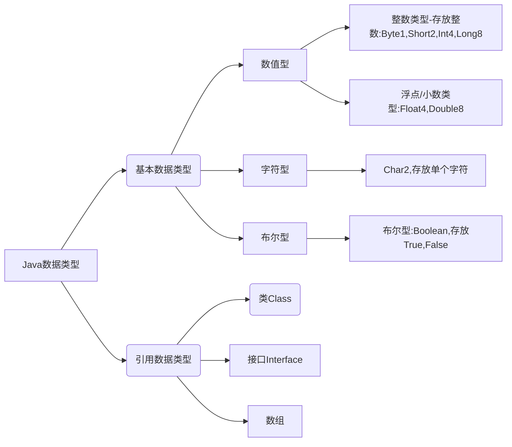

# 变量

> 在各个编程语言中，变量都是必不可少的物件，就跟搭建一个房子一样，有砖头，有水泥，有水管......Java中也不例外

## 变量的基本原理

```java
public class Test{
    public static void main(String[] str){
        int a =1;
        //给“1”在内存里开了一块空间，这个空间坐标为“a”
        //声明变量的步骤：声明变量a为整数型变量，然后对其赋值为1
    }
}
```

## Java中的数据类型



### 使用变量的注意事项

1. 变量表示内存中的一个存储区域[不同的变量，类型不同，占用的空间也不同]
   1. 比如：int 4个字节，double就是八个字节
   2. 该区域有自己的名称[变量名]和类型[数据类型]
   3. 变量必须先声明，后使用，即有顺序
   4. 该区域的数据可以在同一类型范围内不断变化
   5. 变量在同一个作用域内不能重名
   6. 变量=变量名+值+数据类型

### 整数类型 使用细节

1. Java各整数类型有固定的范围和长度，不受系统的影响，以保证Java程序的可移植性，整数类型的默认值是0
2. Java整数常量默认为int类型，声明Long型常量须后加`l`或者`L`
3. Java程序中变量声明为int型，除非不足以表示大数
4. bit：计算机中最小的存储单位，Byte：计算机中基本的存储单元，1Byte=8bit

```java
public class _004VarDetail {
  public static void main(String[] args){
   byte n0 = 1; //1个字节
   int n1=1; //4个字节
   long n2 = 1L //8个字节
   int n3 =(int)1L; // 强转换 4个字节
   System.out.println(n0);// 1
   System.out.println(n1);// 1
   System.out.println(n2);// 1
   System.out.println(n3);// 1

  }
}
```

#### 认识整数数据类型

1. byte：
   - byte 数据类型是8位、有符号的，以二进制补码表示的整数；
   - 最小值是 `-128（-2^7）`；
   - 最大值是 `127（2^7-1）`；
   - 默认值是`0`；
   - byte 类型用在大型数组中节约空间，主要代替整数，因为 byte 变量占用的空间只有 int 类型的四分之一；
   - 例子：byte a = 100，byte b = -50。

2. short：
   - short 数据类型是 16 位、有符号的以二进制补码表示的整数
   - 最小值是 -32768（-2^15）；
   - 最大值是 32767（2^15 - 1）；
   - Short 数据类型也可以像 byte 那样节省空间。一个short变量是int型变量所占空间的二分之一；
   - 默认值是 0
   - 例子：short s = 1000，short r = -20000

3. int：

   1. int 数据类型是32位、有符号的以二进制补码表示的整数；
   2. 最小值是 -2,147,483,648（-2^31）；
   3. 最大值是 2,147,483,647（2^31 - 1）；
   4. 一般地整型变量默认为 int 类型；
   5. 默认值是 0 ；
   6. 例子：int a = 100000, int b = -200000

4. long：

   1. long 数据类型是 64 位、有符号的以二进制补码表示的整数；
   2. 最小值是 -9,223,372,036,854,775,808（-2^63）；
   3. 最大值是 9,223,372,036,854,775,807（2^63 -1）；
   4. 这种类型主要使用在需要比较大整数的系统上；
   5. 默认值是 0L；
   6. 例子： long a = 100000L，Long b = -200000L。
   7. "L"理论上不分大小写，但是若写成"l"容易与数字"1"混淆，不容易分辩。所以最好大写。  

### 浮点类型 使用细节

1. 与整数类型相似，Java浮点类型也是有固定的范围和字段长度，不受OS的影响
   Float是四个字节，Double是八个字节，浮点类型的默认值是`0.0`

2. Java的浮点型常量默认为是Double类型，声明float常量需要在后面加上`f`或`F`

3. 浮点类型常量有两种表现形式

   - 十进制数形式：如`5.12`  `5.102f` `.512`(必须有小数点)
   - 科学计数法形式：如 `5.12e2[]` `5.12e-2[]`

4. 通常情况下，应该使用double型，因为它比float更精确

5. 浮点数使用陷阱：

   ```java
   // 浮点数使用陷阱：2.7和8.1/3比较
   double num1 =2.7;
   double num2 =8.1/3; //预期 2.7
   System.out.println(num1);// 2.7
   // 存储格式导致，效数存放的是一系列离散非连续的值
   System.out.println(num2);// 2.6999999999999997
   // 也就是精度偏离 所有语言都会有这个问题
   // 得到一个重要的使用点：当我们对运算结果是小数的进行相当判断要小心
   if(num1 ==num2){
    System.out.println("相等");
   }else{
    System.out.println("不相等");
   }
   System.out.println(Math.abs(num1-num2)); //4.440892098500626E-16
   // 精度比较，获得两个数差值的绝对值，在某个精度范围内判断
   if(Math.abs(num1-num2)<0.000001){
    System.out.println("精度判断-他们是相等的");
   }
   ```

#### 认识浮点型

1. float：

   1. float 数据类型是单精度、32位、符合IEEE 754标准的浮点数；
   2. float 在储存大型浮点数组的时候可节省内存空间；
   3. 默认值是 0.0f；
   4. 浮点数不能用来表示精确的值，如货币；
   5. 例子：float f1 = 234.5f。

2. double：

   1. double 数据类型是双精度、64 位、符合 IEEE 754 标准的浮点数；

   2. 浮点数的默认类型为 double 类型；

   3. double类型同样不能表示精确的值，如货币；

   4. 默认值是 0.0d；

   5. 例子：

      ```java
      double d1  = 7D ;
      double d2  = 7.;
      double d3  =  8.0;
      double d4  =  8.D;
      double d5  =  12.9867;
      //是一个 int 字面量，而 7D，7. 和 8.0 是 double 字面量。
      ```

### 扩展：JavaApi文档

在上方的浮点类型中，使用了一个特殊的功能-`Math.abs`，这个东西是拿来的，该咋用？

所以就要引出AP文档了，Java API 文档 ，顾名思义，就是这玩意的使用手册

[Java在线文档](https://www.matools.com/api/java8)，建议是用这个，离线的目前网上能下到的JDK1.8的大部分都带有同一个人的广告。。。

在这之中我通过索引+`Ctrl+F`查询到了Mach类，并找到了其中的方法.abs，如图所示，它是返回值为 `double`绝对值


也可以通过API文档找到自己想要的方法的说明文档

例如：ArrayList类有哪些方法，可以找到包-类-方法找到它（当然我大部分都是直接上索引搜索）

## 字符类型-char

1. char 类型是一个单一的 16 位 Unicode 字符；

2. 最小值是 \u0000（十进制等效值为 0）；

3. 最大值是 \uffff（即为 65535）；

4. char 数据类型可以储存任何字符；

5. 例子：char letter = 'A';

6. 字符常量是用单引号`''`括起来的单个字符,他没有默认值

   ```java
   char c1 = 'a';
   char c3 = '我';
   ```

7. Java中还允许使用转义符"\"来将其后面的字符转变为特殊字符型常量

   ```java
   char c2 = '\t'; //制表符
   char c5 = '\n' //换行符
   ```

8. 在Java中，Char的本质是一个整数，在输出时，是Unicode码对应的字符

   > 扩展：ASCII是美国制定的只支持英文等等，够人家用，后来计算机全球兴起，文字符号众多，所以创建了unicode俗称万国码,非洲字都有 可以使用[这个](http://tool.chinaz.com/tools/unicode.aspx?qq-pf-to=pcqq.group)工具来对Unicode进行转码

9. 可以直接个体char赋一个整数，然后输出时，会按照对应的Unicode字符输出

   ```java
   // Char类型的使用
   char c1 = 'a';
   char c2 = '\t';
   char c3 = '我';
   char c4 =97;  // char类型可以直接存放一个数字
   System.out.println(c1);
   System.out.println(c2);
   System.out.println(c3);
   System.out.println(c4); //这里实际输出的是`a`，97对照的字符就是`a`，这是一种编码的概念
   System.out.println((int)c3); //将char转换成数字进行输出 获得25105
   System.out.println((int)c4); //97
   ```

10. Char类型是可以进行运算的，相当于一个整数，因为它都对应有Unicode码

    ```java
    System.out.println('a'+10); //107
    ```

11. 在Java程序中，Char默认输出的是UniCode码对应的字符，如果想要让其输出数字，就要使用int类型进行转换

### 字符型本质的探讨

1. 字符型存储到计算机中，需要将字符对应的码值（整数）取出来，比如'a':
   存储：'a'==>码值97==>二进制(1100 0001) ==>存储
   读取：二进制==>97==>'a'==>显示
2. 字符串的码值的对应关系是通过字符编码表决定的（是规定好的）

### 扩展-常见编码表一览

- ASCII编码表
  - 一个字节表示，一共128个字符
  - 上个世纪60年代，美国指定了一套字符编码(使用一个字节)，对英语字符与二进制位之间的关系做了统一的规定，这被称为ASCII码，ASCII码一共规定了128个字符的编码，只占用了一个字节的后7位，最前面的1统一规定为0
  - 一个字节可以表示256个字符，ASCII码**只用了128个字符**
  - 缺点：**不能表示所有的字符**
- UniCode编码表
  - 固定大小的编码，使用两个字节来表示字符，字母和汉字都是统一占用两个字符，这样有点浪费时间
  - 一种编码，将世界上所有的符号都纳入其中，每一个符号都给予了独一无二的编码，**使用Unicode没有乱码的问题**
  - 2的16次方是65536，所以最多编码是65536个字符
  - 编码0~127的字符与ASCII的编码一样，比如'a'在ASCII码是`0x61`,在UniCode码是`0x0061`，都对应97，因此UniCode码兼容ASCII码
  - 缺点：**一个英文和一个汉字都占用两个字符**，对于存储空间来说这是浪费
- UTF-8编码表
  - 大小可变的编码，字母使用1个字节，汉字使用3个字节
  - UTF-8是在互联网上**使用最广泛的一种UniCode实现方式**
  - UTF-8是一种变长的编码方式，它可以使用1~6个字节表示一个符号，根据不同的符号而变化字节长度
- GBK编码表
  - 可以表示汉字，而且范围广，字母使用1个字节，汉字使用2个字节
- GBK2312编码表
  - 可以表示汉字，GBK2312<GBK
- BIg5编码
  - 繁体中文，台湾和香港用的

## 布尔类型

1. 布尔类型也叫Boolean类型
2. 布尔类型占用一个字节
3. 布尔类型一般都是用于逻辑运算，流程控制等：
   - if条件控制语句
   - while循环控制语句
   - do-while循环控制语句
   - for循环控制语句
4. 这种类型只作为一种标志来记录 true/false 情况
5. 默认值是 **false**，没有**null**，如果像其他语言定义0/-1/1等会报错
6. 例子：

```java
boolean pass = true;
if(pass){
 System.out.println("通过了考试"); //输出这行
}else{
 System.out.println("没有通过考试");
}
```

## 运算符

### 二元运算符

|   运算符   |                          运算                          |            范例            |          结果          |
| :--------: | :----------------------------------------------------: | :------------------------: | :--------------------: |
|     +      |                          正号                          |             +7             |           7            |
|     -      |                          负号                          |          b=11;-b           |          -11           |
|     +      |                           加                           |            9+9             |           18           |
|     -      |                           减                           |            10-8            |           2            |
|     *      |                           乘                           |            2*2             |           4            |
|     /      |                           除                           |            9/9             |           1            |
|     %      |                      取模（取余）                      |            11%9            |           2            |
| ++<br />++ |  自增(前)：先运算后取值<br />自增（后）：先取值后运算  | a=2;b=++a;<br />a=2;b=a++; | a=3;b=3;<br />a=3;b=2; |
| --<br />-- | 自减（前）：前运算后取值<br />自减（后）：先取值后运算 | a=2;b=--a;<br />a=2;b=a--; | a=1;b=1;<br />a=1;b=2; |
|     +      |                       字符串相加                       |      "hello"+"world"       |      "helloworld"      |

### 关系运算符

返回布尔值

|   运算符   |         运算         |           范例            | 结果  |
| :--------: | :------------------: | :-----------------------: | :---: |
|     ==     |        相等于        |           8==7            | false |
|     !=     |        不等于        |           8!=7            | true  |
|     <      |         大于         |            8<7            | false |
|     >      |         小于         |            8>7            | true  |
|     <=     |       大于等于       |           8<=7            | false |
|     >=     |       小于等于       |           8>=7            | true  |
| instanceof | 检查是否是该类的对象 | "Hello" instanceof String | true  |

### 逻辑运算符

一般用于求证多个结果

|   a   |   b   |  a&b  | a&&b  | a\|b  | a\|\|b |  !a   |  a^b  |
| :---: | :---: | :---: | :---: | :---: | :----: | :---: | :---: |
| true  | true  | true  | true  | true  |  true  | false | false |
| true  | false | false | false | true  |  true  | false | true  |
| false | true  | false | false | true  |  true  | true  | true  |
| false | false | false | false | false | false  | true  | false |

1. `a&b`:**&叫逻辑与**，规则：当a和b同时为true，则结果为true，否则为false
2. `a&&b`: **&& 叫短路与**：规则：当a和b同时为true，则结果为true，否则为false
3. `a|b`：**|叫逻辑或**，规则：当a和b中任意一个为true时，则结果为true，否则为false
4. `a||b`：**||叫短路或**，规则：当a和b中任意一个为true时，则结果为true，否则为false
5. `!a`：**!表示取反**，或者称之为非运算，规则：当a为true时，结果为false，当a为false时，结果为true
6. `a^b`：^叫逻辑异或，当a和b不同时，则结果为true，否则为false

通常情况下`a&&b`，`a||b`,`!a`用的比其他的多一些

### 三元运算符

基本语法：`条件表达式？表达式1:表达式2`

1. 如果条件表达是结果为true，则运行表达式1
2. 如果条件表达式结果为false，则运行表达式2

例子：

```java
public class _006Operator{
 public static void main(String[] args){
  int a =10;
  int b=99;
  int res = a>b?++a:--b;
  System.out.println(res); //输出为98
 }
}
```

## 三元运算符特别注意点

使用三元运算符时，它自包含的区域算作一个整体，大概意思就是：

```java
System.out.println(true?1:2.0);
```

结果应该是什么，这时候可能线都不会想就答曰1吧...但是`true?1:2.0`这个在程序运行过程中是当做一个整体来看的，即：他这之中精度最高的是2.0（double），那么返回的数据类型也将是一个double，所以结果是1.0

这个特点对于所有的基本数据类型都有效(包含char byte short)

### 运算符的优先级

| 优先度 | 运算顺序（L:Left;R:Right） |      运算符列表      |
| :----: | :------------------------: | :------------------: |
|   1    |     根据其内的内容决定     |     . () {} ; ,      |
|   2    |           R-->L            |        * / %         |
|   3    |           L-->R            |         + -          |
|   4    |           L-->R            |    << >> >>> 位移    |
|   5    |           L-->R            | < > <= >= instanceof |
|   6    |           L-->R            |        == !=         |
|   7    |           L-->R            |          &           |
|   8    |           L-->R            |          ^           |
|   9    |           L-->R            |          \|          |
|   10   |           L-->R            |          &&          |
|   11   |           L-->R            |         \|\|         |
|   12   |           L-->R            |         ? :          |
|   13   |           R-->L            |      = *= /= %=      |
|        |           R-->L            |    += -= <<= >>=     |
|        |           R-->L            |    >>>= &= ^= \|=    |

- 上方未说明的运算符表示用的比较少，要用到了再百度

## 数据类型转换（比较重要）

Java中，数据类型转换分为自动类型转换和手动类型转换

- 自动类型转换

  - 当Java程序在进行赋值或者运算时，精度小的类型会自动转换为精度大的数据类型，这个就是自动数据类型转换
  - 数据类型按精度（容量）大小排序为：

  ```mermaid
  graph LR
  字符类型-->Char --> int --> long --> float --> double
  数值类型-->byte-->short-->int
  ```

  像下面这样定义是没问题的

  ```java
  int testTranslator1 ='a'; //ok
  double testTranslator2 = 80; //ok
  ```

  但是在定义时**精度大的类型无法转换为精度小的类型**，例如：

  ```java
  int testTranslator3 = 3.1415926;//错误: 不兼容的类型: 从double转换到int可能会有损失
  byte testTranslator4 =132456;//错误: 不兼容的类型: 从int转换到byte可能会有损失
  ```

### 自动类型转换的使用和细节

1. 有多种类型的数据混合运算时，系统会先**自动将所有数据转换成容量最大的那种数据类型**，然后在进行计算
2. 当我们把精度（容量）大的数据类型赋值给精度小的数据类型会报错，**反之就会进行自动类型转换**
3. [Byte，Short]和Char  之间**不会**相互自动转换
4. Byte Short Char他们三者可以进行运算的，在进行运算的时候会首先转换成int类型
5. Boolean类型不参与转换
6. 自动提升原则：表达式结果的类型自动提升为 **操作数中最大的类型**

在实际使用（运算过程中），请按照上方表升序表来决定结果类型，例如:

```java
byte testAdd1 =1;
int testAdd2 =1;
byte testAdd3 =testAdd1+testAdd2; //错误: 不兼容的类型: 从int转换到byte可能会有损失
int testAdd4 =testAdd2+testAdd1;
```

### 强制类型转换

可以这样来强制类型转换，**但相对的可能会出现一些问题**，例如：

```java
int testForce1= (int)1.9;
System.out.println("n1="+n1); // n1=1 造成了精度损失

int testForce2 =2000;
System.out.println(testForce3); //-48  造成了数据溢出
```

除非有把握，不然别乱使用

1. 当数据的大小从`大--->小`进行转换时，就需要使用到强制类型转换

2. 强转符号只针对于最近操作的数据有效，往往会使用小括号提升优先级

   ```java
   int x =(int)10*0.35+6*1.5; //错误
   int y =(int)(10*0.35+6*1.5); //正确
   System.out.println(y);
   ```

3. Char  常量可以保存int 的常量值，但不能保存int 的变量值，需要强转

   ```java
   char c1 =100;
   int m =100;
   char c2 =m;// 报错
   char c3 =(char)m;
   System,.out.println(c3);
   ```

4. Byte和Short类型在进行运算时，当作int类型处理


### 基本数据类型和String类型的转换

- 在程序开发中，我们经常需要将基本数据类型转换成String类型，或者将String类型转换成基本数据类型

- 基本类型转String类型

  - 语法：将基本类型的值+`""`即可

    ```java
    int n1 =100;
    float n2 =1.1f;
    double n3=3.4;
    boolean b1 =true;
    String str =" ";
    System.out.println(n1+str+n2+str+n3+str+b1+str);
    //输出： 100 1.1 3.4 true
    ```

- String类型转基本数据类型

  - 语法：通过基本类型包装的ParseXX方法即可

    ```java
    Integer.parseInt("123");
    Double.parseDouble("12.11");
    Float.parseFloat("123456.41");
    Short.parseShort("12");
    Long.parseLong("123456");
    Boolean.parseBoolean("true");
    Byte.parseByte("12");
    ```

  - 如何将字符串转换成字符Char？

    ```java
    String str ='Hello World';
    System.out.println(str.chatAt(0)); //将H提出转换为Char
    ```

#### 基本数据类型和String类型转换时的注意事项

1. 在将String类型转换成基本数据类型时，要确保String类型能够转换成有效的数据，
   比如：可以将”123“转换成一个整数，但是不能将”Hello123456“转换成一个整数
2. 如果格式不正确，会抛出异常，程序就会终止，这个问题在后续《处理异常》中会处理

## 本章练习

1. 阅读程序，推测输出的值

   ```java
   /**
    * _005HomeWork.java
    * @author Amyakite
    * @version 0.0.1
    */
   public class _005HomeWork{
    public static void main(String[] args){
     int n1;
     n1=13;
     int n2;
     n2=17;
     int n3;
     n3=n1+n2;
     System.out.println("n3:"+n3);
     int n4=38;
     int n5=n4-n3;
     System.out.println("n5:"+n5)
    }
   }
   ```

2. 使用char类型，分别保存\n,\t,\r \\ 1 2 3 等字符，并打印

3. 变成，保存两本数的名称，用+拼接，看看效果，保存两个性别，用加号拼接，看下哦vu哦，保存两本书的价格，用加号拼接，看效果

4. 编程实现类似于Excel表格效果
   姓名    年龄    成绩    性别    爱好
   XX       XX       XX        XX       XX

   1. 要求用变量名将姓名    年龄    成绩    性别    爱好存储
   2. 使用+
   3. 添加适当的注释
   4. 添加转义符，用一条语句输出

> 答

```java
/**
 * _005HomeWork.java
 * @author Amyakite
 * @version 0.0.1
 */
public class _005HomeWork{
 public static void main(String[] args){
  int n1;
  n1=13;
  int n2;
  n2=17;
  int n3;
  n3=n1+n2;
  System.out.println("n3:"+n3); //30
  int n4=38;
  int n5=n4-n3;
  System.out.println("n5:"+n5); //8

  String name ="Ay";
  int age =20;
  double results =60.1;
  String hobby = "敲代码";
  String like ="睡觉";
  char tab ='\t';

  System.out.println(

   "姓名\t年龄\t成绩\t性别\t爱好\n"+
   name+tab+age+tab+results+tab+hobby+tab+like
   );
 }
}
```
