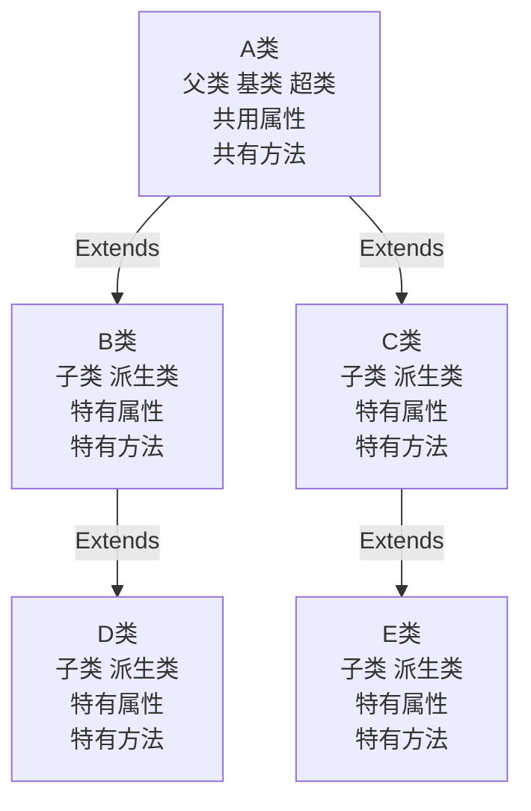

## 包

现在有两个程序员共同开发一个 Java 项目，程序员小明希望定义一个类取名为 Dog，程序员小强也想定义一个类叫 Dog，两个程序员还为此吵了起来

这时候就要用到包来管理了

### 包的三大作用

1. 区分相同名字的类
2. 当类很多时，可以很好的管理类
3. 控制访问范围

### 包的基本语法

package com.Amayakite;

- package 关键字，表示打包
- com.Amayakite: 表示包名


直接创建一个 com.xiaoming,在 IEDA 中是这样显示的


在文件资源管理器是这样显示的


如果说想在文件夹内和资源管理器内有着一样的显示效果：这个取消勾选


### 扩展：常用的包

一个包下，包含很多类，Java 中常用的包有：

- Java.lang.\* // lang 包是基本包，默认引入，不需要再引入；
- java.util.\* //Util 包，系统提供的工具包，工具类，例如使用 Scanner
- java.net.\* // 网络包，网络开发
- java.awt.\* //做 Java 的界面开发，GUI

### 如何引入包

语法`import 包名`

引入一个包的主要目的是要使用该包下的类

比如`import java.util.Scanner` 就是只引入一个类 Scanner;

`import java.util.*` 就是将该包下的所有类引入

### 访问修饰符

> Java 一共提供了四种访问修饰符号控制方法和属性的访问权限（范围）:

1. 公开级别：使用`public`，对外公开
2. 受保护级别：用`protected`,对子类和同一个包中的类公开
3. 默认级别：没有修饰符，对同一个包的类公开
4. 私有级别：用`private`，只有类本身可以访问，不可以对外公开

#### 四种访问修饰符的访问范围

> 备注： :+1:表示可以访问，:rotating_light:表示不可访问

| 访问级别 | 访问控制修饰符 | 同包  |       子包       |       子类       |      不同包      |
| :------: | :------------: | :---: | :--------------: | :--------------: | :--------------: |
|   公开   |    `public`    | :+1:  |       :+1:       |       :+1:       |       :+1:       |
|  受保护  |  `protected`   | :+1:  |       :+1:       |       :+1:       | :rotating_light: |
|   默认   |   没有修饰符   | :+1:  |       :+1:       | :rotating_light: | :rotating_light: |
|   私有   |   `private`    | :+1:  | :rotating_light: | :rotating_light: | :rotating_light: |

- 修饰符可以用来修饰类中的属性，方法，及类
- 只有默认的和 public 才能修饰类，并且遵循上述特点
- 成员方法的访问规则和属性完全一样
- 一般来说，没有修饰符很少用，基本都是能 public 就 public 之类的，以保证代码规范

### 封装

就是把抽象出的数据（属性）和对数据的操作，封装在一起，数据被保护在内部，程序的其他部分只有通过授权的操作才能对数据进行操作

简而言之，就是让外部能够修改和访问 private 定义的属性或者方法

```java
package com.modifier;

public class A {
    private int count = 0;

    /**
     * 封装int的调用方法（get），让外部通过这个方法能够访问到他
     * @return int Count
     */
    public int getCount() {
        return count;
    }

    /**
     * 封装int的修改方法，让外部能够修改它的值
     * @param count 一个数值
     */
    public void setCount(int count) {
        this.count = count;
    }
}
```

```java
package com.modifier;

public class App {
    public static void main(String[] args) {
        A testA = new A();
        System.out.println(testA.getCount()); //0
        testA.setCount(666);
        System.out.println(testA.getCount()); //666
    }
}

```

当然封装和构造器是能够共存的，比如定义构造器让其初始赋值，然后再修改值

```java
package com.modifier;

public class A {
    private int count = 0;

    /**
     * 构造器 传入int
     * @param count anyNumber
     */
    public A(int count) {
        super();
        this.count = count;
    }

    /**
     * 无参构造
     */
    public A() {
        super();
    }

    /**
     * 封装int的调用方法（get），让外部通过这个方法能够访问到他
     * @return int Count
     */
    public int getCount() {
        return count;
    }

    /**
     * 封装int的修改方法，让外部能够修改它的值
     * @param count 一个数值
     */
    public void setCount(int count) {
        this.count = count;
    }
}

```

```java
package com.modifier;

public class App {
    public static void main(String[] args) {
        A testA = new A(10);
        System.out.println(testA.getCount()); //10
        testA.setCount(666);
        System.out.println(testA.getCount()); //666

        A testB = new A();
        System.out.println(testB.getCount()); //0
        testB.setCount(555);
        System.out.println(testB.getCount()); //555

    }
}

```

### 继承

> 这个没啥好多说的，就是定义一个子类继承父类的方法；
>
> 子类可以重写父类的方法，使用@Override

举个例子

```java
class Pupil {
    public String name;
    public int age;
    private double score; //成绩

    public Pupil(String name, int age, double score) {
        this.name = name;
        this.age = age;
        this.score = score;
    }

    public double getScore() {
        return score;
    }

    public void setScore(double score) {
        this.score = score;
    }

    public void testIng() {
        System.out.printf("小学生%s正在考小学数学...\n", score);
    }

    public void showInfo() {
        System.out.printf("学生名：%s,年龄%s,成绩,%s\n", name, age, score);
    }

}

class AdminStudent {
    public String name;
    public int age;
    private double score; //成绩

    public AdminStudent(String name, int age, double score) {
        this.name = name;
        this.age = age;
        this.score = score;
    }

    public double getScore() {
        return score;
    }

    public void setScore(double score) {
        this.score = score;
    }

    public void testIng() {
        System.out.printf("大学生%s正在考小学数学...\n", score);
    }

    public void showInfo() {
        System.out.printf("学生名：%s,年龄%s,成绩,%s\n", name, age, score);
    }

    public void showMessage() {
        System.out.printf("%s:Hello World", name);
    }
}
```

定义了两个类，一个小学生， 一个大学生，可以发现他们的方法都大致相同，变量的数量和类型都一样，构造函数需求的值都一样，区别在于大学生的两个方法内和小学生的两个方法内有一字之差，大学生比小学生多一个方法，这样重复的写多个 class
不好受，所以可以用继承来解决

```java
class Pupil {
    public String name;
    public int age;
    private double score; //成绩

    public Pupil(String name, int age, double score) {
        this.name = name;
        this.age = age;
        this.score = score;
    }

    public double getScore() {
        return score;
    }

    public void setScore(double score) {
        this.score = score;
    }

    public void testIng() {
        System.out.printf("小学生%s正在考小学数学...\n", score);
    }

    public void showInfo() {
        System.out.printf("学生名：%s,年龄%s,成绩,%s\n", name, age, score);
    }

}

class AdminStudent extends Pupil {
    public AdminStudent(String name, int age, double score) {
        super(name, age, score);
    }

    @Override
    public void testIng() {
        System.out.printf("小学生%s正在考小学数学...\n", super.getScore());
    }

    public void showMessage() {
        System.out.printf("%s:Hello World", name);
    }
}
```

这样就完成了继承

#### 继承的基本介绍

继承可以解决代码复用的问题，让我们的编程更加靠近人类的思维，当多个类中存在相同的属性（变量）和方法时，可以从这些类中抽象出父类，在父类中定义这些相同的属性和方法，所有的子类不需要重新定义这些属性和方法，只需要通过 extends
来声明继承父类即可

基本语法

```java
class 子类 extends 父类 {
    ...
}
```

1. 子类会自动拥有父类定义的属性和方法
2. 父类又叫超类，基类
3. 子类叫派生类，实际使用过程中，往往子类的方法或者属性会比父类更多一些

#### 继承的示意图



#### 继承的细节


1. 子类继承了所有的属性和方法，但是私有属性（private)不能在子类中直接访问，需要通过公共的方法去访问

2. 子类必须调用父类的构造器，完成父类的初始化

   ```java
   class AdminStudent extends Pupil {
       //父类也是要三个参数，这里也是，所以编译正常
       public AdminStudent(String name, int age, double score) {
           super(name, age, score);
       }
   }
   ```

3. 当创建子类对象时，不管使用子类的哪个构造器，默认情况下总会取调用父类的无参构造器，如果父类没有提供午餐构造器，则必须于子类的构造器中用 super 取指定父类的那个构造器完成对父类的初始化工作，否则编译会报错

   ```java
   class AdminStudent extends Pupil {
       // 这里相当于给父类定死了要传入的值
       public AdminStudent() {
           super("张三",18,20);
       }
   }
   ```

4. 如果希望指定去调用父类的某个构造器，则显示的调用下

   ```java
   //父类 父类中的super是调用Object的初始方法
   class Pupil {
       public String name;
       public int age;
       private double score; //成绩

       public Pupil(String name, int age, double score) {
           this.name = name;
           this.age = age;
           this.score = score;
       }
       public Pupil() {
           super();
       }
   }
   //子类
   class AdminStudent extends Pupil {
    //我只调用父类的无参构造器
       public AdminStudent() {
           super();
           super.testIng();
       }
   }
   ```

5. super 在使用时，需要放在构造器的第一行

6. super()和 this()都只能放在构造器的第一行，因此这两个方法不能共存在同一个构造器（双亲委派机制）

   ```java
   //父类 父类中的super是调用Object的初始方法
   class Pupil {
       public String name;
       public int age;
       private double score; //成绩

       public Pupil(String name, int age, double score) {
           this.name = name;
           this.age = age;
           this.score = score;
       }
       public Pupil() {
           super();
       }
   }
   //子类
   class AdminStudent extends Pupil {

       // *1 子类无参构造器
       public AdminStudent() {
           super();
           super.testIng();
       }
       public AdminStudent(String name, int age, double score) {
           this(); //这个this指向的是*1
           //super();// 这个和this只能二选一
          super.name=name;
          super.age=age;
          super.setScore(score);
       }

   }
   ```

7. Java 中，Object 类是所有类的基类，万物基于 object 类 Object 自带一些方法，可以重写
   

8. 父类构造器的调用不限于直接父类，将一直往上追溯到 Object 类(顶级父类)，构造器的执行流程：比如现在我定义了两个类：a,b,b 继承于 A，我 new b 时，构造器的执行顺序是：Objcet 构造器先执行，A 构造器执行，B
   构造器执行，在指定有参构造时，会自动调用父类的无参构造 super()

   ```java
   // 父类
   class Pupil {
       public String name;
       public int age;
       private double score; //成绩
   
       public Pupil(String name, int age, double score) {
           //我这里不调用super 系统也会自动给我调用
           this.name = name;
           this.age = age;
           this.score = score;
       }
       public Pupil() {
           //我这里不调用super 系统也会自动给我调用
           //如果说我这里不定义无参构造，子类使用无参构造时将会执行Object的无参构造
       }
   
       public double getScore() {
           return score;
       }
   
       public void setScore(double score) {
           this.score = score;
       }
   
       public void testIng() {
           System.out.printf("小学生%s正在考小学数学...\n", score);
       }
   
       public void showInfo() {
           System.out.printf("小学生名：%s,年龄%s,成绩,%s\n", name, age, score);
       }
   
   }
   //子类
   class AdminStudent extends Pupil {
       public AdminStudent(String name, int age, double score) {
          this(); //我这里调用了this，系统将不会给我调用super
          super.name=name;
          super.age=age;
          super.setScore(score);
       }
   
       public AdminStudent() {
        // 这里系统自动给我调用了super
           super.testIng();
       }
   
       @Override
       public void testIng() {
           System.out.printf("小学生%s正在考小学数学...\n", super.getScore());
       }
   
       @Override
       public void showInfo() {
           System.out.printf("小学生名：%s,年龄%s,成绩,%s\n", name, age, super.getScore());
       }
       public void showMessage(){
           System.out.printf("%s:Hello World",name);
       }
   }
   ```

9. 子类最多只能继承一个父类（直接继承），父类可以有多个子类 假设 我有 A B C 类 ，B 继承 A 我先让 C 继承 B 和 A 只需要 C 继承 B 即可 如果我只想让 C 继承 A 直接继承就行 如果我想在 C 继承 B
   的情况下使用 A 的方法，可以在定义的时候这样`A testc =new C();`

10. 不能滥用继承，子类和父类之间必须满足 is - a 的关系

#### super 关键字

> super 代表父类的引用，用于访问父类的属性，方法，构造器

1. 访问父类的属性，但是不能访问父类的 private 属性

2. 访问父类的方法，但是不能访问父类的 private 方法

3. 访问父类的构造器

4. 调用父类构造器的好处（分工明确，父类属性由父类初始化，子类属性由子类初始化

5. 当子类中有和父类相同的成员（属性和方法）重名时，可以通过 this 指定调用子类的方法，通过 super 指定调用父类的方法，如果没有崇明，使用 super.this，直接访问是一样的效果

   ```
   父类有方法 TestA
   子类有方法 TestA
   子类调用 TestA() 调用的是子类的TestA()
   子类调用 this.TestA() 调用的是子类的TestA()
   子类调用 super.TestA() 调用的是父类的TestA()
   //----------

   父类有方法 TestGo
   子类有方法
   这时候子类无论是调用 TestGo this.testGo() super.TestGO() 都是指向父类的TestGo()方法

   ```

6. super 的访问不限于直接父类，如果爷爷类中和本类中有同名的成员，也可以使用 super 去访问爷爷类的成员，如果多个基类都有同名的成员，使用 super 访问遵循就近原则

7. Super 和 this 的比较

   |  No   |   区别点   | this                                                               | super                                         |
   | :---: | :--------: | :----------------------------------------------------------------- | :-------------------------------------------- |
   |   1   |  访问属性  | 访问本类中的属性，<br />如果本类中没有找到此属性则从父类中继续查找 | 访问父类中的属性                              |
   |   2   |  访问方法  | 访问本类中的此方法<br />如果本类中没有找到此方法则从父类中继续查找 | 直接访问父类中的方法                          |
   |   3   | 调用构造器 | 调用本类构造器<br />必须放在构造器的首行                           | 调用父类构造器<br /> 必须放在子类构造器的首行 |
   |   4   |    特殊    | 表示当前对象                                                       | 子类中访问父类对象                            |

#### 方法的重写(Override)

> 简单来说 就是子类有一个方法，和父类的某个方法的名称 返回类型，参数一样，那么就说明子类的这个方法覆盖了父类的哪个方法
>
> 这里的子类和父类不一定是只有一层的关系 比如 A B C C 继承 B 继承 A
>
> A 有 go
>
> C 有 go
>
> 相当于 C 重写了 A 的方法

```java
class Animal {
    public void cry() {
        sout("动物叫");
    }
}

class Dog extends Animal {
    @override
    public void cry() {
        sout("狗狗叫");
    }
}
```

#### 方法重写的细节

1. 子类的方法的参数，方法名称，要和父类方法的参数，方法名称完全一样
2. 子类方法的返回类型和父类方法的返回类型要一致，或者是父类返回类型的子类，比如 父类 返回类型是 Object 子类方法返回类型是 String（String 也是继承 Object 的）
3. 子类方法不能缩小父类方法的访问权限（例如父类是 public void xxx 子类不能是 void xxx 或者 protected void xxx 或者 private void xxx 只能是 public void xxx
4. 重载和重写并不是同一个东西 简单来说 重载是定义在自类下的，重写是定义在子类下的

### 多态

先看个案例

我现在有三个类-动物-食物-Master

```java
package com.poly;

public class Food {
    /**
     * 食物的名称
     */
    private String name;

    /**
     * 构造器，传入食物的名称，返回食物
     * @param name 食物的名称
     */
    public Food(String name) {
        this.name = name;
    }

    public String getName() {
        return name;
    }

    public void setName(String name) {
        this.name = name;
    }
}

package com.poly;

public class Animal {
    private String name;

    /**
     * 构造器，传入姓名，生成动物的对象
     * @param name 名称
     */
    public Animal(String name) {
        this.name = name;
    }

    public String getName() {
        return name;
    }

    public void setName(String name) {
        this.name = name;
    }
}

```

动物类有两个子类-Cat 和 Dog

```java
package com.poly;

public class Cat extends Animal {
    /**
     * 构造器，传入姓名，生成动物的对象
     *
     * @param name 名称
     */
    public Cat(String name) {
        super(name);
    }
}

package com.poly;

public class Dog extends Animal {
    /**
     * 构造器，传入姓名，生成动物的对象
     *
     * @param name 名称
     */
    public Cat(String name) {
        super(name);
    }
}

```

食物有两个子类：骨头和鱼干

```java
package com.poly;

public class Bone extends Food {
    /**
     * 构造器，传入食物的名称，返回食物
     * @param name 食物的名称
     */
    public Bone(String name) {
        super(name);
    }
}


package com.poly;

public class Fish extends Food {
    /**
     * 构造器，传入食物的名称，返回食物
     * @param name 食物的名称
     */
    public Fish(String name) {
        super(name);
    }
}
```

然后我想在 Master 类中实现这样一个功能：传入 Dog 实例 Bone 实例，打印 ：主人 xx 的宠物 xx 正在吃 xx;

```java
package com.poly;

public class Master {
    private String name;

    public String getName() {
        return name;
    }

    public void setName(String name) {
        this.name = name;
    }

    public Master(String name) {
        this.name = name;
    }

    public void feed(Dog dog, Bone bone) {
        System.out.printf("%s正在给动物%s喂%s吃\n", this.name, dog.getName(), bone.getName());
    }
}
```

嗯，尝试一下

```java
package com.poly;

public class Poyl01 {
    public static void main(String[] args) {
        Master join = new Master("Join");
        Dog dog = new Dog("旺财");
        Bone bone = new Bone("闪闪发亮的骨头");
        join.feed(dog, bone);
    }
}
```

完美运行，然后我接到了一个新的需求-给 Master 添加上猫的实例的和猫吃鱼的功能

```java
    public void feed(Cat cat,Fish fish){
        System.out.printf("%s正在给动物%s喂%s吃\n",this.name,cat.getName(),fish.getName());
        }
```

加上去后，再次运行

```java
package com.poly;

public class Poyl01 {
    public static void main(String[] args) {
        Master join = new Master("Join");
        Dog dog = new Dog("旺财");
        Bone bone = new Bone("闪闪发亮的骨头");
        join.feed(dog, bone);
        Cat jenny = new Cat("Jenny");
        Fish fish = new Fish("皇家鱼干");
        join.feed(jenny, fish);
    }
}

```


依旧是完美运行

但貌似有哪里怪怪的

假设说我现在有十种类型的动物，和十种食物，那我一个一个的加不是得累死

而且一堆 feed 方法也不利于管理

这时候就可以用**多态**来解决问题了

多态是什么？举个小例子

```java
package com.poly;

public class Poyl01 {
    public static void main(String[] args) {
        A a = new A();
        B b = new B();
        a.say();
        b.say();
    }
}

class A {
    public void say() {
        System.out.println("A Say() running");
    }
}

class B extends A {
    @Override
    public void say() {
        System.out.println("B Say() Running");
    }
}
```

这里 a.say()和 b.say()输出的内容是不一样的，因为 a 是 new A();b 是 new B() ，虽然 B 重写了 A 的方法，但是并不影响 A 方法的直接调用，这就是多态的基本原理

> 方法或对象具有多种形态，是面向对象的第三大特征，多态是建立在封装和继承基础之上的

多态的具体表现-对象的多态

1. 一个对象的编译类型和运行类型可以不一致
2. 编译类型在定义对象时，就确定了，不能改变
3. 运行类型是可以变化的
4. **编译类型**看定义时 = 号的**左边**，**运行类型**看 = 号的**右边**;

> 简单理解，老张家的，这个父类，可以定义他下面的所有子类，比如，老张家儿子，老张家女儿，老张家媳妇。。
>
> 一个父类的对象引用 是可以指向子类的一个对象

接下来举个例子，创建：Animal/Cat/Dog

```java
package com.poly.objectpoly_;

public class Animal {
    public void say() {
        System.out.println("Animal say()...动物在叫");
    }
}

//Dog
package com.poly.objectpoly_;

public class Dog extends Animal {
    @Override
    public void say() {
        System.out.println("Dog Say... 小狗旺旺叫");
    }

    public void run() {
        System.out.println("Dog Say ... 小狗跑起来了");
    }
}

//Cat
package com.poly.objectpoly_;

public class Cat extends Animal {
    @Override
    public void say() {
        System.out.println("Cat say()..... 猫在叫");
    }
}
```

再运行一个实例

```java
package com.poly.objectpoly_;

public class PolyObject {
    public static void main(String[] args) {
//        体验对象多态特点
//        Animal 编译类型就是 Animal  new Dog 运行类型是Dog
        Animal animal = new Dog();

        //当运行过程中 运行到这行时，animal的运行类型是Dog 所以这个say就是Dog的Say
        animal.say();//        这个对象本质上仍是Dog，只不过用Animal类型来表示，以提供代码通用性。
//        当运行到这行时，就会执行 Dog Say... 小狗旺旺叫
//        此时此刻,animal的编译类型是Animal
//        如果我试图调用Dog类型中我额外定义的方法 run()
//        animal.run(); 会抛出异常,方法不存在

        Animal cat = new Cat();
        cat.say();//Cat say()..... 猫在叫

    }
}

```


在了解到多态后，返回前面，解决那个开始就存在的例子

```java
package com.poly;

public class Master {
    private String name;

    public String getName() {
        return name;
    }

    public void setName(String name) {
        this.name = name;
    }

    public Master(String name) {
        this.name = name;
    }

    /**
     * 使用多态解决可能要重复定义方法的问题 也就是统一管理主人喂食物的问题
     * @param animal 动物的实例或者其子类的实例
     * @param food 食物的实例或者其子类的实例
     */
    public void feed(Animal animal, Food food) {
        System.out.printf("%s正在给动物%s喂%s吃\n", this.name, animal.getName(), food.getName());
    }
}

```

试着运行下

```java
package com.poly;

public class Poyl01 {
    public static void main(String[] args) {
        Master join = new Master("Join");
        Dog dog = new Dog("旺财");
        Bone bone = new Bone("闪闪发亮的骨头");
        Cat jenny = new Cat("Jenny");
        Fish fish = new Fish("皇家鱼干");
//        使用多态来尝试解决开始的问题
        join.feed(dog, bone);
        join.feed(jenny, fish);
    }
}
out:
        Join正在给动物旺财喂闪闪发亮的骨头吃
        Join正在给动物Jenny喂皇家鱼干吃

```

这个时候我再添加个 Pig 和 Rice 使用起来也是一样的效果，这就是多态的魅力

#### 多态的注意事项和细节讨论

- 多态的前提条件：两个对象（类）存在继承关系
- 多态的向上转型
    1. 本质：父类的引用指向了子类的对象(向上转型)
    2. `父类类型` `引用名` = new `子类类型()`
    3. 特点:编译类看左边，运行类看右边  
       最终实例可以调用父类中所有成员(需遵循访问权限)  
       最终实例不能调用子类中特有的成员或者方法  
       最终运行效果看子类的具体表现(若子类没有重载相关方法，则根据继承的原理自动调用父类的)
    4. Object是所有类的父类，我可以通过它来创建任何类型，例如`Object cat = new Cat();`,当然，这样做的话这个Cat只能使用Object中的方法

- 多态的向下转型
    1. 语法 `子类类型` `引用名` = (`子类类型`) `父类引用`
    2. 只能强制转换父类的引用，不能强制转换父类的对象
    3. 要求父类的引用必须指向的是当前目标类型的对象
    4. 可以调用子类类型中所有的成员

#### 多态注意事项和细节讨论

- 属性没有重 写之说，属性的值看编译类型

  ```java
  package com.poly;
  
  public class PolyDetail02 {
      public static void main(String[] args) {
  //        向上转型不能调用子类的特有方法包括属性 有人是这么理解的
  //        但我理解的是: 变量跟着编译类型走,方法跟着运行类型走
          Base base =new  Sub(); //向上转型
          
          System.out.println(base.count);//? 直接看编译类型
          Sub sub = new Sub();
          System.out.println(sub.count); //20
  
          Sub sub2 =(Sub)base;
          System.out.println(sub2.count); //20
      }
  }
  class Base{ //父类
      int count =10; //属性
  }
  
  class Sub extends Base{ //子类
      int count =20; //属性
  }
  ```

- `instanceof` 比较操作符，用于判断对象的类型是否为XX类型或者XX的子类型，如果是则返回true，如果不是则返回false，如果跟比较的类没有任何关系则报错

## Java动态绑定机制(非常重要)

先来看一道题

```java
package com.poly;

public class DynamicBinding {
    public static void main(String[] args) {
        A a = new B();
        System.out.println(a.sum());
        System.out.println(a.sum1());
    }
}

class A {
    public int i = 10;

    public int sum() {
        return geti() + 10;
    }


    public int sum1() {
        return i + 10;
    }

    public int geti() {
        return i;
    }
}

class B extends A {
    public int i = 20;

    public int sum() {
        return geti() + 20;
    }


    public int sum1() {
        return i + 10;
    }

    public int geti() {
        return i;
    }
}
```

请在不运行代码的情况下说明`sout(a.sum());sout(a.sum1());`分别会打印出什么

> 这里分割下，你想好了就滑下来

-----------------------------------------------
-----------------------------------------------
-----------------------------------------------
-----------------------------------------------
-----------------------------------------------
-----------------------------------------------
-----------------------------------------------
-----------------------------------------------
-----------------------------------------------
-----------------------------------------------
-----------------------------------------------
-----------------------------------------------
-----------------------------------------------

答案是:40,30

为啥？按照之前的思想，不应该是 变量按照引用类型来，方法按照运行类型来吗

没错，因为 变量按照引用类型来，方法按照运行类型来，所以结果是40，30

运行的是方法，方法自然调用本类的变量...

好，那么将上方代码稍作修改，变成下面的这个样子：

```java
package com.poly;

public class DynamicBinding {
    public static void main(String[] args) {
        A a = new B();
        System.out.println(a.sum());
        System.out.println(a.sum1());
    }
}

class A {
    public int i = 10;

    public int sum() {
        return geti() + 10;
    }


    public int sum1() {
        return i + 10;
    }

    public int geti() {
        return i;
    }
}

class B extends A {
    public int i = 20;

//    public int sum() {
//        return geti() + 20;
//    }


    public int sum1() {
        return i + 10;
    }

    public int geti() {
        return i;
    }
}
```

请问，上方a.sum()应该输出什么？

这时候就要说到Java的动态绑定机制了

- 当调用对象方法的时候，该方法会和该对象的**内存地址**/**运行类型**进行绑定  
  所以上方的流程为：a实例运行中寻找B.sum()，发现找不到，于是向父类找，找到了A.sum()，然后发现  
  A.sum()中有个geti()的方法，于是又寻找B中是否有geti()找到了，返回了20  
  所以本题的返回值为30，那如果B内没有sum呢？ 这时候就要调用A.geti()，A的常量是10，所以返回是20
- 当调用对象属性时，没有动态绑定机制，哪里声明，哪里使用

> 如果说a没有sum1,并且调用了sum1呢？  
> 结果是肯定的，掉用了A的sum1，结果为20

所以，动态绑定机制的核心是:**方法有动态绑定机制，属性没有**

### 多态的应用

#### 多态数组

- 数组的定义类型为父类类型，里面保存的实际元素为子类类型
- 应用实例，现有一个继承如下：要求创建一个Person对象，两个Student对象和两个Teacher对象，统一放在数组下，并调用Say方法  
  Person拥有的属性为(private name , private age)  
  Student拥有的属性为(private double score)
- 实例升级：如何调用子类特有的方法，比如Teacher有一个Teach，Student有一个study，怎么调用？

```java
// 定义Class
package com.poly.polyArray;

public class Person {
    private String name;
    private int age;

    public String getName() {
        return name;
    }

    public void setName(String name) {
        this.name = name;
    }

    public int getAge() {
        return age;
    }

    public void setAge(int age) {
        this.age = age;
    }

    public Person(String name, int age) {
        this.name = name;
        this.age = age;
    }

    public void say() {
        System.out.printf("Hello 我是：%s，年龄是%s，是一个人类\n", this.name, this.age);
    }
}

class Student extends Person {
    private double score;

    public double getScore() {
        return score;
    }

    public void setScore(double score) {
        this.score = score;
    }

    public Student(String name, int age, double score) {
        super(name, age);
        this.score = score;
    }

    @Override
    public void say() {
        System.out.printf("Hello 我是：%s，年龄是%s，是一个学生，我的分数是%s分\n", getName(), getAge(), this.score);
    }

    public void study() {
        System.out.printf("%s高高兴兴的去网吧了\n", getName());
    }


}

class Teacher extends Person {
    private double salary;

    public Teacher(String name, int age, double salary) {
        super(name, age);
        this.salary = salary;
    }

    @Override
    public void say() {
        System.out.printf("Hello 我是：%s，年龄是%s，是一个老师,我现在的工资是%s元\n", getName(), getAge(), this.salary);
    }

    public void teach() {
        System.out.printf("开课了啊，现在是%s老师的授课时间\n", getName());
    }

}

```

实例：

```java
package com.poly.polyArray;

public class PolyArray {

    public static void main(String[] args) {
        Person[] persons = new Person[5];
        persons[0] = new Person("张三", 18);
        persons[1] = new Student("李四", 19, 61);
        persons[2] = new Student("王老五", 20, 81);
        persons[3] = new Teacher("吴六", 21, 3000);
        persons[4] = new Teacher("刘七", 22, 5000);
//        循环遍历多态数组，调用Person.say()
        for (Person person : persons) {
            person.say();
//            判断类型是否为Teacher的实例或者Teacher子类的实例
            if (person instanceof Teacher) {
//                向下转换并调用方法
//                Teacher teacher =(Teacher)person;
//                teacher.teach();
//                缩写：
                ((Teacher) person).teach();
            } else if (person instanceof Student) {
                ((Student) person).study();
            }
        }
        System.out.println("end");
    }
}
```

#### 多态参数

- 方法定义的形参类型为父类类型，实参类型允许为子类型
  - 应用实例1：前面的主人喂动物
  - 应用实例2：
    - 定义员工类Employee，包含了姓名和月工资(private),以及计算年工资getAnnual方法
    - 普通员工和经理继承了员工，经理类多了奖金bonus属性和管理manage方法
    - 普通员工多了work方法，普通员工和经理分别重写getAnnual方法
    - 测试类中添加一个方法showEmpAnnal(Employee e),实现获取任何员工对象的年工资，并在main方法中调用该方法[e.getAnnual()]
    - 测试类中添加一个方法：testWork,如果是普通员工，则调用work方法，如果是经理，则调用manage方法

```java
package com.poly.polyparameter;

public class Employee {
    private String name;
    private double salary;

    public String getName() {
        return name;
    }

    public void setName(String name) {
        this.name = name;
    }

    public double getSalary() {
        return salary;
    }

    public void setSalary(double salary) {
        this.salary = salary;
    }

    /**
     * 创建一个员工
     * @param name 姓名
     * @param salary 月工资
     */
    public Employee(String name, double salary) {
        this.name = name;
        this.salary = salary;
    }

    /**
     * 计算年工资
     * @return 返回一年的工资(12个月), double
     */
    public double getAnnualSalary() {
        return salary * 12;
    }

    public static void showEmpAnnal(Employee e) {
        System.out.printf("员工%s，月工资是%s元，年工资是%s元\n", e.getName(), e.getSalary(), e.getAnnualSalary());

        if (e instanceof Ordinary) {
            ((Ordinary) e).work();
        } else if (e instanceof Manager) {
            ((Manager) e).manage();
        } else {
            System.out.println(e.getName() + "正在摸鱼");
        }
    }

}

class Ordinary extends Employee {
    /**
     * 创建一个普通员工
     * 年度工资按照十三个月的薪水计算
     * @param name   姓名
     * @param salary 月工资
     */
    public Ordinary(String name, double salary) {
        super(name, salary);
    }

    public void work() {
        System.out.println("普通员工:" + getName() + "正在工作......");
    }

    /**
     * 普通员工的工资计算
     * @return 返回月工资*13
     */
    @Override
    public double getAnnualSalary() {
        return getSalary() * 13;
    }
}

class Manager extends Employee {
    private double bonus;

    /**
     * 创建一个管理层
     * @param name 姓名
     * @param salary 月工资
     * @param bonus 奖金
     */
    public Manager(String name, double salary, double bonus) {
        super(name, salary);
        this.bonus = bonus;
    }

    public double getBonus() {
        return bonus;
    }

    public void setBonus(double bonus) {
        this.bonus = bonus;
    }

    public void manage() {
        System.out.println("经理" + getName() + "正在管理");
    }

    @Override
    public double getAnnualSalary() {
        return getSalary() * 14 + bonus;
    }
}
```

实例

```java
package com.poly.polyparameter;

public class PolyParameter {
    public static void main(String[] args) {
        Employee[] employees = new Employee[6];
        employees[0] = new Employee("张三", 1000);
        employees[1] = new Employee("李四", 1500);
        employees[2] = new Ordinary("王五", 2000);
        employees[3] = new Ordinary("李流", 3000);
        employees[4] = new Manager("狗蛋", 3500, 1500);
        employees[5] = new Manager("House", 5660.3, 7000);

        for (Employee employee : employees) {
            Employee.showEmpAnnal(employee);
        }
    }
}
```

### Object类讲解

前面有说到过，所有类都继承了Object类，那么，这里开始简单阐述下Object类

#### 扩展：==和equals对比[面试常驻]

> ==的用法

1. == 既可以判断基本类型，又可以判断引用类型
2. == 如果判断基本类型，判断的值是否相等？示例： int i=10;double d=10.0; //结果为true
3. ==如果判断引用类型，会判断地址是否相等，即判定是不是同一个对象

```java
package com.poly.object_;

public class Equals01 {
    public static void main(String[] args) {
        A a = new A();
        A b = a;
        A c = a;
        System.out.println(a == b); //true
        System.out.println(a == c); //true
        B bobj = a;
        System.out.println(bobj == a);
        //ture b=a是引用类型，所以最终运行时a运行类型和运行地址都是指向开头的a
        int num1 = 1000;
        double num2 = 1000.0;
        System.out.println(num1 == num2); //true
        //基本数据类型，判断的是值是否相等
    }
}

class B {
}

class A extends B {
}

```

> equals方法

1. equals:是Object类中的方法，只能判断引用类型[看看JDK源码]

   ```java
       public boolean equals(Object obj) {
           return (this == obj);
       }
       //可以看到,Object中的equal本质上是调用了==,即：判断地址是否相等
   ```

2. 默认判断的是地址是否相等，子类中往往重写该方法，用于判断内容是否相等，如：Integer,String[看看String，Interger中equals的源码]

   ```java
   //String的equals    
   public boolean equals(Object anObject) {
       //先判断两个的地址是否相等
        if (this == anObject) {
            return true;
        }
        //如果地址不相等，判断传入的类型anObject是否是String类型
        if (anObject instanceof String) {
            //如果是String类型，则将其向下转型
            String anotherString = (String)anObject;
           //然后获取自身(this)的length
            int n = value.length;
           //在判断两个length的长度是否相等，若相等则继续比较
            if (n == anotherString.value.length) {
                //分别将两个元素转换为char数组
                char v1[] = value;
                char v2[] = anotherString.value;
                int i = 0;
   
               //根据自生的长度开始进行while循环
               //如果自生的长度为0，且传入的对象转换成String的长度也为0，则返回true
                while (n-- != 0) {
                    // 开始逐一对比每一个元素
                    // 如果这之中有任意一个元素不相等
                    // 就返回false
                    if (v1[i] != v2[i])
                        return false;
                    i++;
                }
                //上方while执行完毕，若没有在上方return，则返回true
                //(也就是char[]数组中的每一个元素都相等，或两个字符串的长度都为0（空值）)
                return true;
            }
        }
       //如果传入的类型不是String类型，或后续的长度比较中不相等,返回False
        return false;
    }
    
    //Interface的equals
    public boolean equals(Object obj) {
        if (obj instanceof Integer) {
            return value == ((Integer)obj).intValue();
        }
        return false;
    }
   ```

实例：

```java
package com.poly.object_;


public class Equals01 {
    public static void main(String[] args) {
        A a = new A();
        A b = a;
        A c = a;
        System.out.println(a == b); //true
        System.out.println(a == c); //true
        B bobj = a;
        System.out.println(bobj == a);
        //ture b=a是引用类型，所以最终运行时a运行类型和运行地址都是指向开头的a
        Object obj = new Object();
        String ass = "123456";

        Integer integer1 = new Integer(100000);
        Integer integer2 = new Integer(100000);
        System.out.println(integer1 == integer2); //false
        System.out.println(integer1.equals(integer2)); //true

        String str1 = new String("123456");
        String str2 = new String("123456");
        System.out.println(str1 == str2);//false
        System.out.println(str1.equals(str2));//true

    }
}

class B {
}

class A extends B {
}

```

#### 重写equals

> 实例：判断两个Person对象的内容是否相等，如果两个Persong对象的各个属性都一致，则返回true，反之返回false

```java
//Person
package com.poly.object_.equals_;


import java.util.Objects;

public class Person {
    private String name;
    private int age;
    private double salary;

    @Override
    public boolean equals(Object o) {
//        判断地址是否相同
        if (this == o) {
            return true;
        }
//        判断是否为空
        if (o == null) {
            return false;
        }
//        判断是否为Person类
        if (o instanceof Person) {
            Person person = (Person) o;
//            判断字段是否相同
            return this.name.equals(person.getName()) && this.age == person.getAge() && this.salary == person.getSalary();
        }

        return false;
    }


    public String getName() {
        return name;
    }

    public void setName(String name) {
        this.name = name;
    }

    public int getAge() {
        return age;
    }

    public void setAge(int age) {
        this.age = age;
    }

    public double getSalary() {
        return salary;
    }

    public void setSalary(double salary) {
        this.salary = salary;
    }

    public Person(String name, int age, double salary) {
        this.name = name;
        this.age = age;
        this.salary = salary;
    }
}
```

实例

```java
package com.poly.object_.equals_;

public class EqualsExcrcise1 {
    public static void main(String[] args) {
        Person person1 = new Person("张三", 18, 1000);
        Person person2 = new Person("张三", 18, 1000);
        Object person3 = (Object) person1;
        int a = 10;
        String str = "132456";

        System.out.println(person1.equals(person2)); //true
        System.out.println(person2.equals(person3)); //true
        System.out.println(person1.equals(a)); //false
        System.out.println(person1.equals(str)); //false

    }
}


```

### Object-hashCode

> 来自JDK1.8文档的介绍：返回对象的哈希码值。 支持这种方法是为了散列表，如HashMap提供的那样
> hashCode的总合同是：
> 只要在执行Java应用程序时多次在同一个对象上调用该方法， hashCode方法必须始终返回相同的整数，前提是修改了对象中equals比较中的信息。 该整数不需要从一个应用程序的执行到相同应用程序的另一个执行保持一致。
>
> 如果根据equals(Object)方法两个对象相等，则在两个对象中的每个对象上调用hashCode方法必须产生相同的整数结果。
>
> 不要求如果两个对象根据equals(java.lang.Object)方法不相等，那么在两个对象中的每个对象上调用hashCode方法必须产生不同的整数结果。 但是，程序员应该意识到，为不等对象生成不同的整数结果可能会提高哈希表的性能。
>
> 尽可能多的合理实用，由类别Object定义的hashCode方法确实为不同对象返回不同的整数。 （这通常通过将对象的内部地址转换为整数来实现，但Java的编程语言不需要此实现技术。）

HashCode有六个特点

1. 提高具有**哈希结构的容器的效率**
2. 两个引用，如果指向的是**同一个对象**，则**哈希值一定是一样的**
3. 两个引用，如果指向的是**不同对象**，则**哈希值通常是不一样的**
4. 哈希值主要是根据地址来写的，**不能将哈希值等价于地址**
5. 案例演示[HashCode_.java],
6. 后面在集合中的Hash Code如果需要的话，也会重写

```java
package com.poly.object_.equals_;

public class HashCode_ {
    public static void main(String[] args) {
        TestA aa1 = new TestA();
        TestA aa2 = new TestA();
        TestA aa3 = aa1;
        System.out.println("aa1.hashCode():" + aa1.hashCode()); //1975012498
        System.out.println("aa2.hashCode():" + aa2.hashCode()); //1808253012
        System.out.println("aa3.hashCode():" + aa3.hashCode()); //1975012498

    }
}

class TestA {
}
```

### Object-toString

- 基本介绍

  - 默认返回：全类名+@+哈希值的十六进制，子类往往会**重写**toString方法，用于返回对象的属性信息

      ```java
      public String toString() {
          return getClass().getName() + "@" + Integer.toHexString(hashCode());
      }
      ```

- 重写toString方法，打印对象或拼接对象时，都会自动调用对象的toString形式，案例演示[ToString_.java]

- 当直接输出一个对象时，toString方法会被默认调用，比如`System.out.println(monster);` 就会默认调用`monster.toString()`

```java
package com.poly.object_.tostring_;

public class ToString_ {
    public static void main(String[] args) {
        /*
        *  getClass().getName() 获得类的全类名(报名+类名)
        *public String toString() {
            return getClass().getName() + "@" + Integer.toHexString(hashCode());
            }
        *
        * */

        Object obj = new Object();
        System.out.println(obj.toString()); //java.lang.Object@75b84c92

        Monster monster = new Monster("毛怪", "拔毛的", 1000);
//        没有重写toString时，调用的是Object的toString
        System.out.println("未重写-monster.toString():" + monster.toString()); //com.poly.object_.tostring_.Monster@6bc7c054
        System.out.println("未重写-monster.hashCode():" + monster.hashCode()); //1808253012 这个十进制转成十六进制就是6bc7c054

//        重写后输出的
        System.out.println("重写后输出的");
        System.out.println("重写-monster.toString():" + monster.toString()); //Monster{name='毛怪', job='拔毛的', salary=1000.0}
        System.out.println("重写-monster:" + monster);  //等价monster.toString()

        System.out.println("重写-monster.hashCode():" + monster.hashCode()); //1808253012


    }
}

class Monster {
    private String name;
    private String job;
    private double salary;


    public Monster(String name, String job, double salary) {
        this.name = name;
        this.job = job;
        this.salary = salary;
    }

    /**
     * 一般在IDEA中都是通过alt+Insert来快速进行toString和构造之类的
     * @return 重写对象的toString方法，输出对象的属性
     */
    @Override
    public String toString() {
        return "Monster{" +
                "name='" + name + '\'' +
                ", job='" + job + '\'' +
                ", salary=" + salary +
                '}';
    }
}
```

### Object-finalize 垃圾回收

> emm 就像是Vue中的销毁生命的周期钩子函数一样，可以在销毁前做一些事情

概述

1. 当对象被回收时，系统自动调用该对象的finalize方法，子类可以重写该方法，做一些释放资源的操作
2. 什么时候去回收：当某个对象**没有任何引用**时，则`JVM`就会认为这个对象是一个垃圾对象，就会使用垃圾回收机制来销毁该对象，在销毁前，会先调用finalize方法
3. 垃圾回收机制的调用是由系统来决定的(即：有自己的Gc算法)，也可以通过`System.gc()`主动触发垃圾回收机制
4. 在实际开发的过程中，基本上不会用到这玩意，而且从`JDK 12.0`开始，这个东西就已经被弃用了，了解这玩意更多的就是为了**应付面试**

```java
package com.poly.object_.finalize_;

public class FinaLize_ {
    public static void main(String[] args) {
//        演示FinaLize演示
        Car bwm = new Car("宝马"); // bwm 对象引用指向了Car

        bwm = null;
        //我把bwm指向空，new Car("宝马") 就没有任何引用了，
        // 他此时就变成一个垃圾
//        这时，car对象就是一个垃圾，垃圾回收期就会回收/销毁这个对象
//        就是把这个堆的空间释放了，让别人可以继续去使用这个堆
//        在销毁对象前，会调用该对象的finalize方法
//        程序员就可以在这个方法中写入自己的业务逻辑代码：
//        比如：释放连接（数据库）或者打开文件,关闭文件
//        如果程序员不重写finalize方法，就会调用Object的finalize,即默认处理
//        如果程序员重写了finalize，就可以实现自己的逻辑

        System.out.println("程序退出");
//        这时候并不会触发我写的finalize方法，因为垃圾回收机制的调用是由系统来决定的

//        System.gc()可以主动触发垃圾回收机制
        System.gc(); //这玩意也不一定能即时执行，比较玄学
//        当然，也可以可以写个死循环一直new对象但不引用，这样就会触发垃圾回收
        System.out.println("程序真正的退出了");


        /*
        * 最终运行结果：
        程序退出
        程序真正地退出了
        我们销毁了汽车宝马
        释放了某些资源
        * 进程已结束，退出代码为 0
        * */


    }
}

class Car {
    private String name;

    public String getName() {
        return name;
    }

    public void setName(String name) {
        this.name = name;
    }

    public Car(String name) {
        this.name = name;
    }
//    重写finalize

    @Override
    protected void finalize() throws Throwable {
//        super.finalize();
        System.out.println("我们销毁了汽车" + name);
        System.out.println("释放了某些资源");
    }
}
```

### 扩展-IEDA断点调试(Debug)

> 来一个实际需求

1. 在开发中，新手程序员在查找错误时，这时老程序员就会温馨提示，可以用断点调试，一步一步的查看源码执行的过程，**从而发现错误**所在
2. **重要提示**：在断点调试过程中，时运行状态，是以对象的**运行类型**来执行的

#### 断点调试介绍

1. 断点调试是指在程序的某一行设置一个断点，调试时，程序运行到这一行就会停住，然后可以一步一步往下调试，调试过程中可以看各个变量当前的值，出错的话，调试到出错的代码行即显示错误，停下，进行分析从而找到这个BUG
2. 断点调试时程序员必须掌握的功能
3. 断点调试也能帮助我们查看Java底层源代码的执行过程，提高程序员的Java水平

IEDA默认Debug快捷键：

- F7(跳入) 跳入方法内
- F8(跳过) 逐行执行代码
- F9(Resume) 执行到下一个断点
- shift+F8(跳出方法)


更多细节建议看[老韩](https://www.bilibili.com/video/BV1fh411y7R8?p=331&spm_id_from=pageDriver)

### 实操-零钱通


> 嘛还是挺简单的，我大概花了三百多行代码吧（有很大一半是那啥getset的，我做的具体效果:
>
> 没钱的时候将没法理财和恰饭，只能去打工，理财是通过Random的方法实现的，显示时间是通过Date的方法和格式化Date实现的，封装了收支类，所有消费途径都要通过该类来实现，封装了钱包和消费记录类（两个类），钱包类存放 name 金钱 和消费纪录类的数组

```
----------------零钱通菜单----------------
    1 零钱通明细
    2 收益入账
    3 消费
    4 打工赚钱
    5 退出
请选择(1-4):2
----------------尝试理财----------------
当前金额4100.0
理财失败 金额亏损：-305.0
----------------零钱通菜单----------------
    1 零钱通明细
    2 收益入账
    3 消费
    4 打工赚钱
    5 退出
请选择(1-4):3
----------------前往恰饭----------------
吃了顿饭，余额-50.0
----------------零钱通菜单----------------
    1 零钱通明细
    2 收益入账
    3 消费
    4 打工赚钱
    5 退出
请选择(1-4):4
----------------前往打工----------------
正在打工中，请耐心等待5秒
幸苦的工作了一天，余额：200.0
----------------零钱通菜单----------------
    1 零钱通明细
    2 收益入账
    3 消费
    4 打工赚钱
    5 退出
请选择(1-4):1
----------------零钱通明细----------------
消费:理财 -305.0 2021年10月29日 10:18:23 3795.0
消费:吃饭 -50.0 2021年10月29日 10:18:26 3745.0
收入:打工 200.0 2021年10月29日 10:18:30 3945.0
当前剩余金额：3945.0
----------------零钱通菜单----------------
    1 零钱通明细
    2 收益入账
    3 消费
    4 打工赚钱
    5 退出
请选择(1-4):a
输入有误，请重新输入!
----------------零钱通菜单----------------
    1 零钱通明细
    2 收益入账
    3 消费
    4 打工赚钱
    5 退出
请选择(1-4):5
----------------正在退出----------------
游戏结束，你当前剩余的金额为3945.0，感谢游玩！
```


### 小练

1. 定义一个`Person`类{name,age,job},初始化Persong对象数组，有三个Person对象，并按照Age从小到大排序[提示：使用冒泡排序]
2. 写出四种访问修饰符和各自的访问权限
3. 编写老师类`HomeWork.java`
   1. 要求有属性 name age post salary
   2. 编写业务方法 `introduce()`实现输出一个教师的信息
   3. 编译教师类的三个子类：教授类，副教授类，讲师类，工资级别分别为教授1.3，副教授1.2，讲师1.1，在三个子类里面都重写父类的`introduce()`
   4. 定义并初始化一个老师对象，调用业务方法，实现对象的基本信息打印
4. 通过继承实现员工工资核算打印功能
   1. 父类 员工类
   2. 子类 部门经理类 普通员工类
      1. 部门经理工资=1000x单日工资x天数x等级(1.2)
      2. 普通员工工资=单日工资x天数x等级(1.0)
      3. 员工属性：姓名，单日工资，工作天数
      4. 员工方法(打印工资)
      5. 普通员工即部门经理都是员工子类，需要重写打印工资方法
      6. 定义并初始化普通员工对象，调用打印工资方法输入工资，定义并初始化部门经理对象，调用打印工资方法输入工资
5. 设计父类-->员工类，子类：工人，农名，教师，科学家，服务生类
   1. 其中工人，农名，服务生只有基本工资
   2. 教师除了基本工资外，还有课酬(元/天)
   3. 科学家除了基本工资外，还有年终奖
   4. 编写一个测试类，将各种类型的员工的全年工资打印出来
6. ..剩下的去看[老韩](https://www.bilibili.com/video/BV1fh411y7R8?p=343&spm_id_from=pageDriver)吧，挺简单的

### 房屋出租系统


> 下面是我根据我的思想写的代码，该封装的封装，传统CRUD

```java
//Hours类，用于存储房屋的基本信息
package com.poly.Housingrentalsystem;

import java.util.Objects;

/**
 * 存储房屋相关的信息
 */
public class Hours {
    private String name;
    private long phone;
    private String address;
    private double monthly;
    private boolean isRent;

    /**
     * 创建房屋信息对象
     * @param name 房主的姓名
     * @param phone 房主的电话
     * @param address 房屋的地址
     * @param monthly 月租金
     * @param isRent 是否已出租
     */
    public Hours(String name, long phone, String address, double monthly, boolean isRent) {
        this.name = name;
        this.phone = phone;
        this.address = address;
        this.monthly = monthly;
        this.isRent = isRent;
    }

    @Override
    public boolean equals(Object o) {
        if (this == o) return true;
        if (o == null || getClass() != o.getClass()) return false;
        Hours hours = (Hours) o;
        return  phone == hours.phone &&
                Double.compare(hours.monthly, monthly) == 0 &&
                isRent == hours.isRent &&
                Objects.equals(name, hours.name) &&
                Objects.equals(address, hours.address)
                ;
    }

    @Override
    public String toString() {
        return name+"\t"+phone+"\t"+address+"\t"+monthly+"\t"+(isRent?"已出租":"未出租");
    }

    @Override
    public int hashCode() {
        return Objects.hash(name, phone, address, monthly, isRent);
    }

    public String getName() {
        return name;
    }

    public void setName(String name) {
        this.name = name;
    }

    public long getPhone() {
        return phone;
    }

    public void setPhone(long phone) {
        this.phone = phone;
    }

    public String getAddress() {
        return address;
    }

    public void setAddress(String address) {
        this.address = address;
    }

    public double getMonthly() {
        return monthly;
    }

    public void setMonthly(double monthly) {
        this.monthly = monthly;
    }

    public boolean isRent() {
        return isRent;
    }

    public void setRent(boolean rent) {
        isRent = rent;
    }
}

```

```java

package com.poly.Housingrentalsystem;

/**
 * Server类，用于存储房屋信息列表及增删读封装
 */
public class Server {
    private Hours[] hours;

    public Server() {
//        创建实例
        hours = new Hours[0];
    }

    public Hours[] getHours() {
        return hours;
    }

    /**
     * 增加一条记录
     *
     * @param hours 一个Hours对象
     */
    public void addHours(Hours hours) {

        int length = this.hours.length;
        Hours[] hours1 = new Hours[this.hours.length + 1];
        System.arraycopy(this.hours, 0, hours1, 0, this.hours.length);
        hours1[this.hours.length] = hours;
        this.hours = hours1;
    }

    /**
     * 通过Index查找一个房屋的记录 从1开始计算
     *
     * @param index int值
     * @return 返回字符串
     */
    public String searchHours(int index) {
        if (index <= 0 || index > hours.length) {
            return "查找出错：" + index + "不存在";
        }
        return index + "\t" + hours[index - 1].toString();
    }

    /**
     * 删除一个元素
     *
     * @param index 位置，从1开始算
     * @return
     */
    public boolean deleteHours(int index) {
        if (index <= 0 || index > hours.length) {
            return false;
        }
//        创建暂存数组
        Hours[] newArray = new Hours[hours.length - 1];
        int length = hours.length;
        for (int i = 0; i < hours.length; i++) {
            if (i != index - 1) {
                newArray[i] = hours[i];
            } else {
//                删除的顺序： 不要复制hours[i]到newArray[i]
//                同时将该数组后面的部分复制出来
                for (int j = i + 1; j < hours.length; j++) {
                    newArray[j - 1] = hours[j];
                }
                break;
            }
        }
//        赋值
        this.hours = newArray;
        for (Hours hour : hours) {
            System.out.println(hour);
        }
        return true;
    }


}

```

```java
package com.poly.Housingrentalsystem;

import java.util.Scanner;

public class App {
    public static void main(String[] args) {
//        实现基于文本界面的房屋出租软件
//        能够实现对房屋信息的添加，修改，和删除（均用数组实现），并能够打印房屋的明细表
        initHours();
    }

    public static void initHours() {
        Server server = new Server();
        Scanner scanner = new Scanner(System.in);
        boolean isRunning = true;
        while (isRunning) {
//            菜单列表
            System.out.println("---------房屋出租系统----------");
            System.out.println(
                    "\t\t\t" + "1.新增房源" + "\n" +
                            "\t\t\t" + "2.查找房屋" + "\n" +
                            "\t\t\t" + "3.删除房源" + "\n" +
                            "\t\t\t" + "4.修改房屋信息" + "\n" +
                            "\t\t\t" + "5.查看房屋信息" + "\n" +
                            "\t\t\t" + "6.退出" + "\n"
            );
            try {
                System.out.print("请输入你要执行的任务(1~6):");
                int parseInt = Integer.parseInt(scanner.nextLine());
                switch (parseInt) {
                    case 1:
                        Utils.addHours(scanner, server);
                        break;
                    case 2:
                        int length = server.getHours().length;
                        if (length > 0) {
                            Utils.searchHours(scanner, server);
                        } else {
                            System.out.println("当前没有房屋数据");
                        }
                        break;
                    case 3:
                        length = server.getHours().length;
                        if (length > 0) {
                            Utils.deleteHours(scanner, server);
                        } else {
                            System.out.println("当前没有房屋数据");
                        }
                        break;
                    case 4:
                        length = server.getHours().length;
                        if (length > 0) {
                            Utils.editHours(scanner, server);
                        } else {
                            System.out.println("当前没有房屋数据");
                        }
                        break;
                    case 5:
                        Utils.showAllItems(server);
                        break;
                    case 6:
                        if (Utils.quitSystem(scanner, "退出")) {
                            System.out.println("成功退出");
                            isRunning = false;
                        } else {
                            System.out.println("取消了退出");
                        }
                        break;
                    default:
                        throw new NumberFormatException();
                }

            } catch (NumberFormatException e) {
                System.out.println("输入有误，请重新输入");
            }


        }
    }
}

//Utils类，用于封装最终的操作
class Utils {
    /**
     * 显示当前所有房屋信息
     *
     * @param server Server实例
     */
    public static void showAllItems(Server server) {
        System.out.println("---------所有房源----------");

        Hours[] hours = server.getHours();
        if (hours.length > 0) {
            StringBuilder str = new StringBuilder("编号\t房主\t电话\t地址\t月租\t状态\n");
            for (int i = 0; i < hours.length; i++) {
                str.append(i + 1).append("\t").append(hours[i].toString()).append("\n");
            }
            System.out.println(str);
        } else {
            System.out.println("暂时没有任何房屋信息");
        }
    }

    /**
     * 增加一个房屋信息，会校验是否存在
     *
     * @param scanner Scanner实例
     * @param server  Server实例
     */
    public static void addHours(Scanner scanner, Server server) {
        System.out.println("---------添加房屋----------");
        String name;
        long phone;
        String address;
        double monthly;
        boolean isRent;
        try {
            System.out.print("姓名：");
            name = scanner.nextLine();
            System.out.print("电话：");
            phone = Long.parseLong(scanner.nextLine());
            System.out.print("地址：");
            address = scanner.nextLine();
            System.out.print("月租金：");
            monthly = Double.parseDouble(scanner.nextLine());
            System.out.print("是否已出租(y/N)：");
            String userInputIsRent = scanner.nextLine();
            if (userInputIsRent.equalsIgnoreCase("y")) {
                isRent = true;
            } else if (userInputIsRent.equalsIgnoreCase("n")) {
                isRent = false;
            } else {
                throw new BootstrapMethodError();
            }
            Hours hours = new Hours(name, phone, address, monthly, isRent);

            boolean isValid = false;
            Hours[] hours1 = server.getHours();
            int index = 0;
            for (int i = 0; i < hours1.length; i++) {
                if (hours.equals(hours1[i])) {
                    isValid = true;
                    index = i;
                    break;
                }
            }
            if (!isValid) {
//                添加数据
                server.addHours(hours);
                System.out.println("添加成功！");
                System.out.println("该房屋信息");
                System.out.println("房主\t电话\t地址\t月租\t状态\n" + hours);
            } else {
                System.out.println("添加失败-和之前的数据重复了");
                System.out.println("以下是重复的数据");
                System.out.println("编号\t房主\t电话\t地址\t月租\t状态\n" + (index + 1) + "\t" + hours1[index]);
            }

        } catch (NumberFormatException e) {
            System.out.println("字段输入不合法！");
            System.out.println("添加失败");
        } catch (BootstrapMethodError e) {
            System.out.println("字符输入不合法！");
            System.out.println("添加失败");
        }
    }

    /**
     * 查找一个房源
     *
     * @param scanner Scanner实例
     * @param server  Server实例
     */
    public static void searchHours(Scanner scanner, Server server) {
        Hours[] hours = server.getHours();
        System.out.print("请输入要删除的房源（-1退出）" + (hours.length > 1 ? 1 + "~" + hours.length : "1~1") + ":");

        try {
            int index = Integer.parseInt(scanner.nextLine());
            if (index > hours.length || index == 0) throw new NumberFormatException();
            if (index == -1) return;
            String searchHours = server.searchHours(index);
            System.out.println("查询结果:\n");
            System.out.println(searchHours);
        } catch (NumberFormatException e) {
            System.out.println("输入有误！请输入有效的值");
        }
    }

    /**
     * 删除一个房屋
     *
     * @param scanner Scanner实例
     * @param server  Server实例
     */
    public static void deleteHours(Scanner scanner, Server server) {
        Hours[] hours = server.getHours();
        System.out.print("请输入要删除的房源（-1退出）" + (hours.length > 1 ? 1 + "~" + hours.length : "1~1") + ":");
        try {
            int index = Integer.parseInt(scanner.nextLine());
            if (index > hours.length || index == 0) throw new NumberFormatException();
            if (index == -1) return;
            if (quitSystem(scanner, "删除")) {
                if (server.deleteHours(index)) {
                    System.out.println("删除成功");
                } else {
                    System.out.println("删除失败");
                }
            } else {
                System.out.println("取消删除");
            }

        } catch (NumberFormatException e) {
            System.out.println("输入有误！请输入有效的值");
        }

    }

    public static void editHours(Scanner scanner, Server server) {
        Hours[] hours = server.getHours();
        System.out.print("请输入要删除的房源（-1退出）" + (hours.length > 1 ? 1 + "~" + hours.length : "1~1") + ":");
        try {
            int index = Integer.parseInt(scanner.nextLine());
            if (index > hours.length || index == 0) throw new NumberFormatException();
            if (index == -1) return;
//           修改数据：先获取到旧的数据
            Hours hour = hours[index - 1];
//            再获取用户输入的数据
            System.out.print("姓名[当前:" + hour.getName() + "]" + "：");
            String name = scanner.nextLine();
            if (name != null && name.length() > 0) {
                hour.setName(name);
            }
            System.out.print("电话[当前:" + hour.getPhone() + "]" + "：");
            String userInputPhome = scanner.nextLine();
            if (userInputPhome != null && userInputPhome.length() > 0) {
                hour.setPhone(Long.parseLong(userInputPhome));
            }

            System.out.print("地址[当前:" + hour.getAddress() + "]" + "：");
            String address = scanner.nextLine();
            if (address != null && address.length() > 0) {
                hour.setAddress(address);
            }
            System.out.print("月租金[当前:" + hour.getMonthly() + "]" + "：");
            String userInputMonthly = scanner.nextLine();
            double monthly;
            if (userInputMonthly != null && userInputMonthly.length() > 0) {
                monthly = hour.getMonthly();
                hour.setMonthly(Double.parseDouble(userInputMonthly));
            }


            System.out.print("是否已出租[当前:" + (hour.isRent() ? "已出租" : "未出租") + "]" + "(y/N)：");
            String userInputIsRent = scanner.nextLine();
            if (userInputIsRent != null && userInputIsRent.length() > 0) {
                if (userInputIsRent.toLowerCase().equals("y")) {
                    hour.setRent(true);
                } else if (userInputIsRent.toLowerCase().equals("n")) {
                    hour.setRent(false);
                } else {
                    throw new NumberFormatException();
                }
            }

            System.out.println("修改完毕！");


        } catch (NumberFormatException e) {
            System.out.println("输入有误！请输入有效的值");
        }

    }

    /**
     * 封装 确认（Y/N）
     *
     * @param scanner Scanner
     * @param str     例如:确定要str吗？ 确定要恰饭吗？
     * @return 一个布尔值，只有用户输入了Y才会返回true
     */
    public static boolean quitSystem(Scanner scanner, String str) {
        System.out.printf("确定要%s吗?(y/N):", str);
        String userInputIsRent = scanner.nextLine();
        if (userInputIsRent != null && userInputIsRent.length() > 0) {
            if (userInputIsRent.toLowerCase().equals("y")) {
                return true;
            }
        }
        return false;
    }
}
```
