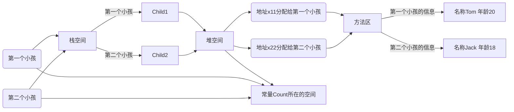
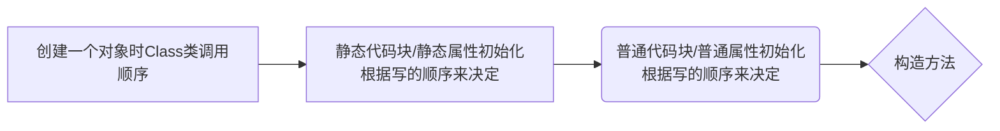
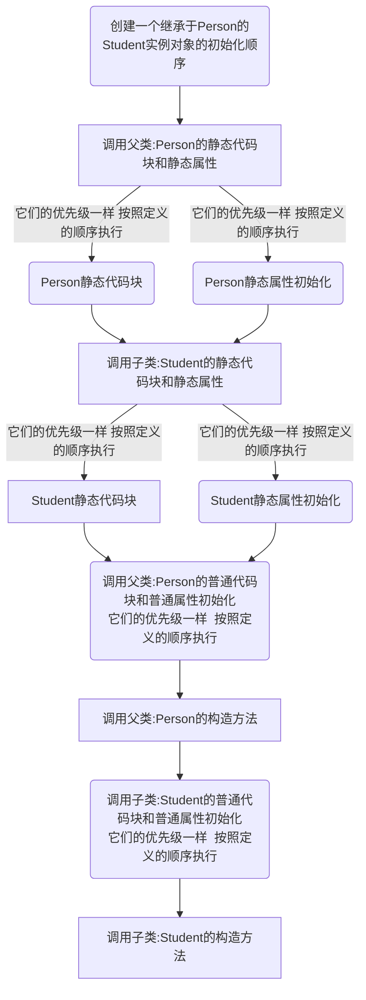

## 类变量

> 现在有一个问题：有一群小孩在玩堆雪人，不时有新的小孩加入，请问如何知道现在共有多少人在玩？编写程序解决

- 用传统的方法来解决
  1. 在main方法中顶一个一个变量`count`
  
  2. 当一个小孩加入游戏后`count++`，最后根据`count`来记录有多少个小孩玩游戏
  
     ```java
     package com.static_;
     
     public class ChildGame {
         public static void main(String[] args) {
     //        定义一个变量，统计有多少个小孩加入了游戏
             int count = 0;
             Child child1 = new Child("白骨精");
             child1.join();
             count++;
             Child child2 = new Child("狐狸精");
             child2.join();
             count++;
             Child child3 = new Child("老鼠");
             child3.join();
             count++;
             System.out.println("共有"+count+"加入了游戏");
         }
     }
     
     class Child{
         private String name;
     
         Child(String name) {
             this.name = name;
         }
     
         public void join(){
             System.out.println(name+"加入了游戏");
         }
     }
     ```
  
  3. 问题分析：
  
     1. `count`是一个独立于对象/类变量的东西，很尴尬
     2. 以后我们**访问count很麻烦**，没有使用到OOP(面对对象编程)
     3. 因此，我们引出`类变量`/`静态变量`来完美的解决该问题

### 使用类变量

> 思考：如果设计一个`int count` 表示总人数，我们在每**创建一个小孩**时，就把count+1，并且count是**所有对象共享的****就OK了，接下来我们使用类变量来解决它

```java
package com.static_;

public class ChildGame {
    public static void main(String[] args) {
        Child child1 = new Child("白骨精");
        child1.join();
        child1.count++;
        Child child2 = new Child("狐狸精");
        child2.join();
        child2.count++;
        Child child3 = new Child("老鼠");
        child3.join();
        child3.count++;
        
//        类变量可以通过类名来访问
        System.out.println("共有"+Child.count+"加入了游戏");
//        下面的变量都统一指向了 public static int count 所以现在输出都是3
//        类变量被所有的对象实例共享
        System.out.println("Child1.count:"+child1.count);
        System.out.println("Child2.count:"+child2.count);
        System.out.println("Child3.count:"+child3.count);
    }
}

class Child{
    private String name;
//    定义一个变量count，是一个类变量(静态变量) static 静态
//    该变量最大的特点就是会被Child类的所有对象实例共享
    public static int count =0;
    Child(String name) {
        this.name = name;
    }

    public void join(){
        System.out.println(name+"加入了游戏");
    }
}
```

好吧，看起来......十分简单，而且早就接触过了似的，就是通过`Static`修饰符定义静态变量，这个变量可以被所有的实例对象共享，一般调用都是直接`Child.count`，而不需要调用实例来使用

接下来看看它的内存布局图



按照上方可得出，类变量是在堆空间中的，当然，也有一些书籍是说类变量在方法区的类信息的静态域中：


无论他放在哪里，有一点是可以肯定的：这个变量是所有实例共享的（被对象共享），且在类加载的时候就被生成了，因此，无论它是在堆中还是在方法区中，都不影响正常的使用

那这玩意到底是在哪里呢？

- 在`JDK8`之前，例如JDK7，JDK6，类变量是被放在方法区的，**静态区中类信息中类方法生成了一个静态域，它就存放于此**
- JDK8及之后，它是放在堆里面的，在这个版本时，**堆中会通过一个反射机制建立一个CLASS的对象，静态的数据将会放在这个Class对象的最后**
  也就是当这个类加载的时候[类在方法区加载]，它会在堆内生成一个对应的Class对象（比如说Child类在加载的时候，就会在堆中生成一个Child类的对象，它是一个原型对象，在创建每个对象的时候，都要依赖它来制造而且可以通过这个对象获取这个类的很多信息，这里稍微了解下就行，后面反射还会碰上它）


CSDN上有位[大佬对此做了详细的到底层的分析](https://blog.csdn.net/x_iya/article/details/81260154/)，可以看到最后写着：


在知乎上，也有相关的问题：[java中的静态变量和Class对象究竟存放在哪个区域？](https://www.zhihu.com/question/59174759/answer/163207831)

可以看到，最高赞同中的答复是：**JDK7以上版本，静态域存储于定义类型的Class对象中，Class对象如同堆中其他对象一样，存在于GC堆中**。

**不管Static变量在哪里，有几点是肯定达到共识的**

1. Static变量是同一个类的所有对象共享的
2. Static是在类加载的时候就生成了

#### 系统的了解类变量

::: info 什么是类变量

类变量也叫静态变量/静态属性，是该类的所有对象共享的变量，任何一个该类的对象去访问它时，取到的都是相同的值，同样任何一个该类的对象去修改它时，修改的也是同一个变量，这个从前面的图也可以看得出来

:::

- 如何定义类变量
  定义语法：
  `访问修饰符 static 数据类型 变量名;`[推荐]
  `static 访问修饰符 数据类型 变量名;`[不太推荐]
- 如何访问类变量
  - 类名.类变量名(`Child.count`) 一般是这样用的多
  
  - 对象名.类变量名(`child1.count`)
  
  - 注意，静态变量的访问修饰符的访问权限和范围 和普通属性是一样的

    | 访问级别 | 访问控制修饰符 | 同包  |       子包       |       子类       |      不同包      |
    | :------: | :------------: | :---: | :--------------: | :--------------: | :--------------: |
    |   公开   |    `public`    | :+1:  |       :+1:       |       :+1:       |       :+1:       |
    |  受保护  |  `protected`   | :+1:  |       :+1:       |       :+1:       | :rotating_light: |
    |   默认   |   没有修饰符   | :+1:  |       :+1:       | :rotating_light: | :rotating_light: |
    |   私有   |   `private`    | :+1:  | :rotating_light: | :rotating_light: | :rotating_light: |

#### 类变量的细节

1. 什么时候要用到类变量？

   > 当我们需要让某个类的所有对象都共享一个变量时，就可以考虑使用类变量(静态变量)
   >
   > 比如：定义学生类，统计所有学生共交多少钱Student(name,fee)

   ```java
   package com.static_;
   
   public class testStatic_ {
       public static void main(String[] args) {
           Student student1 = new Student("张三", 100);
           Student student2 = new Student("李四", 20165.615);
           Student student3 = new Student("王老五", 540654);
       }
   }
   
   class Student{
       public static double allMoney=0;
       private String name;
       private double money;
       public Student(String name,double money) {
           this.name = name;
           this.money=money;
           Student.allMoney+=money;
           goStudent();
       }
       public void goStudent() {
           System.out.println("学生:"+name+"交了:"+money+"学费,现在总共交了"+Student.allMoney+"的学费");
       }
   }
   ```

2. 类变量和实例变量(普通属性)区别

   > **类变量是该类的所有对象共享的**，而**实例变量是每个对象独享的**

3. 加上`static`称为类变量或静态变量，否则称为实例变量/普通变量/非静态变量

   > 反正把变量分成两种用就是了，我是这样理解的：
   >
   > 外面无需New就能调用的加上static
   >
   > 外面需要New才能调用的就不加static

4. 变量名可以通过`类名.类变量名`或者`对象名.类变量名`来访问，但Java设计者推荐使用`类名.类变量名`方式访问(前提是满足访问修饰符的访问权限和设计范围)

5. 实例变量(不加static)的不能通过`类名.类变量名`方式访问

6. 类变量(Static)是在类加载时就初始化了，也就是说，无论你有没有创建对象，只要类加载了，就可以使用类变量

   > 人话：只要import之类的把他导进来了，就可以直接类名访问。
   >
   > 其实本质上用起来跟我之前用Typescript基本没啥区别

7. 类变量的生命周期是随类的加载开始，随着类卸载(消亡)而销毁

## 类方法

- 类方法的基本概述

  > 类方法也叫静态方法
  >
  > 访问形式如下：

  - `访问修饰符 static 数据返回类型 方法名(){}` 推荐这样用，大部分人也是一直这样用
  - `static 访问修饰符 数据返回类型 方法名(){}`

- 类方法的调用

  > 使用方式跟类变量一样。。`类名.类方法名()` 满足修饰访问权限即可

- 举例：

  ```java
  package com.static_;
  
  public class StaticMethod {
      public static void main(String[] args) {
          Stu tom = new Stu("Tom");
  //        类名调用
          Stu.payFee(100);
          Stu.showFee();
          Stu mary = new Stu("mary");
  //        对象名调用
          mary.payFee(20010);
          mary.showFee();
      }
  }
  
  class Stu{
      private String name; //普通属性
  //    定义一个静态变量，来累计学生的学费
      private static double allMoney=0;
  
      public Stu(String name) {
          this.name = name;
      }
      public static void payFee(double fee){
          Stu.allMoney+=fee; //累计到static变量内
      }
      public static void showFee(){
  //        当这玩意加了static就可以直接调用静态属性，而不需要加前缀
  //        注意，静态方法只能调用静态成员，无法调用非静态成员 也就是说这玩意调用name会报错的，除非声明接收一个实例对象，再通过实例对象调用
          //就跟我在上一章中最后那道题案例一样，接收Scanner 接收Server 并调用
          System.out.println("总学费有："+allMoney);
      }
  }
  ```

- 类变量的使用场景：
  - 当方法中不涉及到任何对象的相关成员，则可以将方法设置为static方法，提高开发效率，
  - 比如：工具类中的方法utils
    Math类，Arrays类，Collections 集合类
  - 实际应用：比如封装一下打印数组，冒泡排序等

### 类方法的使用注意事项

1. 类方法和普通方法都是随着类的加载而加载，将结构信息存储在方法区，**类方法中无this的参数**，**普通方法中隐含着This的参数**
2. 类方法可以通过类名调用，也可以通过对象名调用
3. 普通方法和对象有关，需要通过对象名调用，比如：`对象名.方法名(参数||无参)`,不能通过类名调用

> 总结，把这玩意拿来封装自己的工具即可，当然现在也有现成的库：[HuTool](https://www.hutool.cn/)

## 深入理解main方法

> 解释main方法的形式:**public static void main(Stirng args[])**

1. **main方法是由Java虚拟机(JVM)来调用的**

2. Java虚拟机需要调用类的main()方法，所以该对象的访问权限必须是public

   > main关键是，只是被jvm认识一个名字,公共的，静态的，无返回值类型，main ,字符串数组

3. Java虚拟机在执行main()方法时**不必创建对象**，所以该方法**必须是static**

4. 该方法接收String类型的数组参数，该数组中保存执行Java命令时**传递给所运行的类的参数，接收参数**

   ```java
   //手搓一个Hello.java
   public class Hello{
    public static void main(String[] args){
           //遍历args
           for(int i=0;i<args.length;i++){
               System.out.println("第"+(i+1)+"个参数是："+args[i]);
           }
       }
   }
   ```

   > 运行一哈

   ```shell
   javac Hello.java
   java Hello 测试1 测试2 测试3 测试4 安静的卡了巨大 adasdjkl jklhsn 156da1s56 g1f65g1 fsd1f561
   ```

   

5. Java 执行的程序 参数1 参数2 参数3

   > 例如我们平常使用的软件: javac xx.java 就程序 参数1
   >
   > 或者 yarn add yarn install vue@next .....这些cli程序都是可以在启动时传参的

   ```mermaid
   graph TB
   Java运行的类名
   第一个参数-->A
   第二个参数-->A
   第三个参数-->A
   A[Args数组<br>第一个参数<br>第二个参数<br>第三个参数]
   
   ```

6. 当然，正式工作过程中不可能向上面那样传那么简单的参数和参数的判定，可以参考下node/npm/yarn 或者python pip

#### main方法特别提醒

- 在main()方法中，**可以直接调用main方法所在类的静态方法或者属性**
- 但是，**不能直接访问该类中的静态成员**，必须得先创建一个实例对象后，才能通过这个对象去访问类中的非静态成员

#### 扩展-IEDA如何动态传值

> 先找到这样的玩意，一般都在上面靠着 根据主题决定停靠位置


找到这个叫程序实参的填进去就行了，左侧是可运行的代码（有main的）


## 代码块(Code Block)

- 基本介绍
  - 代码块又称为**初始化块**，属于类中的成员[即：是类的一部分]，类似于方法，将逻辑语句封装在方法体中，通过`{}`包装起来
  - 但它和方法不同，**没有方法名，没有返回，没有参数，只有方法体，而且不用通过对象或类显示调用，而是加载类时，或创建对象时隐式调用**
- 基本语法:`[修饰符]{代码}`
- 注意事项
  - `修饰符`可选，要写的话，也只能写static
  - 代码块分为两类，使用static修饰的叫静态代码块，没有static修饰的，叫普通代码块/非静态代码块。
  - 逻辑语句可以为任何逻辑语句(输入，输出，方法调用，循环，判断等)
  - `;`号可以写上写上，也可以省略

### 代码块的好处和案例演示

1. 相当于另外一种形式的构造器(对构造器机制进行补充)，可以做初始化操作
2. 如果**多个**构造器中**都有重复的语句**，可以**抽取到初始化块中**，提高代码的重要性

> 代码块的实例演示
>
> 现在我有一个Movie电影类，类中有三个属性：`name` `price` `director` 我想分别构造(重载构造)，并且无论使用哪种构造方法都会打印出一些放映前的话，如下所示

```java
package com.codeblock_;

public class CodeBlock {
}

class Movie{
    private String name; //电影的名字
    private double price;//电影的价格
    private  String direction; //导演
//    3个 构造器 -->重载关系
//    经观察，可以发现，下面三个构造器都有相同的语句
//    这样代码看起来比较冗余
//    这时候我们可以把相同的语句，放入到一个代码块中即可

    public Movie(String name) {
        System.out.println("电影屏幕打开了...");
        System.out.println("广告开始...");
        System.out.println("广告正式开始了......");
        this.name = name;
    }
    public Movie(String name, double price) {
        System.out.println("电影屏幕打开了...");
        System.out.println("广告开始...");
        System.out.println("广告正式开始了......");
        this.name = name;
        this.price = price;
    }
    public Movie(String name, double price, String direction) {
        System.out.println("电影屏幕打开了...");
        System.out.println("广告开始...");
        System.out.println("广告正式开始了......");
        this.name = name;
        this.price = price;
        this.direction = direction;
    }
}
```

> 使用代码块解决问题：

```java
package com.codeblock_;

public class CodeBlock {
    public static void main(String[] args) {
//        测试下代码块
        Movie movie = new Movie("《提瓦特一日游》");
        Movie movie1 = new Movie("《“我要你——”旅行者抬手指向刻晴》", 999);
        Movie movie2 = new Movie("《我虽无意逐鹿，却知苍生苦楚》", 648, "钟离");
    }
}

class Movie {
    private String name; //电影的名字
    private double price;//电影的价格
    private String direction; //导演
//    3个 构造器 -->重载关系
    {
        System.out.println("电影屏幕打开了...");
        System.out.println("广告开始...");
        System.out.println("广告正式开始了......");
    };
    public Movie(String name) {
        this.name = name;
        System.out.println("Movie(String name)被调用了:"+name);
    }
    public Movie(String name, double price) {
        this.name = name;
        this.price = price;
        System.out.println("Movie(String name)被调用了:"+name+"价格："+price);

    }
    public Movie(String name, double price, String direction) {
        this.name = name;
        this.price = price;
        this.direction = direction;
        System.out.println("Movie(String name)被调用了:"+name+"价格："+price+"制作者："+direction);
    }
}
```

运行结果：

```markdown
电影屏幕打开了...
广告开始...
广告正式开始了......
Movie(String name)被调用了:《提瓦特一日游》
电影屏幕打开了...
广告开始...
广告正式开始了......
Movie(String name)被调用了:《“我要你——”旅行者抬手指向刻晴》价格：999.0
电影屏幕打开了...
广告开始...
广告正式开始了......
Movie(String name)被调用了:《我虽无意逐鹿，却知苍生苦楚》价格：648.0制作者：钟离

进程已结束，退出代码为 0
```

综上可总结一些代码块的特点：

1. 经观察，可以发现，上面三个构造器都有相同的语句
2. 这样代码看起来比较冗余
3. 这时候我们可以把相同的语句，放入到一个代码块中即可
4. 使用代码块后，我们不管调用哪个构造器来创建对象，都会先调用代码块的内容
5. 代码块的调用顺序优先于构造器

### 使用代码块的注意事项

1. 通过static修饰的代码块也叫静态代码块，作用就是对类进行初始化，而且它随着类的加载而运行，并且只会执行一次，如果是普通的代码块，每创建一个对象就会执行

   |      代码块类型       |  加载时间  |    执行次数    |
   | :-------------------: | :--------: | :------------: |
   |    普通代码块`{}`     | 创建对象时 | 每次创建对象时 |
   | 静态代码块`static {}` |  类加载时  |    执行一次    |

2. **类是在什么时候被加载？[重要]**

   1. 创建对象实例时(New Object )
   2. 创建子类对象实例时，父类也会被加载
   3. 使用类的静态成员时(静态属性，静态方法)

   ```java
   package com.codeblock_;
   public class CoeBlockDetail {
       public static void main(String[] args) {
   //        1 创建对象实例时(New)
   //        AA aa = new AA();
   //       AA类的静态代码1被执行了
   
   //        2 创建子类实例对象时，父类也会被加载，而且父类先加载，子类后加载
           AA aa = new AA();
   //        BB类的静态代码1被执行了
   //        AA类的静态代码1被执行了
   
   //        3 使用类的静态成员时(静态变量，静态方法);
           System.out.println(Cat.age);
   //        Cat类的静态代码1被执行了
   //        999
   
   //        静态代码块只会被加载一次，所以后续调用将不会调用静态代码块
           System.out.println(Cat.age);
   //        999
   
       }
   }
   class BB  {
       static {
           System.out.println("BB类的静态代码1被执行了");
       }
   }
   class AA extends BB {
       //    静态代码块
       static {
           System.out.println("AA类的静态代码1被执行了");
       }
   }
   class Cat{
       public static int age=999;
       static {
           System.out.println("Cat类的静态代码1被执行了");
       }
   }
   ```

3. **普通的代码块**，在创建对象实例时，会被隐式调用，**被创建一次，就会被调用一次**，**如果只是实用类的静态成员时，普通代码块并不会被执行**

4. 创建一个对象时，在**<u>一个类</u>**调用顺序是（**重点**）：

   1. 调用静态代码块和静态属性初始化（注意，静态代码块和静态属性初始化时调用的优先级一样，如果有诸多个静态代码块和诸多个静态变量初始化，则按照他们定义的顺序调用）

      ```java
      package com.codeblock_;
      
      public class CodeBlockDetail2 {
          public static void main(String[] args) {
              A a = new A();
      //        Getting N1被调用了
      //        A 静态代码块01
          }
      }
      
      class A{
      //    静态属性的初始化
      //    因为顺序原因，会先对n1进行赋值
          private static  int n1=getN1();
      //    然后再调用静态代码块
      //    如果我把他们两的位置互调一下，那就会先执行静态代码块，再执行静态初始化
      //    反正就一个先后顺序，无论有多少个都是这样的
          static {
              System.out.println("A 静态代码块01");
          }
      //    静态代码
          public static int  getN1(){
              System.out.println("Getting N1被调用了");
              return 10;
          }
      }
      ```

   2. 调用普通代码块和普通属性的初始化（注意，普通代码块和普通属性初始化的调用优先级一样，如果有多个普通属性和多个普通属性初始化，则按照定义顺序调用）

      ```java
      package com.codeblock_;
      
      public class CodeBlockDetail2 {
          public static void main(String[] args) {
              A a = new A();
      //        Getting N1被调用了
      //        A 静态代码块01
      //        Getting N2被调用了
      //        A的普通代码块
      //        无参构造器
          }
      }
      
      class A {
      
          private int n2 = getN2();
      
          {
      //        普通代码块
              System.out.println("A的普通代码块");
          }
      //    无参构造器 构造器始终是在代码块和初始化之后的
          public A(){
              System.out.println("无参构造器");
          }
      
      
          private static int n1 = getN1();
      
          static {
              System.out.println("A 静态代码块01");
          }
      
          public static int getN1() {
              System.out.println("Getting N1被调用了");
              return 10;
          }
      
          public int getN2() {
              System.out.println("Getting N2被调用了");
              return 366;
          }
      
      }
      ```

   3. 调用构造方法



**补充：构造方法（构造器）的最前面其实隐含了super()和调用普通代码块，静态相关的代码块，属性初始化，在类加载时，就执行完毕，因此是优先于构造器和普通代码块执行的**

```java
class A{
    public A(){
        //这里有个隐藏的执行要求
        //1. super();
        //2 调用普通代码块
        System.out.print("A被创建了")
    }
}

```

```java
package com.codeblock_;

public class CodeBlockDetail3 {
    public static void main(String[] args) {
        BBB bbb = new BBB();
        /**
         * 打印顺序：
         * 最高优先级是静态代码块
         * 001 AAA的静态代码块被调用
         * 002 BBB的静态代码块被调用
         * 1 AAA的代码块被调用
         * 2 AAA的构造器被调用
         * 3 BBB的代码块被调用
         * 4 BBB的构造器被调用
         */
    }
}
class AAA{
    static{
        System.out.println("AAA的静态代码块被调用");
    }
    {
        System.out.println("AAA的代码块被调用");

    }
    public AAA() {
        System.out.println("AAA的构造器被调用");
    }
}

class BBB extends AAA{
    
    {
        System.out.println("BBB的代码块被调用");
    }
    static{
        System.out.println("BBB的静态代码块被调用");
    }
    public BBB() {
//        1 super()
//        2 调用本类的普通代码块
        System.out.println("BBB的构造器被调用");

    }
}
```

**创建一个子类时(继承关系)，他们的静态代码块，静态属性初始化，普通代码块，普通属性初始化，构造方法的调用顺序如下**

1. 父类的静态代码块和静态属性(优先级一样，按照定义的顺序执行)
2. 子类的静态代码块和静态属性(优先级一样，按照定义的顺序执行)
3. 父类的普通代码块和普通属性初始化(优先级一样，按照定义的顺序执行)
4. 父类的构造方法
5. 子类的普通代码块和普通属性初始化(优先级一样，按照定义的顺序执行)
6. 子类的构造方法



**注意，静态代码块只能直接调用静态成员（静态属性和静态方法），普通代码块可以调用任意成员**

## 单例设计模式

### 基本介绍

- 什么是设计模式？
  1. 静态方法和属性的经典使用
  2. 设计模式是在大量的实践中总结和理论优化之后的优选的代码结构/编程风格，以及解决问题的思考方式，设计模式就像是经典的棋谱，不同的对局，我们就用不同的棋谱，以免去我们自己再思考和摸索
- 什么是单例模式？(单个的实例)
  1. 所谓类的单例设计模式，就是采取一定的方法保证在整个的软件系统中，对某个类只能存在一个对象实例，并对该类只提供一个取得其对象实例的方法
  2. 单例模式有两种方式：
     1. **饿汉式**
     2. **懒汉式**

### 快速上手

步骤：

1. 构造器私有化(防止new)
2. 类的内部创建对象
3. 向外暴露一个静态的公共方法（getInstance）
4. 代码实现

> 饿汉式代码实现

```java
package com.single_;

public class SingleTon01 {
    public static void main(String[] args) {
//        通过方法可以获取对象
        GirlFriend instance =GirlFriend.getInstance();
        System.out.println(instance);
//        和上面的都指向同一个对象
//        com.single_.GirlFriend@75b84c92
//        com.single_.GirlFriend@75b84c92
//        GirlFriend{name='小红'}
//        GirlFriend{name='小红'}
        GirlFriend instance2 =GirlFriend.getInstance();
        System.out.println(instance2);
        System.out.println(instance==instance2); //true
    }
}

//有一个类 GirlFriend
//只能有一个女朋友
class GirlFriend{
    private String name;

//    如何保证 我们只能创建一个女朋友？
//    步骤[单例模式-饿汉式]
//    1 将构造器私有化 外部不可调用
    private GirlFriend(String name) {
        this.name = name;
    }
//    2 在类的内部直接创建对象（该对象是static）
    private static GirlFriend girlFriend = new GirlFriend("小红");
//    3 提供一个公共的static方法，可以直接返回女朋友对象
    public static GirlFriend getInstance(){
        return girlFriend;
    }
    @Override
    public String toString() {
        return "GirlFriend{" +
                "name='" + name + '\'' +
                '}';
    }
}
```

> 懒汉式

```java
package com.single_;

/**
 * 演示懒汉式的单例设计模式
 */
public class SingleTon02 {
    public static void main(String[] args) {
        System.out.println(Cat.n1);
//       log: 999;
        Cat cat1 = Cat.getInstance();
        System.out.println(cat1);
//       log: Cat被初始化了

//        这玩意就是按需加载，要用到啥就加载啥，不会跟饿汉式一样
//        饿汉式是单例调用任意类型的时候，就加载并初始化了static中的所有内容
//        有时候会因为那玩意降低运行的效率
//        饿汉式则不会

        Cat cat2 = Cat.getInstance();
//        log:null
        System.out.println(cat2);
        System.out.println(cat1==cat2); //cat
    }
}

//希望在程序运行过程中，只能创建一个Cat对象
//使用单例模式
class Cat {
    public static int n1 = 999;
    private String name;

    //步骤：
//    1 仍然将构造器私有化
    private Cat(String name) {
        System.out.println("Cat被初始化了");
        this.name = name;
    }

    //    2 顶一个一个static静态属性对象
    private static Cat cat;

    //    3 提供一个public的static方法，可以返回一个cat对象
    public static Cat getInstance() {
//        如果cat是空的，就创建并返回，否则直接返回cat
        if (cat == null) {
            cat = new Cat("小花猫");
        }
        return cat;
    }

}
```

### 饿汉式和懒汉式的对比

1. 二者最主要的区别在于创建对象的**时机**不同：**饿汉式是在类加载的时候就创建了对象实例**，而**懒汉式是在使用时才会创建**
2. **饿汉式不存在线程安全问题，懒汉式存在线程安全问题**(后面到了多线程就知道了)
3. 饿汉式存在浪费资源的可能，因为如果程序员一个对象实例都没有使用，那么饿汉式创建的对象就浪费了，懒汉式是使用时才创建，不存在这个问题
4. 在`JavaSE`标准内中，`java.lang.Runtime`就是经典的单例设计模式

### 小结

1. 单例模式的两种实现方式
   1. 饿汉式
   2. 懒汉式
2. 饿汉式的问题：在类加载的时候就被创建，可能存在资源浪费的问题
3. 懒汉式的问题：线程安全问题，后面到线程会有详情和解决方案
4. 这个本质上还是很简单的

## Final关键字(常量)

### 基本介绍

`final` 中文意思：最后的，最终的

`final`可以修饰类，属性，方法和局部变量

在某些情况下，程序员可能有以下要求，就会用到`final`

1. 当**不希望类被继承时**，可以用`final`修饰

   ```java
   package com.final_;
   public class Final01 {}
   //当我们要求A类不能被其他类继承
   //可以用fina修饰A类即可
   final class TooA {}
   class TooB extends TooA {}
   ```

   

2. 当**不希望父类的某个方法被子类覆盖/重写时**，可以用`final`修饰

   ```java
   package com.final_;
   
   public class Final01 {
   }
   class TooC {
   //    如果我们不希望hi()被子类重写，可以使用final来修饰hi方法
       public final void hi(){
           System.out.println("Hello World");
       }
   }
   
   class TooD extends TooC {
       @Override
       public void hi() {
           System.out.println("重写了TooC的hi()方法");
       }
   }
   ```

   

3. 但**不希望类的某个属性的值被修改时**，可以用`final`修饰

   ```java
   package com.final_;
   
   public class Final01 {
       public static void main(String[] args) {
           TooE tooE = new TooE();
           tooE.TAX_RATE=0.999156;
       }
   }
   class TooE{
       public final double TAX_RATE= 0.08; 
   
   }
   ```

   

4. 当**不希望某个局部变量被修改**，可以使用`final`修饰

   ```java
   class TooF{
       public void cry(){
           final double NUM =0.09;
           NUM=1.1561564;
           System.out.println("NUM="+NUM);
       }
   }
   ```

   

> 嘛 用起来就跟JavaScript or Go语言中的`const`一样 定义一个常量啥的，不允许被修改

通常来说，为了规范，常量的值采用全大写下划线命名法，例如

- 常规变量名`name` 如果要改成常量的话就是`NAME`
- 常规变量名`dayPrice` 如果要改成常量的话就是`DAY_PRICE`

### final使用注意事项和细节

1. final修饰的属性又被称之为常量，一般用`XX_XX_XX来命名

2. final修饰的属性在定义时，必须赋初始值，并且以后不能再更改，赋值可以在如下位置之一(选择一个位置赋值即可)

   1. 定义时：如：`public final double TAX_RATE_KITE_COLOR_PAGE_FACE_NF=0.08`
   2. 在构造器中
   3. 在代码块中

3. 如果**final修饰的属性是static(静态的)**，则初始化的位置只能是：

   1. **定义时**
   2. **在静态代码块，不能在构造器中赋值**

4. **final类不能继承，但是可以实例化对象**（断子绝孙）

5. 如果类**不是final类，但是含有final方法**，则**该方法虽然不能被重写，但是可以被继承**

6. 一般来说，如果**一个类已经是final类**了，就**没有必要再将方法修饰成final**方法(都不能被继承了，为啥还要限制重写方法)

7. **final不能修饰构造器(构造方法)**

8. **final和static往往搭配使用，效率更高，不会导致类加载， 底层编译器做了优化**

   ```java
   package com.final_;
   
   public class Final02 {
       public static void main(String[] args) {
           System.out.println(A.NUM);
       }
   }
   
   class A{
       public final static int NUM = 10000;
       static{
           System.out.println("A的静态代码块被执行了");
       }
   }
   ```

   

9. 包装类(Interget,Double,Float,Boolean等都是final类),String也是final类

## 抽象类(abstract)

抽象类是啥，有什么作用？

首先看一段代码

```java
Class Animal{
    private String name;
    private int age;
    public Animal(String name,int age){
        this.name=name;
        this.age=age;
    }
    //动物都有的eat行为
    //我们非常清楚，所有动物都能吃东西，这个eat的方法往往都是要子类去重写他，但是因为子类要重写eat所以就得在这个父类中定义eat，就相当矛盾 这就是父类方法不确定性问题
    public void eat(){
        System.out.println("这是一个动物，但是目前不知道该吃什么");
    }
}
```

当父类的某些方法，需要声明，但是又不确定如何实现时，可以将其声明为抽象方法，那么这个类就是抽象类，简而言之：**我们有一个父类，他之中有一些方法我们不确定该怎么样去实现，并且我们也不想去直接在父类上实现，这时，就可以把这个方法改造成抽象方法，并把这个类改为抽象类**

```java
package com.abstract_;

public class Abstract01 {
    public static void main(String[] args) {
        Animal cat =new Cat("猫猫");
        cat.eat();
    }
}
abstract class Animal{
    public String getName() {
        return name;
    }
    public void setName(String name) {
        this.name = name;
    }
    private String name;

    public Animal(String name) {
        this.name = name;
    }
    /*
     * 思考：这里的eat，即使实现了，其实没有什么意义
     * 即：父类方法不确定性问题
     * ---> 考虑将该方法设计为(abstract)方法，
     * ---> 所谓抽象方法就是没有实现方法
     * ---> 所谓没有实现 就是指没有方法体
     * ---> 一旦类中包含有抽象方法时，类也要声明为抽象类
     * ---> 一般来说，抽象类会被继承，由它的子类来实现抽象的方法
     */
//    public void eat() {
//        System.out.println("这是一个动物，但是不知道吃什么...");
//    }
    public abstract void eat();
}

/**
 * 实现抽象类
 */
class Cat extends Animal{

    public Cat(String name) {
        super(name);
    }

    @Override
    public void eat() {
        System.out.println(getName()+"在吃鱼干");
    }
}

```

### 抽象类的介绍

1. 用`abstract`关键字来修饰一个类时，这个类就叫做抽象类

   ```java
   访问修饰符 abstract 类名{
       
   }
   ```

2. 用`abstract`关键字来修饰一个方法时，这个方法就是抽象方法，**抽象方法没有方法体**，即不能实现

   ```java
   访问修饰符 abstarct 返回类型 方法名(参数);
   ```

3. 抽象类的价值更多作用是在于设计，是设计者设计好后，让子类继承并实现抽象类

4. 抽象类是考官比较爱问的知识点，在框架和设计模式使用较多

5. **抽象类无法被实例化(无法New出来)**

6. 抽象类不一定要包含`abstract`方法，也就是说，抽象类可以没有`abstract`方法

   ```java
   abstract class A{
       //抽象类不一定要包含abstract方法，也可以包含可以实现的方法
       public void hi(){
           System.out.prinln("Hi~");
       }
   }
   ```

7. 一旦包含了`abstract`方法，则这个类必须声明为抽象类

8. `abstract`只能修饰类和方法，不能修饰属性和其他的Hello啊

9. 抽象类可以拥有任意成员（抽象类本质还是类），比如：非抽象方法，构造器，静态函数等

10. 如果一个类继承了抽象类，则它必须实现抽象类的所有抽象方法，除非它自己也是一个`abstarct`类(~~人话：总有一个人要接盘的，至于是谁来接盘的问题`abstarct`酱目前丝毫不关心~~)

11. 抽象方法不能使用`private` `final` 和`static`来修饰，因为这些关键字都是和重写违背的

### 抽象类的最佳实践-模板设计模式

需求：

- 有多个类，完成不同的任务job
- 要求能够得到各自完成任务的时间

```java
package com.abstract_;

public class TestTemplate {
    public static void main(String[] args) {
        OrgA orgA = new OrgA();
        orgA.job();
        OrgB orgB = new OrgB();
        orgB.job();
    }
}

class OrgA {
//    计算任务
//    1+...+1000
    public void job() {
//        得到开始的时间 使用了System中的获取时间戳功能
        long startTime = System.currentTimeMillis();
        long num = 0;
        for (long i = 1; i < 1000000; i++) {
            num += i;
        }
//        得到结束的时间
        long end = System.currentTimeMillis();
        System.out.println("AA执行时间：" + (end - startTime) + "ms");
    }
}

class OrgB {
    public void job() {
        long start = System.currentTimeMillis();
        long num = 0;
        for (long i = 1; i < 1000000; i++) {
            num *= i;
        }
//        得到结束的时间
        long end = System.currentTimeMillis();
        System.out.println("BB 执行时间：" + (end - start) + "ms");
    }
}
```

可以看到，他们之中的代码大体都相同，就那么一两行不一样，一个是+=,一个是*=，为此，我依旧还是要写这么多行重复的代码，接下来我试图封装一下它

```java
package com.abstract_;

public class TestTemplate {
    public static void main(String[] args) {
        OrgA orgA = new OrgA();
        orgA.job();
        OrgB orgB = new OrgB();
        orgB.job();
    }
}

class OrgA {
    public void calculateTimes(){
        long startTime = System.currentTimeMillis();
        job();
        long endTime = System.currentTimeMillis();
        System.out.println("AA执行时间：" + (endTime - startTime) + "ms");

    }
    public void job() {
        long num = 0;
        for (long i = 1; i < 1000000; i++) {
            num += i;
        }
        long end = System.currentTimeMillis();
    }
}

class OrgB {
    public void calculateTimes(){
        long startTime = System.currentTimeMillis();
        job();
        long endTime = System.currentTimeMillis();
        System.out.println("BB执行时间：" + (endTime - startTime) + "ms");
    }
    public void job() {
        long num = 0;
        for (long i = 1; i < 1000000; i++) {
            num *= i;
        }

    }
}
```

可以看到，这样封装一下，我的job代码就只需要关心它该执行的事情了，计算时间的事情会由`calculateTimes`来完成，这就是一种方法的**组合模式**，但此时假设还有一个CC，那么就又要重写一遍`calculateTimes`了，这不太舒服，所以就要用到继承来解决问题了，我就将父类作为一个模板累类，然后将`job`作为一个抽象方法，形成一种设计模式，这种设计模式就叫做**模板设计模式**

> 设计一个抽象类(Template) 以完成如下功能

1. 编写一个方法`calculateTime()` 可以计算某段代码的消耗时间
2. 编写抽象方法`job()`
3. 编写一个子类，继承抽象类Template,并实现Job方法
4. 编写一个测试类`TestTemplate()`，看看是否好用

```java
package com.abstract_;
public class TestTemplate {
    public static void main(String[] args) {
        OrgA orgA = new OrgA();
        System.out.println("orgA的"+orgA.calculateTimes());
        OrgB orgB = new OrgB();
        System.out.println("orgB的"+orgB.calculateTimes());

    }
}
abstract class Org {
    public String calculateTimes() {
        long startTime = System.currentTimeMillis();
        job(); //动态绑定，跟实际运行的对象绑定
        long endTime = System.currentTimeMillis();
        return "执行时间：" + (endTime - startTime) + "ms";
    }
 // 抽象方法
    public abstract void job();
}

class OrgA extends Org {
    public void job() { //实现了抽象方法
        long num = 0;
        for (long i = 1; i < 1000000; i++) {
            num += i;
        }
        long end = System.currentTimeMillis();
    }
}

class OrgB extends Org {

    public void job() {//实现了抽象方法
        long num = 0;
        for (long i = 1; i < 1000000; i++) {
            num *= i;
        }

    }
}
```

## 接口

为什么有接口？


USB插槽就是现实中的接口，你可以把手机，相机，U盘都插在USB插槽上，而不用担心那个插槽是专门插哪个的，原因就是做USB插槽的厂家和做各种设备的厂家都遵循了统一的规定，包括尺寸，排线等

这样的设计需求在Java编程/PhP/.net/Typescript/GoLang中也是大量存在的，一个程序就是一个世界，在现实世界存在的情况，往往在编程中也会出现，我们用程序来模拟一下

```java
package com.interface_;

public interface UsbInterFace {
//    规定接口的相关方法
    public void start();
    public void stop();
}
```

```java
package com.interface_;

public class Camera implements UsbInterFace{ //实现接口 本质就是把接口的方法完成

    @Override
    public void start() {
        System.out.println("相机开始了工作");
    }

    @Override
    public void stop() {
        System.out.println("相机停止了工作");
    }
}

```

```java
package com.interface_;

//phone类实现USBInterFace
public class Phone implements UsbInterFace{
    @Override
    public void start() {
        System.out.println("手机开始工作");
    }
    @Override
    public void stop() {
        System.out.println("手机停止工作");
    }
}

```

```java
package com.interface_;

public class Computer {
//    编写一个方法
    public void work(UsbInterFace usbInterFace){
//        通过接口来调用方法
        usbInterFace.start();
        usbInterFace.stop();
    }
}

```

```java
package com.interface_;

public class Interface01 {
    public static void main(String[] args) {
//        创建手机 相机对象
        Camera camera = new Camera();
        Phone phone = new Phone();
//        创建计算机
        Computer computer = new Computer();
        computer.work(phone); //把手机接入到计算机
        System.out.println("---------");
        computer.work(camera); //把相机接入到计算机
    }
}
```

> 看起来则挺酷的，一个接口，通过实例化类和方法，让其方便的调用

### 接口的基本介绍

接口就是给出一些没有实现的方法，封装到一起，到某个类要使用的时候，再根据具体情况把这些方法写出来，语法：

```java
interface 接口名{
 定义属性;
    定义方法;(1 抽象方法,2 默认实现方法 3 静态方法---在JDK8及之后才有的)
}
class 类名 implements 接口{
    自己的属性;
    自己的方法;
    必须实现接口的抽象方法
}
```

> 小Tips

- 在Jdk7.0前 接口里的所有方法都没有方法体,即都是抽象方法
- Jdk8.0后 接口类可以有静态方法,默认方法,也就是说接口中可以有方法的具体表现

### 接口的深入讨论

理解接口的概念不算太南,难的是不知道什么时候使用接口,下面举例几个应用场景

1. 现在要制造战斗机/武装直升飞机.专家只需要把飞机需要的功能/规定定下来即可,然后让别的人具体实现就可以

   

2. 现在有一个项目经理,手下有三个程序猿,功能开发一个软件,为了控制和管理软件,项目经理可以定义一些接口,然后由程序猿具体负责实现
   实际要求:3个程序猿,编写三个类,分别完成对Mysql,Oracle,Db2数据库的链接
   connect,close,Interface......
   

### 接口的使用细节

1. **接口不能被实例化**

2. 接口中**所有方法**都是`public`方法，接口中的抽象方法可以不用`abstract`修饰，当然**不允许**使用`protected`或者`private`来进行修饰

   ```java
   void aaa();
   实际上是 public abstract void aaa();
   ```

3. 接口中可以定义普通变量，普通方法，静态变量，静态方法，但是在定义普通方法时，需要用`default`关键字修饰

   ```java
   public default void run(){
       System.out.println("Run起来了，一切都会好起来的！")
   }
   ```

4. 一个**普通类实现接口**，就**必须要将接口的所有抽象方法都实现**

5. **抽象类实现接口，可以不用实现接口的方法**，但总归有人要来接盘的...

6. **一个类可以同时实现多个接口，但是只能继承一个父类**

   ```java
   interface Usb {
       void start();
   
       void stop();
   }
   
   interface WIFI {
       void open();
   
       void close();
   }
   //实现多个接口
   class Test implements Usb, WIFI {
   
       @Override
       public void start() {
           System.out.println("USB连接上了");
       }
   
       @Override
       public void stop() {
           System.out.println("USB断开了链接");
       }
   
       @Override
       public void open() {
           System.out.println("打开了WIFI");
       }
   
       @Override
       public void close() {
           System.out.println("关闭了WIFI");
       }
   }
   ```

7. 接口中的属性只能是final的，而且是`public static final`修饰符，比如：

   ```java
   int a=1;
   实际上是： public static final int a=1;
   定义的时候必须初始化值！
   ```

8. 接口中属性的访问形式：接口名.属性名

   ```java
   package com.interface_;
   
   public class InterfaceDetail03 {
       public static void main(String[] args) {
   //        非实现接口的类的静态方法的调用
           int faceRun = Usb.faceRun;
       }
       public void TestUsB(){
   //        非实现接口的类的的普通方法调用
           System.out.println(Usb.faceRun);
       }
   }
   
   interface Usb {
       void start();
   //    定义
       public int faceRun= 10;
       void stop();
   }
   
   class Test implements Usb {
   
       @Override
       public void start() {
           System.out.println("USB连接上了");
   //实现接口的类调用 无需加Super 但是通常来说为了规范一些都是 Usb.FaceRun这样的形式来调用
           System.out.println(faceRun);
       }
       @Override
       public void stop() {
           System.out.println("USB断开了链接");
       }
   
   }
   ```

9. 接口不能继承其他的类，但是可以继承多个别的接口

   ```java
   interface Usb {
       void start();
   //    定义
       public int faceRun= 10;
       void stop();
   }
   interface WIFI{
       void run();
       void stop();
   }
   
   //接口不能继承其他的类，但是可以继承(extends)多个别的接口 不能implements别的接口！
   interface Router extends WIFI,Usb{
       void open();
       void shutdown();
   
   }
   //这样子类实现起来就是多倍的快乐。。。
   class TestRouter implements Router{
   
       @Override
       public void start() {
   
       }
   
       @Override
       public void run() {
   
       }
   
       @Override
       public void stop() {
   
       }
   
       @Override
       public void open() {
   
       }
   
       @Override
       public void shutdown() {
   
       }
   }
   ```

10. 接口的修饰符，只能是public和默认，这点和类的修饰符是一样的

### 关于实现接口和继承类

其实实现接口就是对Java单继承的一种补充，让类可以变得多元化


比如这只小猴子，他继承至他的父类-大猴子，所以他会吃饭，会跑步，会爬树，并且，他实现了鸟的接口，所以他现在会飞，他实现了鱼的接口，他现在会游泳...大概就是这么回事

> 接口就是拿来弥补继承中单一性导致的程序某些方面不足的玩意。

### 接口的多态性质

1. 多态参数，就拿前面的Usb接口来举例子：

   ```java
   package com.interface_;
   
   public class Computer {
     //多态参数   
       //解读
       // 1 UsbInterFace usbInterFace 形参是接口类型UsbInterFace
       // 2 可以看到这个参数接收一个实现了UsbInterFace接口的类
       
       public void work(UsbInterFace usbInterFace){
           usbInterFace.start();
           usbInterFace.stop();
       }
   }
   
   ```

   在前面的USB接口案例，UsbInterface既可以接收手机对象，又可以接收相机对象，就体现了接口的多态性（**接口引用可以指向实现了接口的类的对象**）

2. 多态数组

   ```java
   package com.interface_;
   
   public class InterfacePloyArr {
       public static void main(String[] args) {
   //        多态数组-->接口类型数组
           Usb_[] usbs = new Usb_[2];
           usbs[0] = new Phone_();
           usbs[1] = new Camera_();
           for (Usb_ usb : usbs) {
   //            老一套，判断运行类型
               if (usb instanceof Phone_) {
                   ((Phone_) usb).call();
               }
               usb.work();
           }
           /*
           * 在USB数组中，存放Phone和相机对象，Phone类还有一个特有的call方法
           * 遍历该数组，如果是phone对象，就调用phone方法，并且调用usb接口定义的work方法
           * */
       }
   }
   
   
   interface Usb_ {
       void work();
   }
   
   class Phone_ implements Usb_ {
       public void call() {
           System.out.println("手机可以打电话");
       }
   
       @Override
       public void work() {
           System.out.println("手机工作中");
       }
   }
   
   class Camera_ implements Usb_ {
   
       @Override
       public void work() {
           System.out.println("相机工作中");
       }
   }
   ```

3. 接口存在**多态传递**现象

## 内部类

> 一个类的内部又完整的钱啊讨论另一个类结构，被嵌套的类称为内部类(`inner class`)，嵌套其他类的类称为外部类(`outer class`)。是类中的第五大成员，内部类最大的特点就是可以直接访问私有属性，并且可以体现类与类之间的包含关系

### 基本语法

```java
package com.innerclass;

public class InnerClass01 { //外部其他类
    public static void main(String[] args) {

    }
}

class Outer {//外部类
    private int n1 =100;//属性

    public Outer(int n1) { //构造器
        this.n1 = n1;
    }

    public void m1(){//方法
        System.out.println("m1()");
    }
    {//代码块
        System.out.println("代码块");
    }

    class Inner{ //内部类，在Outer的内部

    }

}
```

> 在Java中，内部类总共有四种，划分了两种分类

- 定义在外部类局部变量上（比如方法内）
  1. 布局内部类（有类名）
  2. 匿名内部类（**没有类名**，这个东西在开发中用的非常多多多多多多）
- 定义在外部类的成员位置上
  1. 成员内部类（没用static修饰）
  2. 静态内部类（使用static修饰）

### 局部内部类的使用（有类名）

说明：局部内部类是定义在外部类的局部位置，比如方法中，并且有类名，他的特点是：

1. **可以直接访问外部类的所有成员，包含私有的**
2. 不能添加访问修饰符，因为他的地位就是一个局部变量，局部变量不能使用修饰符的，但是可以使用`final修饰`，因为局部变量也可以使用`final`
3. **作用域：仅仅在定义它的方法或者代码块中**
4. 局部内部类访问外部类的成员--->直接访问即可
5. 外部类访问局部内部类的成员：
   访问方式：创建对象，再访问（注意，必须在**作用域**内）
6. 外部其它类**不能访问**局部内部类(因为局部内部类的定位就是一个局部变量)
7. 如果外部类和局部内部类的成员重名时，默认遵循就近原则，如果想访问外部类的成员，可以去使用(外部类名.this.成员)去访问

8.

```java
package com.innerclass;

/**
 * 演示局部内部类的使用
 */
public class LocalInnerClass {
    public static void main(String[] args) {
        Outer02 outer02 = new Outer02();
        outer02.m1();
    }
}

//外部类
class Outer02 {
    private int n1 = 100;

    private void m2() { //私有方法
        System.out.println("Outer外部类的m2方法被调用了");

    }

    public void m1() {
//        1. 局部内部类是定义在外部类的局部位置，通常都是在方法中定义
        class Inner02 {
            //局部内部类（本质任然是一个类）
//        3.  不能够添加访问修饰符，因为他的定位就是一个局部变量，但是可以使用final修饰
//         2.   可以直接访问外部类的所有成员，包括私有的
//            4. 他的作用域仅仅在他的方法或代码块中 这里相当于只能在M1方法中使用
            public void f1() {
//               5. 布局内部类可以直接访问外部类的成员，比如;
                System.out.println("n1=" + n1);
                m2();
            }
        }

        final class Inner03 extends Inner02 {

        }

//      6.  外部类在方法中，可以创建Inner02这个对象实例，然后调用方法即可
        Inner02 inner02 = new Inner02();
        inner02.f1();
        System.out.println("Outer外部类的m1方法被调用了");
    }

    {
//        代码块中也能存在局部内部类，性质和方法中的一样
        class Inner04 {

        }
    }

}
```

上方代码*DeBug*一下就一目了然了

### 匿名内部类(重要)

1. 本质是一个类
2. 是一个内部类
3. 是一个匿名的(该类没有名字，或者说他的名字是由系统决定的)
4. 匿名内部类同时还是一个对象

> 简而言之，匿名内部类是定义在外部类的局部位置，比如说在方法中，并且他没有类名(表面上看没有)，

- 基本语法：

  ```java
  new 类或接口(参数列表){
      类体
  }
  ```

案例演示[AnonymousInnerClass.java]

```java
package com.innerclass;

/**
 * 演示匿名内部类的使用
 */
public class AnonymousInnerClass { //外部其它类
    public static void main(String[] args) {
        new Outer04().method();
    }
}


class Outer04 { //外部类
    private int n1 = 10;

    public void method() {//方法
//        基于接口的匿名内部类
//        1. 需求：我要实现一个A接口，并创建对象
//        2. 传统的方式就是：写一个类，实现该接口，并创建对象
//        2.2 传统的创建对象，并调用
//        A tiger = new Tiger();
//        tiger.cry();
//        3. 现在的需求是，这个Tiger类只使用一次，后面再也不使用了
//        3.1 并且可能会存在其他的动物，例如Dog，按照传统的方法会定义很多类，特别繁琐
//        4. 解决方法：使用匿名内部类来简化开发
//        5. Tiger的编译类型是？ 看等号的左边：A
//        6. Tiget的运行类型是？ 就是匿名内部类XXX==>Outer04$1
        /*
         * 我们看底层 会分配一个类名 Outer04$1
         * class Outer04$1 implements A{
         *    @Override
         *   public void cry() {
         *        System.out.println("老虎在叫");
         *   }
         * }
         * A tiger = new Outer04$1();
         * */
//        7. JDK底层在创建了匿名内部类Outer04$1后，立即创建了它的实例，
//        并且把地址返回给 tiger
//        8. 匿名内部类使用一次，就不能再使用了（Outer04$1拿来创建了tiget这个实例后就跟消失了一样，但是tiget在这个作用域类是可以正常使用的）
        A tiger = new A() {
            @Override
            public void cry() {
                System.out.println("老虎在叫");
            }
        };
        tiger.cry();
        System.out.println("tiger.getClass()-运行类型:" + tiger.getClass());//class com.innerclass.Outer04$1

//        演示基于类的匿名内部类
//        分析
//        1. father编译类型 Father
//        2. father运行类型 Outer04$2
//        3. 底层会创建匿名内部类
        /*
         * class Outer04$2 extends Father{......重写方法等操作}
         * Father father =new  Outer04$2("Hello world")
         * 这个参数实际上传递给了Father的构造器(继承原理)
         * */

        Father father = new Father("Hello world") {
//            注意，匿名内部类中不能有构造方法！！！
            @Override
            public void test() {
                System.out.println("匿名内部类重写了test方法");
            }
        };
        System.out.println("father的运行类型：" + father.getClass()); //class com.innerclass.Outer04$2
        father.test(); //匿名内部类重写了test方法

//        基于抽象类的匿名内部类
        Animal animal = new Animal() {
            @Override
            void cry() {
                System.out.println("实现了抽象类Animal的抽象方法");
            }
        };
        System.out.println("animal的getclass："+animal.getClass()); //Outer04$3
        animal.cry();

    }
}

interface A { //接口
    public void cry();
}

class Tiger implements A { //2.1 传统的解决方法：创建一个类

    @Override
    public void cry() {
        System.out.println("老虎嗷嗷叫");
    }
}

class Father {
    public Father(String name) {//构造器
        System.out.println("接收到了name:"+name);
    }

    public void test() {//方法

    }
}

abstract class Animal{ //抽象类
    abstract void cry();
}
```

匿名内部类本身的语法比较奇特，需要注意下，因为匿名内部类既是一个类的定义，同时它本身也是一个对象，因此从语法上看，它既有定义类的特征，也有创建对象的特征，对前面的代码分析可以看出来这个特点，因此可以调用匿名内部类方法

```java
package com.innerclass;

public class AnonymousInnerClass02 {
    public static void main(String[] args) {
    new Outer05().f1();
    }
}
class  Outer05{
    private int n1 =99;
    public void f1(){
//        创建一个基于类的匿名内部类
        Person person = new Person() {
            @Override
            public void hi() {
                System.out.println("匿名内部类的hi方法");
            }
        };
        person.hi();// 动态绑定机制，运行类型是Outer05$1

//        也可以直接调用,匿名内部类本身也是返回对象
        new Person(){
            @Override
            public void hi() {
                System.out.println("hahahahah");
            }
        }.hi();
    }
}
class Person{
    public void hi(){
        System.out.println("Person的hi方法");
    }
}
```

- 匿名内部类可以访问外部类的所有成员，包括私有的

  ```java
  class  Outer05{
      private int n1 =99;
      public void f1(){
          Person person = new Person() {
              @Override
              public void hi() {
                  System.out.println("匿名内部类的hi方法");
                  System.out.println("调用外部的n1:"+n1);//99
              }
          };
          person.hi();
      }
  }
  
  ```

- 不能添加访问修饰符，因为它的地位就是一个局部变量

- 作用域：仅仅在定义它的方法或者代码块中

- 匿名内部类访问外部成员：直接方法问

- 外部其他类 不能访问匿名内部类（因为匿名内部类的地位就是一个局部变量）

- 如果外部类和匿名内部类的成员重名时，匿名内部类访问的话，默认就遵循就近原则，如果先访问外部类的成员，则可以用（外部类名.this.成员）去访问

  ```java
  package com.innerclass;
  
  public class AnonymousInnerClass02 {
      public static void main(String[] args) {
      new Outer05().f1();
      }
  }
  class  Outer05{
      private int n1 =99;
      public void f1(){
  //        创建一个基于类的匿名内部类
          Person person = new Person() {
              int n1 =233;
              @Override
              public void hi() {
                  System.out.println("匿名内部类的hi方法");
                  System.out.println("匿名内部类的n1:"+n1);//233
                  System.out.println("外部类的n1:"+Outer05.this.n1);/99
              }
          };
          person.hi();
  
      }
  }
  class Person{
      public void hi(){
          System.out.println("Person的hi方法");
      }
  }
  
  ```

#### 匿名内部类的最佳实践

- 当做实参传递 简洁高效

  ```java
  package com.innerclass;
  
  public class InnerClassExercise01 {
      public static void main(String[] args) {
          f1(new AA() {
              @Override
              public void show() {
                  System.out.println("这是一幅名画");
              }
          });
      }
  //    静态方法 形参是接口类型
      public static void f1(AA obj){
          obj.show();
      }
  }
  
  //接口
  interface AA{
      void show();
  }
  ```

### 成员内部类的使用

说明：成员内部类是定义在外部类的成员位置，并且没有static修饰

1. 可以直接访问外部类中的所有成员，包括私有的

2. 可以添加任意访问修饰符(public protected 默认 private)，因为它的地位就是一个成员

3. 作用域和外部类的其他成员一样，为整个类体

4. 成员内部类范围外部类的属性，变量：直接访问

5. 外部类访问成员内部类的属性，变量：创建对象，再访问

6. 外部其它类访问成员内部类：

   ```java
   package com.innerclass;
   
   /**
    * 成员内部类
    */
   public class MemberInnerClass {
       public static void main(String[] args) {
           Outer08 outer08 = new Outer08();
           outer08.t1();
   //        outer的N110
   //        outer的name张三
   
   //        外部其它类，使用成员内部类的三种方式
   //        第一种方法
   //        1 相当于把new Inner08 当做是Outer08的成员 这就是一个语法，不要特别的纠结
           Outer08.Inner08 inner08 = outer08.new Inner08();
   
   //        第二种方式，在外部类中编写一个方法，可以返回成员内部类
           Outer08.Inner08 inner081 = outer08.getInner08();
   
   //        第三种方式
           Outer08.Inner08 inner082 = new Outer08().new Inner08();
   
       }
   }
   
   
   class Outer08 {
       private int n1 = 10;
       public String name = "张三";
   
       class Inner08 {
           public void say() {
               System.out.println(
                       "outer的N1" + n1 + "\n" +
                               "outer的name" + name
               );
           }
       }
   
   //    写方法调用成员内部类
       public void t1(){
           Inner08 inner08 = new Inner08();
           inner08.say();
       }
   
   //    方法，返回一个Inner08的实例
       public Inner08 getInner08() {
           return new Inner08();
       }
   
   }
   ```

7. 如果外部类和匿名内部类的成员重名时，匿名内部类访问的话，默认就遵循就近原则，如果先访问外部类的成员，则可以用（外部类名.this.成员）去访问

### 静态内部类的使用

静态内部类是定义在外部类的成员位置，并用static修饰

特点：

1. 可以直接访问外部类的所有静态成员，静态方法，包括私有的，但不能直接访问非静态成员
2. 可以添加任意访问修饰符，因为他的地位就是一个成员
3. 作用域：同其他的成员，为整个类体
4. 访问方式：和成员内部类一样

## 扩展-类的五大成员(面试大概率会问道)

他们分别是：

- 属性
- 方法
- 构造器
- 代码块
- 内部类
