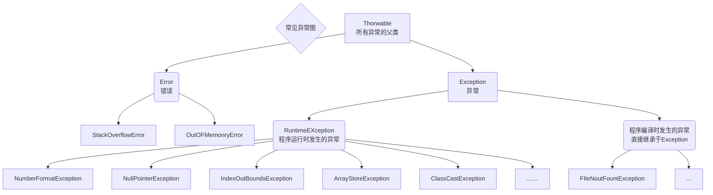
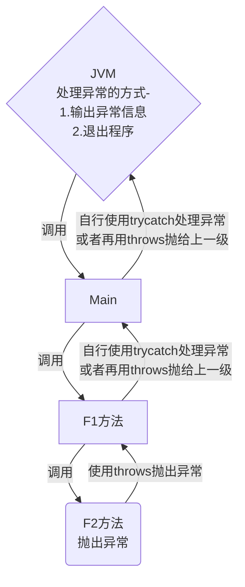

## 异常的概念

> 在说到异常前，来看一段代码：

```java
package com.exception_;

public class Exception01 {
    public static void main(String[] args) {
        int num1=10;
        int num2 =0;
//        num1/num2 ==>10/0
//        当执行到num1/num2时，程序就会抛出异常：ArithmeticException
//        当抛出异常后，程序就结束了（崩溃了），下面的代码就不再执行
//        思考，这样的程序好吗？这样不好，不应该因为出现了一个不算致命性的问题，就导致整个程序停止运行/整个系统崩溃
//        Java设计者 提供了一个 异常处理机制 来处理该问题
        int res =num1/num2;
        System.out.println("程序继续运行");
    }
}

```

上方代码结果：


截下来使用try-catch来解决这个问题：

```java
package com.exception_;

public class Exception01 {
    public static void main(String[] args) {
        int num1=10;
        int num2 =0;

//        如果程序员 认为一段代码可能出现异常/问题，可以使用try-catch机制来处理异常
//        从而保证程序的健壮性
//        小tips：在IDEA中，可以把想要处理的代码选中，按Ctrl+alt+T来快速创建trycatch
//        或者在一句代码后面.try也可以自动生成
//        如果进行异常处理，name及时出现了异常，程序也可以继续执行

        try {
            int res =num1/num2;
        } catch (Exception e) {
//            e.printStackTrace(); 打印异常
            System.out.println("出现异常的原因"+e.getMessage()); //输出异常的信息
        }
        System.out.println("程序继续运行");
    }
}
```

运行结果：


可以看到，烦人的异常消失了，接下来仔细了解下它

### 异常的解决方案-Try-Catch

#### 基本概念

Java语言中，将程序执行中发生的不正常情况称之为*异常*(**开发过程中的语法错误和逻辑错误不是异常**)

- 程序执行过程中所发生的异常事件可分为两类
  1. `Error`(错误):**Java虚拟机无法解决的严重问题**，如：
     - JVM内部系统错误，资源耗尽等严重情况，比如：
       - `Stack Overflow Error`栈溢出
       - `OOM(out of memory)`
     - **ERROR是严重错误，程序会崩溃**
     - 就相当于一个人得了癌症一样，是无法处理的(就目前科技来说)
  2. `Exception`:其他原因变成错误或偶然的外在因素下导致的一般性问题，**可以使用针对性代码进行处理**，例如：
     - 空指针访问
     - 试图读取不存在的文件
     - 网络连接中断等
     - Exception分为两大类：**运行时异常**[*程序运行时发生的异常*]和**编译时异常**[*编程时，由编译器检查出的异常*]
     - 就相当于人得了牙疼 脚疼 手疼 感冒之类的病，可以通过对症下药解决问题
- 运行时异常，编译器检查不出来，一般是指编程时的逻辑错误，是程序员应该避免出现的异常
  `Java.lang.RuntimeException`类及它的子类都是运行时异常
- 对于运行时异常，可以不做处理，因为这类异常很普遍，若全处理可能会对程序的可以毒性和运行效率产生影响
- 编译时异常，是编译器要求必须处置的异常

上方的案例中，所出现的异常就是*运行时异常*，因为它在编译的时候并没有报任何错误，程序也是正常运行直至`res = num1/num2`时抛出异常

## 异常体系图

###




(使用IEDA自带工具绘制出的一部分异常体系图，展现了他们的继承关系（虚线表示实现了接口，实现表示继承了类）)

## 常见的运行时异常

### NullPointerException 空指针异常

该异常的继承关系图:


> 下方异常中没有表明出处的都是直接继承于RuntimeException

当程序试图在需要对象地方使用null时，会抛出该异常

```java
package com.exception_;

public class NullPointerException_ {
    public static void main(String[] args) {
        String name =null;
        System.out.println(name.length());
    }
}
```

输出：

```java
Exception in thread "main" java.lang.NullPointerException
 at com.exception_.NullPointerException_.main(NullPointerException_.java:6)
```

### ArithmeticException 数学运算异常

当出现异常的运算条件时，抛出此异常，例如：*一个整数除以零*时，抛出此类的一个实例：

```java
package com.exception_;

public class ArithmeticException_ {
    public static void main(String[] args) {
        System.out.println(10/0);
    }
}
```

输出：

```java
Exception in thread "main" java.lang.ArithmeticException: / by zero
 at com.exception_.ArithmeticException_.main(ArithmeticException_.java:5)
```

### ArrayIndexOutOfBoundsException 数组下标越界异常

该异常的继承关系图：


用非法索引访问数组时抛出异常，如果索引值为负或者大于小于数组大小（arr.length-1），则该索引为非法索引：

```java
package com.exception_;

public class ArrayIndexOutOfBoundsException_ {
    public static void main(String[] args) {
        int[] arr= new int[4];
        System.out.println(arr[-1]+arr[4]);
    }
}
```

输出：

```java
Exception in thread "main" java.lang.ArrayIndexOutOfBoundsException: -1
 at com.exception_.ArrayIndexOutOfBoundsException_.main(ArrayIndexOutOfBoundsException_.java:6)
```

### ClassCastException 类型转换异常

当试图将对象强制转换为不是实例的子类时，抛出异常：

```java
package com.exception_;

public class ClassCastException_ {
    public static void main(String[] args) {
        A b = new B(); //运行通过 向上转型
        B b2=(B)b; //运行通过，向下转型
        C c1 =(C)b; // 运行失败，没有任何继承关系，向下转型
    }
}
class A{}
class B extends A{}
class C extends A{}
```

```java
Exception in thread "main" java.lang.ClassCastException: com.exception_.B cannot be cast to com.exception_.C
 at com.exception_.ClassCastException_.main(ClassCastException_.java:7)
```

### NumberFormatException 数字格式不正确异常

继承关系图：


当应用程序试图将字符串转换成以重数组类型，但该字符串不能转换为适当格式时，抛出该异常(使用该异常可以确保最终输入的是数字)

```java
package com.exception_;
public class NumberFormatException_ {
    public static void main(String[] args) {
        String name ="123465";
        int num = Integer.parseInt(name);//运行通过，因为传进来的值确实是数字
        System.out.println(num); //123465
        String age ="11abcdef613db56d11";
        int num2 =Integer.parseInt(age);//运行失败，传入的值不是纯数字，会直接抛出异常
        System.out.println(num2);
    }
}
//当然，这里的name啊，age啊都是可以通过Scanner的nextlin来获取，然后试图转换，并处理
```

上方运行结果：

```java
123465
Exception in thread "main" java.lang.NumberFormatException: For input string: "11abcdef613db56d11"
 at java.lang.NumberFormatException.forInputString(NumberFormatException.java:65)
 at java.lang.Integer.parseInt(Integer.java:580)
 at java.lang.Integer.parseInt(Integer.java:615)
 at com.exception_.NumberFormatException_.main(NumberFormatException_.java:9)
```

## 常见的编译时异常

编译异常是指在编译期间，就必须处理的异常，否则代码不能通过编译

- [] SQLException：操作数据库时，查询表可能发生异常
- [] IOException：操作文件时，发生的异常
- [] FileNotFoundException：当操作一个不存在的文件时，发生异常
- [] ClassNotFoundException：加载类，而该类不存在时，异常
- [] EOFException：操作文件时，到文件末尾，发生异常
- [] IllegalArguementException：参数异常

## 异常处理

异常处理就是当异常发生时，对异常处理的方式

1. 一般来说，都是`try-catch-finally`和`throws`二选一
2. 如果程序员没有显示的处理异常，默认是使用了`throws`

### try-catch-finally

程序员在代码中捕获发生的异常， 自行处理

Java提供try和Catch块来处理异常，Try块用于包含可能出错的代码，Catch块用于处理Try块中发生的异常，可以根据需要在程序中有多个数量的try-catch块

处理机制：

```java
try{
    代码/可能有异常发生;
}catch(Exception e){
    //1 捕获到异常
    //2 系统将异常封装成Exception对象e，传递给catch
    //3 得到异常对象后，程序员自己处理该异常
    //4 注意，如果在try中没有发生异常，则catch代码块不会执行
}finally{
    //1 不管try代码块有没有异常发生，始终会执行finally
    //1.1 也就是说无论是没有异常，或者是在异常处理结束后，都会调用finally中的内容
    //2 这里一般用作于释放资源，关闭连接，比如：关闭跟mysql数据库的连接，关闭IO流等
}
//如果没有finally，语法是可以通过的，比如后面再定义值调用函数之类的
int a =100;
runInit();
...
```

#### Try-Catch方式处理异常-注意事项

1. 如果异常**发生了**，则**异常发生后面的代码不会执行，直接进入到catch块**
2. 如果异常**没有发生**，则**顺序执行try代码块，不会进入到catch**
3. 如果希望**不管是否发生异常**，**都执行某段代码块**(如关闭连接，释放资源等)，则使用`final{}`

### throws

将发生的异常抛出，交给调用者（方法）来处理，**最顶级的处理者就是JVM**

处理机制：



Throws基本介绍：

1. 如果一个方法（中的语句执行时）可能生成某种异常，但是并不能确定如何处理这种异常，由此方法应该显示的声明抛出异常，表明该方法将不对这些异常进行处理，而由该方法的**调用者负责处理**
2. 在方法中用throws语句可以声明抛出异常的列表，throws后面的异常类型可以是方法中产生的异常类型，也可以是它的父类

```java
package com.throws_;

import java.io.FileInputStream;
import java.io.FileNotFoundException;

public class Trhows01 {
    public static void main(String[] args) {

    }
    public static void f1() throws FileNotFoundException,NullPointerException,ArithmeticException { //Exception 也可以这样写，Exception是所有异常的父类
//        创建了一个文件流对象，遇到了编译时异常FileNotFoundException
//        处理方式1：使用trycatch环绕
//        处理方式2：使用throws抛出异常，让调用f1方法的调用者(方法)去处理
//        throws后面的异常类型可以是方法中产生的异常类型，还可以是它的父类
//        trhows关键之后，也可以是个列表，即：可以抛出多个异常
        FileInputStream fileInputStream = new FileInputStream("D://date.json");
    }

}
```

#### Throws使用细节

1. 对于编译异常，程序中必须处理，比如使用`try-catch`或`throws`

2. 对于运行时异常，程序中如果没有处理，默认就是Throws方法处理

3. 子类重写父类方法时，对抛出异常的规定：子类重写的方法：**所抛出的异常类型要么和父类抛出的异常一致，要么为父类抛出的异常类型的子类型**，**<u>抛出的异常类型绝不能是父类异常的父类型或者跟父类异常无关的同级异常类型/子类型</u>**

   ```java
   class Father{
       public void method() throws RuntimeException{
   
       }
   }
   class Son extends  Father{
   //    子类重写父类方法时，对抛出异常的规定：子类重写的方法：
   //    所抛出的异常类型要么和父类抛出的异常一致，要么为父类抛出的异常类型的子类型
       //这里不能扩大异常范围，比如将异常改成Exception
       @Override
       public void method() throws NullPointerException {
           super.method();
       }
   }
   ```

   

4. 在throws中，如果由方法try-catch，就相当于异常处理，就可以不必throws(二选一)

## 自定义异常

当程序中出现了某些“错误“，当该错误信息并没有在`Throwable`子类中描述，这个时候可以自己设计类异常，用于描述错误信息

### 自定义异常的步骤

1. 定义类：自定义异常类名(程序员自己写)，继承`Exception`或者`RuntimeException`
2. 如果继承`Exception`，属于编译异常
3. 如果继承`RuntimeException`，属于运行异常（一般来说自定义的异常都是继承于`RuntimeException`）

> 实例：当我们接收Person年龄对象时，要求范围在18~120之间，否则抛出一个自定义异常，并给出提示信息

```java
package com.customException;

public class CustomException {
    public static void main(String[] args) /*throws Exception*/ {
        int age = 133;
//        要求范围在18~120类，否则抛出异常
        if (!(age >= 18 && age <= 120)) {
//            这里我们可以通过构造器设置它的信息
            throw new AgeException("年龄需要在18~120之间");
        }
        System.out.println("年龄正确");
    }
}

//定义一个类，继承RuntimeException，所以它是自定义异常
//一般情况下，自定义异常都是继承RuntimeException，
//即把自定义异常做成运行时异常，好处是，我们可以使用默认处理机制(throws)来处理它
//即：比较方便
class AgeException extends RuntimeException /*Exception */{
    public AgeException(String message) {
//        构造器
        super(message);
    }
}
```

## throw和throws的对比

|        |           意义           |    位置    |  后面跟的东西  |
| ------ | :----------------------: | :--------: | :------------: |
| trhows |    异常处理的一种方式    | 方法声明处 |    异常对象    |
| throw  | 手动生成异常对象的关键字 |  方法体中  | 异常对象(参数) |
