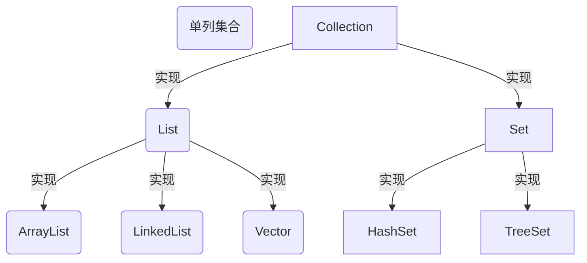
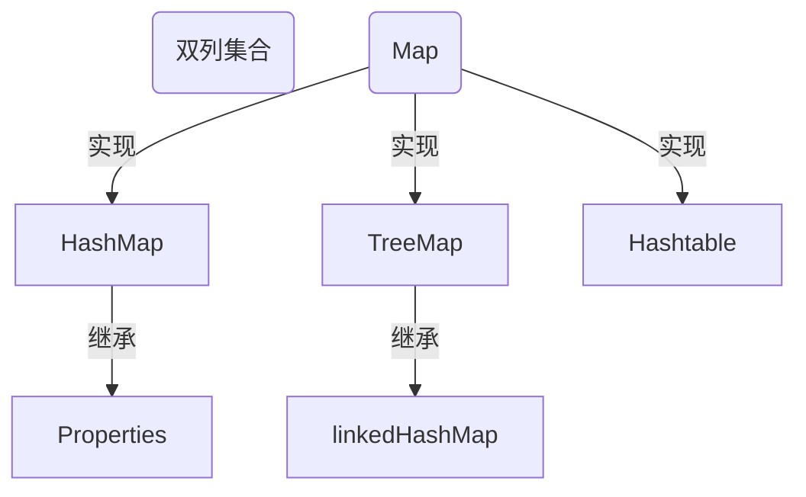

## 关于数组

好吧，在开始之前，得先了解一些东西，首先回顾一下之前常用的数组，想想他有什么不足的地方...

emm大概有以下几点主要的，会让工作比较难受的：

1. 数组的长度开始时必须指定，而且一指定就无法修改其值

2. 保存的必须为同一类型的元素

3. 使用数组进行增加元素比较麻烦

   ```java
   class Face {
       public static void main(String[] args) {
           int[] arr = {1, 2, 3};
   //这时候想加个4...
   //目前赋值较为便捷的的方法是：
           int[] arr2 = new int[arr.length + 1];
           System.arraycopy(arr, 0, arr2, 0, arr.length);
           arr2[3] = 4;
           arr = arr2;
   //草，这里多少行代码了都
       }
   }
   ```

好吧，集合就是来解决这个问题的，接下来开始一个本身并不难但是原理比较复杂的东西：集合，它本身用起来难度不高，但是要熟练使用的话得足够深入了解

## 集合的简介

先来看看集合有哪些特点：

1. 可以**动态保存**任意多个对象，使用比较方便
2. 提供了**一系列方便操作对象的方法**：add、remove、set、get等

## 框架体系图

Java的集合类很多，主要分为两大类，如图：

这两张图比较重要，需要背下来他们的关系，比如ArrayList实现了List接口，List接口实现了Collection

### Collection接口的子类构造图(单列集合-value)



注意，上面只是罗列了主要的，实际上list和set所拥有的子类不止这些

### Map接口的构造图（双列集合-key-value）



注意，上面只是罗列了主要的，实际上Map所拥有的子类不止这些

# Collection接口

万事从简到难，Java这就从Collection接口开始吧，可能当你看到这里(获取这篇文章只有我会看吧hhh)并且之有过其他解释型语言的编程经验的话，应该对这玩意不陌生，反正我是很亲切，在JavaScript中，这个玩意叫List，并且包含了诸多方法

好，总之先来看看这个接口有哪些功能吧：


可以看到它还是定了了非常多的功能..接下来仔细说说他

## Collection接口的概述

```java
public interface Collection<E> extends Iterable<E> {}
```

### Collection的特点

1. `Collection`实现子类可以存放多个元素，**每个元素都可以是`Object`**
2. `Collection`的实现类，**有些可以存放重复的元素**，**有些不行**
3. `Collection`的实现类，**有些是有序**的(List)，**有些不是有序**的(Set)
4. **`Collection`接口没有直接实现的子类，是通过它的子接口Set和List来实现的**

### Collection接口的常用方法

下面是Collection接口的常用方法，案例以它的实现子类ArrayList来演示（因为这个接口本身是不能实例化的，只有实现类这个接口的类才能被实例化）

1. `add`：添加单个元素 可以添加任意类型的Object
   存放基本数据类型时，会自动将其装箱，也就是说，添加的每一个元素都是对象

   ```java
   list.add("jack");
   list.add(10); //这里存数值的时候会有个自动装箱的过程-自动将他转换成Integer,下方同理
   list.add(true);//new Boolean(true) <--相当于实际存放进去的是这个
   list.add(15.1564);//new Double(15.1564)
   System.out.println("list="+list);//[jack, 10, true, 15.1564]
   ```

2. `remove`：删除指定元素
   **可以指定索引来删除一个元素**(传入int index)，**也可以指定要删除哪个元素**（传入Object），也就是说，**如果要删除一个`int`元素，那么一定要给他装箱**
   删除元素后的返回值：
   通过Index删除元素，**如果删除成功，会返回这个元素**,删除**失败则抛出异常IndexOutOfBoundsException**
   通过Object删除元素：如果成功返回true，如果失败返回false

   ```java
   list.add("jack");
   list.add(10);
   list.add(true);
   list.add(15.1564);
   list.remove(new Integer(10)); //删除指定的int元素一定要手动装箱
   list.remove(true); //删除其他的基本类型会自动装箱 跟add一个道理
   // 如果试图删除一个不存在的元素:
   //通过Object删除的话会返回true或false，true为删除成功，false为元素不存在
   System.out.println(list.remove("Hello world")); //false
   //通过index
   //如果元素存在，返回在列表中删除并返回这个元素，此时这个列表的第0位是"jack"
   System.out.println(list.remove(0));  //jack
   //如果元素不存在，这会直接抛出索引异常 IndexOutOfBoundsException
   System.out.println(list.remove(10)); //会直接抛出索引异常hhh
   System.out.println("remove over list=" + list);//remove over list=[true]
   ```

3. `contains`：查找元素是否存在 要传入的值：Object，如果存在即返回true，如果不存在返回false

   ```java
   list.add("helloworld");
   System.out.println(list.contains("helloworld")); //true
   System.out.println(list.contains("Hello World"));//false
   ```

4. `size`：获取元素个数

   ```java
   ArrayList list1 = new ArrayList();
   System.out.println(list1.size());//0
   list1.add("bac");
   System.out.println(list1.size());//1
   list1.add("fff");
   list1.add(123.456);
   System.out.println(list1.size());//3
   ```

5. `isEmpty`：判断是否为空 即判断这个集合中是否有东西，有则返回false，无任何元素则返回true

   ```java
   ArrayList list2 = new ArrayList();
   System.out.println(list2.isEmpty()); //true
   list2.add("bac");
   list2.add("fff");
   list2.add(123.456);
   System.out.println(list2.isEmpty()); //false
   ```

6. `clear`：清空，顾名思义，清空这个集合的所有元素

   ```java
   list2.clear();
   System.out.printf("list2现在的元素个数是：%s，是否为空：%s",list2.size(),list2.isEmpty()); //list2现在的元素个数是：0，是否为空：true
   ```

7. `addAll`：添加多个元素 **接受的对象：实现了Collection的类**,可以接收的额外参数:(int index)

   ```java
   ArrayList list3 = new ArrayList();
   list1.add("张三");
   list1.add("李四");
   list1.add("王老五");
   
   list2.add("bac");
   list2.add("fff");
   list2.add(123.456);
   
   list3.addAll(list2);
   //[bac, fff, 123.456]
   
   list3.add("hahaha");
   //[bac, fff, 123.456, hahaha]
   
   //        也可以在指定位置添加
   list3.addAll(3,list1); 
   //这里相当于在索引为3的前面添加，即原本在第四位的前面添加了指定的元素，也可以理解为从1开始计数在索引3后面添加了指定的元素
   
   System.out.println("addAll-List3:"+list3); //[bac, fff, 123.456, 张三, 李四, 王老五, hahaha]
   ```

8. `containsAll`：查找多个元素是否都存在，要传入一个实现了Collection的类，如果都存在则返回true

   ```java
   System.out.println(list3.containsAll(list2));//true
   ```

9. `removeALl`：删除多个元素，要传入一个实现了Collection的类

   ```java
   //before:[bac, fff, 123.456, 张三, 李四, 王老五, hahaha]
   list3.removeAll(list2);
   System.out.println(list3);
   //after： [张三, 李四, 王老五, hahaha]
   ```

10. 说明，上方的内容以ArrayList实现类来演示

```java
package com.collection_;

import java.util.ArrayList;


public class Collection_ {
    @SuppressWarnings({"all"}) //抑制泛型警告
    public static void main(String[] args) {
//        0. 创建一个ArrayList
        ArrayList list = new ArrayList();
//        1. `add`：添加单个元素 可以存放任意类型的Object
        list.add("jack");
        list.add(10); //这里存数值的时候会有个自动装箱的过程-自动将他转换成Integer,下方同理
        list.add(true);//new Boolean(true)
        list.add(15.1564);//new Double(15.1564)
        System.out.println("list=" + list);//list=[jack, 10, true, 15.1564]
//        2. `remove`：删除指定元素 可以指定删除索引(传入int index)，也可以指定要删除哪个元素（传入Object），也就是说，如果要删除一个int元素，那么一定要给他装箱
        list.remove(new Integer(10)); //删除指定的int元素一定要手动装箱
        list.remove(true); //删除其他的基本类型会自动装箱 跟add一个道理
//        如果试图删除一个不存在的元素:
//        通过Object的话会返回true或false，true为删除成功，false为元素不存在
        System.out.println(list.remove("Hello world")); //false
//        通过index
//        //如果元素存在，返回在列表中删除并返回这个元素，此时这个列表的第0位是"jack"
        System.out.println(list.remove(0));  //jack
//        如果元素不存在，这会直接抛出索引异常 IndexOutOfBoundsException
//        System.out.println(list.remove(10)); //会直接抛出索引异常hhh

        System.out.println("remove over list=" + list);//remove over list=[true]


//        3. `contains`：查找元素是否存在
        list.add("helloworld");
        System.out.println(list.contains("helloworld")); //true
        System.out.println(list.contains("Hello World"));//false

//        4. `size`：获取元素个数
        ArrayList list1 = new ArrayList();
        System.out.println(list1.size());//0
        list1.add("bac");
        list1.add("fff");
        list1.add(123.456);
        System.out.println(list1.size());//3
//        5. `isEmpty`：判断是否为空
        ArrayList list2 = new ArrayList();
        System.out.println(list2.isEmpty()); //true
        list2.add("bac");
        list2.add("fff");
        list2.add(123.456);
        System.out.println(list2.isEmpty()); //false
//        6. `clear`：清空
        list2.clear();

        System.out.printf("list2现在的元素个数是：%s，是否为空：%s\n",list2.size(),list2.isEmpty()); //list2现在的元素个数是：0，是否为空：true
        list1.clear();
//        7. `addAll`：添加多个元素
        ArrayList list3 = new ArrayList();
        list1.add("张三");
        list1.add("李四");
        list1.add("王老五");

        list2.add("bac");
        list2.add("fff");
        list2.add(123.456);


        list3.addAll(list2);
        list3.add("hahaha");
//        也可以在指定位置添加
        list3.addAll(3,list1);
        //这里相当于在索引为3的前面添加，即原本在第四位的前面添加了指定的元素，也可以理解为在索引3后面添加了指定的元素

        System.out.println("addAll-List3:"+list3); //[bac, fff, 123.456, 张三, 李四, 王老五, hahaha]

//        8. `containsAll`：查找多个元素是否都存在
        System.out.println(list3.containsAll(list2));//true
//        9. `removeALl`：删除多个元素
//        before:[bac, fff, 123.456, 张三, 李四, 王老五, hahaha]
        list3.removeAll(list2);
        System.out.println(list3);
//        after： [张三, 李四, 王老五, hahaha]
    }
}

```

### Collection接口遍历元素的方式-Iterator(迭代器)

#### 基本介绍

1. Iterator对象称为迭代器，主要用于遍历Collection集合中的元素
2. 所有实现了Collection接口的集合类都有一个iterator()方法，用以返回一个实现了iterator接口的对象，即可以返回一个迭代器
3. iterator仅用于遍历集合，iterator本身并不存放对象
4. iterator的执行原理
   

### Iterator接口的方法

- `hasNext()` 判断是否还有下一个元素，返回一个布尔值
- `next()`
  1. 作用
     1. 下移
     2. 将下移后的集合位置三的元素返回
  2. 注意事项：**在调用`iterator.next()`方法之前必须要调用`iterator.hasNext()`进行检测**，若不调用，且下一条记录无效，**直接调用`iterator.next()`会抛出`NoSuchElementException`异常**----这是所有Java程序员使用迭代器的共识
- `remove()`从底层集合中删除此迭代器返回的最后一个元素（一般都不会用它）


> 个人理解：迭代器最初并不指向集合的任何元素，但是在使用next后，就开始进入数组，获取第一个元素，同时记录该点，下次再调用直接从该点出发往下继续游走，下面来看一个迭代器实例

- 小tips：定义完迭代器后，在IEDA中可以输出`itit`快速的调用while循环

```java
package com.collection_;

import java.util.ArrayList;
import java.util.Collection;
import java.util.Iterator;

public class CollectionIterator {
    @SuppressWarnings({"all"})
    public static void main(String[] args) {
        Collection books = new ArrayList();
        books.add(new Book("三国演义", "罗贯中", 15.3));
        books.add(new Book("图解算法", "xx出版社", 35.79));
        books.add(new Book("我制作的笔记本", "me", 10));

//        直接输出
        System.out.println(books);

//        遍历集合：
//        1 想得到集合对应的迭代器 只要是实现了Collection接口的class都必须去实现iterator()这个方法，所以直接获取即可
        Iterator iterator = books.iterator();

        //        2 使用while循环遍历即可
        System.out.println("使用迭代器来遍历输出集合");
        while (iterator.hasNext()) { //判断是否还有数据
//            如果有数据则直接通过next()方法方法来获取下一个元素，获取到的元素(编译)类型是Object
            System.out.println(iterator.next());
        }
//        在结束while循环后，iterator迭代器指向了最后一个元素，如果这个时候在试图取值则会直接抛出异常
//        iterator.next(); //这里会直接抛出异常 java.util.NoSuchElementException

//        如果需要再次遍历，需要重置我们的迭代器：
        iterator=books.iterator(); // 重置迭代器
        System.out.println("第二次遍历");
        while (iterator.hasNext()) {
            Object next =  iterator.next();
            System.out.println(next);
        }
    }
}

class Book {
    private final String name;
    private final String author;
    private final double price;

    public Book(String name, String author, double price) {
        this.name = name;
        this.author = author;
        this.price = price;
    }
    @Override
    public String toString() {
        return "Book{" +
                "name='" + name + '\'' +
                ", author='" + author + '\'' +
                ", price=" + price +
                '}';
    }
}

```

### Collection接口遍历元素的方式-增强for循环

挣钱for循环，可以替代iterator迭代器，**特点：增强for循环就是简化版的iterator，本质一样，只能用于遍历集合或者数组**

使用增强for，底层任然是迭代器..这里可以通过debug来查看：

流程和使用迭代器一样：`for (Object book : books)`在这一步就new了一个，然后依次执行`hashNext`和`next`，所以他可以理解为简化版的迭代器

- 小Tips：输入大I或者在books的后面跟.for会直接互换出增强for循环

```java
package com.collection_;

import java.util.ArrayList;
import java.util.Collection;

public class CollectionFor {
    @SuppressWarnings({"all"})
    public static void main(String[] args) {
        Collection books = new ArrayList();
        books.add(new Book("三国演义", "罗贯中", 15.3));
        books.add(new Book("图解算法", "xx出版社", 35.79));
        books.add(new Book("我制作的笔记本", "me", 10));
        for (Object book : books) {
            System.out.println("book:"+book);
        }
    }
}
```

#### 扩展-小练

请编写程序`CollextionExercise.java`

1. 创建三个Dog{name,age}对象，放入到ArrayList中，赋值给List引用
2. 使用迭代器和增强for循环的方式来遍历
3. 重写Dog的toString方法，输出name和Age

太简单，写不出来建议去看看樱花树

```java
package com.collection_;

import java.util.ArrayList;
import java.util.Iterator;

public class CollextionExercise {
    @SuppressWarnings({"all"})
    public static void main(String[] args) {
        ArrayList list = new ArrayList();
        list.add(new Dog("旺财",1));
        list.add(new Dog("小兰",2));
        list.add(new Dog("Faker",6));

        System.out.println("使用迭代器来遍历输出List:");
        Iterator iterator = list.iterator();
        while (iterator.hasNext()) {
            Object next =  iterator.next();
            System.out.println(next);
        }

        System.out.println("使用增强for循环来输出list:");
        for (Object o : list) {
            System.out.println(o);
        }
    }
}

class Dog {
    private final String name;
    private final int age;

    @Override
    public String toString() {
        return "Dog{" +
                "name='" + name + '\'' +
                ", age=" + age +
                '}';
    }

    public Dog(String name, int age) {
        this.name = name;
        this.age = age;
    }
}
```

## Collection接口的子接口：List实现类

### List的基本介绍

List接口是Collection接口的子接口，**它额外包含如下特点**：

1. List集合类中的**元素有序(即添加顺序和取出顺序一致)，且可以重复**

   ```java
   List list = new ArrayList();
   list.add("jack");
   list.add("jenny");
   list.add("Monika");
   list.add("jack");
   //        打印后可以发现，它取值的顺序添加元素的顺序是保持一致的，且可以有重复的元素
   System.out.println(list); //[jack, jenny, Monika, jack]
   ```

2. List结合中的**每个元素都有其对应的顺序索引，即支持索引(索引从0开始计数)**

   ```java
   System.out.println(list.get(2));//Monika
   ```

3. 实现了List接口的类有很多很多，不仅仅只有三个
   

### List中额外的方法

List集合里添加了一些根据索引来操作集合元素的方法

并且，List支持使用普通的fori进行循环

1. `void add(int index,Object ele)` 在index位置插入ele元素

   ```java
   List list = new ArrayList();
   list.add("张三");
   list.add("李四");
   list.add(1, "刘备");
   System.out.println(list); //[张三, 刘备, 李四]
   ```

2. `boolean addAll(int index,Collection eles)`从index位置开始将eles中的所有元素添加进来

   ```java
   List list2 = new ArrayList();
   list2.add("jack");
   list2.add("mart");
   list2.add("faker");
   list2.add("theshy");
   list2.addAll(2,list);
   System.out.println(list2); //[jack, mart, 张三, 刘备, 李四, faker, theshy]
   ```

3. `Obcejt get(int  index)`获取指定index位置的元素

4. `int IndexOf(Object obj)`返回obj在集合中首次出现的位置

5. `int lastIndexOf(Object obj)` 返回obj在集合中最后一次出现的位置

6. `Object remove(int index)`:移除指定index位置的元素，并返回该元素

7. `Object set(int index ,Object obj)`设置指定index位置的元素为obj，相当于是替换，返回值为被替换的对象

8. `List subList(int startindex,int endindex)` 返回从start到endindex位置的子集合
   范围其实是: strtindex <= NewList < endindex 也就是说不包含endindex
   比如说输入 0，2 ，返回的新列表中包含的则是[0,1]第0和第1这两个元素

#### 扩展-小练

`ListExercise.java`添加10个以上的元素(比如String "Hello"),然后再2号位插入一个元素”EDG牛逼“，然后获取第五个元素，然后删除第六个元素，然后修改第七个元素为："___Hub"，再使用迭代器遍历组合，要求：使用list的实现类ArrayList来完成

```java
package com.list_;

import java.util.ArrayList;
import java.util.Iterator;
import java.util.List;

public class ListExercise {
    @SuppressWarnings({"all"})
    public static void main(String[] args) {
//        `ListExercise.java`添加10个以上的元素(比如String "Hello"),
//        然后再2号位插入一个元素”EDG牛逼“，然后获取第五个元素，
//        然后删除第六个元素，然后修改第七个元素为："___Hub"，
//        再使用迭代器遍历组合，要求：使用list的实现类ArrayList来完成
        List list = new ArrayList();
        for (int i = 1; i <= 10; i++) {
            list.add("hello "+i);
        }
//        然后再2号位插入一个元素”EDG牛逼“
        list.add((2-1),"EDG牛逼");
//        然后获取第五个元素，
        System.out.println(list.get(5-1));
//        然后删除第六个元素
        list.remove(6-1);
//        然后修改第七个元素为："___Hub"，
        list.set(7-1,"GitHub");
        Iterator iterator = list.iterator();
        System.out.println(list);
        while (iterator.hasNext()) {
            System.out.println(iterator.next());
        }
    }
}
```

> 小练2：`ListExercise02.java`使用List的实现类添加三本书，打印出美观的效果
>
> 要求
>
> 1. 按照价格排序，从低到高(冒泡排序法)
> 2. 要求使用ArrayList、LinkedList和Vector三种集合实现
> 3. 结论：主要说明，只要实现了Lit接口，那么List的实现类都可以使用接口中的方法

小Tips：List中自带的sort底层实际上也是Arrays的那个二叉树排

```java
default void sort(Comparator<? super E> c) {
    Object[] a = this.toArray();
    Arrays.sort(a, (Comparator) c);
    ListIterator<E> i = this.listIterator();
    for (Object e : a) {
        i.next();
        i.set((E) e);
    }
}
```

```java
package com.list_;

import java.util.ArrayList;
import java.util.Comparator;
import java.util.List;

public class ListExercise02 {
    @SuppressWarnings({"all"})
    public static void main(String[] args) {
//        小练2：`ListExercise02.java`使用List的实现类添加三本书，打印出美观的效果
        List list = new ArrayList();
        list.add(new Book("GitHub从pull到clone", "null", 20.5));
        list.add(new Book("Mysql从入门到删库", "张三", 99));
        list.add(new Book("Linux从入门到WordPress", "李四", 65));
        list.add(new Book("Docker从入门到砸电脑", "王五", 99));
        list.add(new Book("Go从入门到给著者寄刀片", "李六", 65));

        for (Object o : list) {
            System.out.println(o);
        }
//        1. 按照价格排序，从低到高(冒泡排序法)
        MySort(list, new Comparator() {
            @Override
            public int compare(Object o1, Object o2) {
                Book b1 = (Book) o1, b2 = (Book) o2;
                int n = (int) (b1.getPrice() - b2.getPrice());
                if (n == 0) {
//                    判断书名长度
                    n = b1.getName().length() - b2.getName().length();
                }
                return n;
            }
        });
        System.out.println("分割线");
        for (Object o : list) {
            System.out.println(o);
        }
        System.out.println("Test List Sort");
        list.sort(new Comparator() {
            @Override
            public int compare(Object o1, Object o2) {
                Book b1 = (Book) o1, b2 = (Book) o2;
                return (int) (b2.getPrice() - b1.getPrice());
            }
        });
        System.out.println("分割线");
        for (Object o : list) {
            System.out.println(o);
        }
//        2. 要求使用ArrayList、LinkedList和Vector三种集合实现
//        略
//        3. 结论：主要说明，只要实现了Lit接口，那么List的实现类都可以使用接口中的方法
    }

    public static void MySort(List list, Comparator c) {
        for (int i = 0; i < list.size() - 1; i++) {
            for (int j = 0; j < list.size() - 1 - i; j++) {
                if (c.compare(list.get(j), list.get(j + 1)) > 0) {
                    Object obj = list.get(j);
                    list.set(j, list.get(j + 1));
                    list.set(j + 1,  obj);
                }
            }
        }
    }

}

class Book {
    private final String name;
    private final String author;
    private final double price;

    @Override
    public String toString() {
        return String.format("书名：%s\t\t作者：%s\t\t价格：%.2f", name, author, price);
    }

    public String getName() {
        return name;
    }

    public String getAuthor() {
        return author;
    }

    public double getPrice() {
        return price;
    }

    public Book(String name, String author, double price) {
        this.name = name;
        this.author = author;
        this.price = price;
    }
}
```

## ArrayList

### ArrayList注意事项

1. ArrayList可以放入所有类型的元素，包括null（可以放多个null）

   ```java
   ArrayList list = new ArrayList();
   list.add(null);
   list.add("这个是字符串");
   list.add(null);
   list.add(null);
   list.add(null);
   list.add("这是第二个字符串");
   System.out.println(list); //[null, 这个是字符串, null, null, null, 这是第二个字符串]
   ```

2. ArrayList是由数组来实现数据存储的

3. ArrayList基本等同于Vector，除了ArrayList线程是不安全的(执行效率高)，在多线程的情况下，不建议使用ArrayList

   ```java
   public boolean add(E e) {
       ensureCapacityInternal(size + 1);  // Increments modCount!!
       elementData[size++] = e;
       return true;
   }
   //可以看到源码中，所有方法都没有synchroized的修饰
   ```

### ArrayList的底层机制和源码分析(重点)

1. ArrayList中维护了一个Object类型的数组elementData

   ```java
   transient Object[] elementData;
   //transient 表示瞬间，短暂的，如果有一个属性或者成员被transient修饰了，表示将来在被序列化的时候这个数据话的时候将不被序列化   也就是说，这个属性不会被序列化
   ```

2. 当创建元素对象时，如果使用的是无参构造器，则初始化elementData容量为0(当然在JDK7是10)

   ```java
   public ArrayList() {
       this.elementData = DEFAULTCAPACITY_EMPTY_ELEMENTDATA;
   }
   //DEFAULTCAPACITY_EMPTY_ELEMENTDATA:
   private static final Object[] DEFAULTCAPACITY_EMPTY_ELEMENTDATA = {};
   //由源码可得出，ArrayList在无参初始化的时候就将elementData指向了一个空数组，也就是创建了一个空的element数组
   ```

3. 当添加元素时：先判断是否需要扩容，如果需要扩容，则调用grow方法，否则直接添加元素到合适的位置

   ```java
   //前置：new ArrayList() 空的Array List
   //这里演示：对空数组添加数据，系统的扩容机制
   //比方说添加一个1，那么底层会调用Integer的装箱
   public static Integer valueOf(int i) {
       if (i >= IntegerCache.low && i <= IntegerCache.high)
           return IntegerCache.cache[i + (-IntegerCache.low)];
       return new Integer(i);
   }
   //然后再执行add方法
   public boolean add(E e) {
       //1. 先确定是否要扩容
       //调用ensureCapacityInternal这一步是确定elementData的空间够不够
       ensureCapacityInternal(size + 1); 
       //补充：size为当前数组存放的元素数量，没出存放元素都会被记录↓size++
       //注意，是先赋值后++。比如要在第一位添加元素，则索引=0，所以这里是先给索引=0的赋值e，然后在给索引++
       //2 再执行赋值的操作
       elementData[size++] = e;
       return true;
   }
   //来看看 ensureCapacityInternal这个方法都做了什么吧
   private void ensureCapacityInternal(int minCapacity) {
       ensureExplicitCapacity(calculateCapacity(elementData, minCapacity));
   //可以看到它这里只调用了两个方法：calculateCapacity((elementData, minCapacity)
   //和ensureExplicitCapacity(calculateCapacity的返回值)，下面先看看calculateCapacity做了什么
   }
   
   //calculateCapacity:
   private static int calculateCapacity(Object[] elementData, int minCapacity) {
       //到这一步，系统先判断elementdata是不是一个空数组
       if (elementData == DEFAULTCAPACITY_EMPTY_ELEMENTDATA) {
           //如果是的话，系统会调用Math的max方法，即求最大值，传入了两个参数
           //第一个参数是DEFAULT_CAPACITY，第二个参数即为之前add方法中的size+1=1
           return Math.max(DEFAULT_CAPACITY, minCapacity);
           //然后追踪查看发现DEFAULT_CAPACITY的值为：所以可以得出，这里返回的是10
           private static final int DEFAULT_CAPACITY = 10;
       }
       //如果不是一个空数组，则直接返回原先传入进来的size + 1 
       return minCapacity;
   } // 也就是说，第一次扩容，为10
   
   //然后看看调用calculateCapacity的ensureExplicitCapacity：
   private void ensureExplicitCapacity(int minCapacity) {
       //这个modCount 是用来记录当前集合被修改的次数(给多线程用的)
       modCount++;
   
      //这里使用了minCapacity - elementData.length > 0
       //已知minCapacity=10,elementData.length=0,所以它是大于0的
       //这一步翻译就是，如果最小容量，减去当前数组的实际大小大于0，说明数组空间不够了
       if (minCapacity - elementData.length > 0)
           //所以就要对数组进行扩容
           grow(minCapacity);
   }
   //grow 对数组进行扩容
   private void grow(int minCapacity) {
       
       int oldCapacity = elementData.length;// 获取到当前数组的长度
       
       //这一步相当于原先数组大小+原先数组大小/2（oldCapacity >> 1 位移，向右移动一位就相当于是/2） 所以可以得出，扩容机制是按照1.5倍来扩容的
       int newCapacity = oldCapacity + (oldCapacity >> 1);
       //但是由于这是对空数组扩容 当前数组的长度为0，所以得出的结果还是0
       
       //判断 新的长度(newCapacity:0)减去传入的数据长度(minCapacity:10)是否小于0
       if (newCapacity - minCapacity < 0)
           //如果小于0，则newCapacity=minCapacity：新的长度=传入的数据长度
           newCapacity = minCapacity;
       
       //如果新的容量比数组的最大容量还要大，则执行hugeCapacity来处理
       if (newCapacity - MAX_ARRAY_SIZE > 0)
           newCapacity = hugeCapacity(minCapacity);
       
       // 最后，使用ArraysCopy来完成数值的复制 newCapacity 新的空间大小
       elementData = Arrays.copyOf(elementData, newCapacity);
   }
   ```

4. 如果使用的是无参构造器，且第一次添加元素时，则扩容elementData为`10`，如果需要再次扩容的话，则扩容elementData为`1.5`倍

5. 如果使用的是指定容量capacity（有参）的构造器，则初始的elementData容量为capacity

6. 如果使用的是指定容量capacity（有参）的构造器，如果需要扩容，则直接扩容elementData为`1.5`倍

## Vector


1. Vector底层也是一个数组`protected Object[]elementData`

2. Vector线程是同步的，即线程安全，Vector类的操作方法均带有`synchronized`

   ```java
   public synchronized void addElement(E obj) {
       modCount++;
       ensureCapacityHelper(elementCount + 1);
       elementData[elementCount++] = obj;
   }
   ```

3. 在开发中，需要线程同步安全时，考虑使用Vector

4. 扩容机制：如果是无参，默认为10（初始为10），满后，就按照2倍扩容，如果指定大小，则直接每次直接按照2倍扩展

## Vector底层结构和ArrayList的比较

|           | 底层结构 | 版本<br />(最低兼容) | 线程安全(同步) | 扩容倍数                                                                                                             |
| :-------: | :------: | :------------------: | :------------- | :------------------------------------------------------------------------------------------------------------------- |
| ArrayList | 可变数组 |        Jdk1.2        | 不安全，效率高 | 初始值：<br />有参：长度为参数的长度<br />无参：0<br />扩容：<br />第一次：10<br />第二次及以后：按照现有长度的1.5倍 |
|  Vector   | 可变数组 |        Jdk1.0        | 安全，效率不高 | 初始值：<br />有参：长度为参数的长度<br />无参：10<br />扩容：<br />每次都按照按照现有长度的2倍扩容                  |

## LinkedList

1. LinkedList底层实现了双向**链表**和双端**队列**特点
2. 可以添加任意元素（元素可以重复），包括null
3. 线程不安全，没有实现同步

### 底层结构

1. LinkedList底层维护了一个双向链表
2. LinkedList中维护了两个属性First和Last分别指向：首节点和子节点
3. 每个节点（Node对象）里面又维护了prev，next，item三个属性，其中通过prev可以指向前一个，通过next指向后一个节点，最终实现双向链表
4. 所以LinkedList的元素添加和删除，不是通过数组完成的，相对来说效率较高
5. 双向链表以后到底层的时候会了解到，现在来简单模拟一个双向链表

```java
package com.list_;

public class testLinked_ {
    public static void main(String[] args) {
//        模拟简单的双向链表
        Node jack = new Node("jack");
        Node tom = new Node("tom");
        Node node = new Node(123);
//        目前他们三个没有任何关系
//        链接他们三个，行成双向链表
        jack.next = tom;
        tom.next = node;
//        a->b->c (next);
        node.pre = tom;
        tom.pre = jack;
//        c->b->a
//        这样就形成了双向链表
        Node first = jack; //让first指向应用Jack 就是双向链表的首节点
        Node last = node;//让last指向node，这就是双向链表的尾结点

//        演示从头到尾进行遍历
        while (true) {
//            如果first为空则直接退出
            if (first == null) {
                break;
            }
//            否则输出first的信息
            System.out.println(first);
//            同时first重定向
            first = first.next;
        }
//        从尾到头的遍历
        System.out.println("====Last:");
        while (last != null) {
            System.out.println(last);
            last = last.pre;
        }
//        演示链表的添加和删除对象
//        在jack和tom之间加个张飞
        Node zhangfei = new Node("张飞");

//        对于链表而言，插入元素需要且只需要修改四个指向即可
        jack.next = zhangfei;
        zhangfei.next = tom;

        tom.pre = zhangfei;
        zhangfei.pre = jack;
        last=node;
        System.out.println("重定向:");
        while (last != null) {
            System.out.println(last);
            last = last.pre;
        }
    }
}

//定义一个Node类，Node对象，表示双向链表的一个节点
class Node {
    public Object item; //真正存放数据的地方
    public Node next; //指向下一个节点
    public Node pre; //指向上一个节点

    public Node(Object obj) {
        this.item = obj;
    }

    @Override
    public String toString() {
        return "Node name=" + item;
    }
}
```

### LinkedList底层结构

接下来，我创建一个无参的LinkedList，来看他是什么怎么CRUD的

1. 创建`LinkedList list = new LinkedList();`

   ```java
   public LinkedList() {
   }
   //可以看到，它实际上什么也没错，只是创建了个对象，但是，跟随着Debug，可以看到，他有一些自带的初始值：
   transient int size = 0;
   transient Node<E> first;//也就是=null
   transient Node<E> last;//也就是=null
   protected transient int modCount = 0;
   //所以得出他这几个初始值：
   size =0; //表的长度
   Node first = null; //表的第一个节点
   Node last = null; //表的最后一个节点
   int modCount=0; // 表的修改次数
   ```

2. 然后我给他增加了一个元素`list.add(1);`

   1. 它直接跳转到了以下方法：

      ```java
      public boolean add(E e) {
          linkLast(e);
          return true;
      }
      //这里的e实际上就是我传入的元素1
      ```

   2. 然后进入到`linkLast(e)`中看看他做了什么

      ```java
      //见名知意，这玩意是将我传入的元素放置在最后的节点上
      void linkLast(E e) {
          
          final Node<E> l = last;
          //首先获取到last的值，并赋值为l，此时last节点是空(null)所以l=null
          
          final Node<E> newNode = new Node<>(l, e, null);
          //创建一个新的节点 这里三个对应的参数为：
          // pre = l (刚刚获取到的null)
          // item = e(传入的Object)
          // next = null
          
          last = newNode;
          //然后将last节点指向刚刚创建的节点
          
          if (l == null)
          //判断开始获取到的last的值是否为空 这里为空 也就是表示这个双向链表目前还没有任何元素
              first = newNode;
          //将 first指向刚刚创建的节点
          else
      //如果说不为空的话说明此时双向链表是有内容的，将双向链表最后一个元素的next指向为新的节点
              l.next = newNode;
          //现在的链表关系为  1.next=null 1.pre=null first=1 last=1
          
          size++; //同时将双向链表的长度+1
          modCount++;  // 表的修改次数+1
      }
      ```

3. 那么再给他添加个元素`list.add(2);`

   ```java
   void linkLast(E e) {
       //因为前面添加1时，已经将last指向他了，所以这里last指向的是刚刚创建的Node.item=1的元素
       final Node<E> l = last;
   
       
       final Node<E> newNode = new Node<>(l, e, null);
       //pre = 刚刚添加的1
       //item =传入的节点=2
       //next =null
       
       last = newNode; //将last指向新创建的Node
       if (l == null)
           //这里判断l是否为null，实际上他不为空，所以不走这一步
           first = newNode;
       else
         //走这一步：原先last的next指向这个新的节点，   
           l.next = newNode;
        //现在的节点关系为： 1.next=2 2.pre=1 last=2 first=1
       //给相应数据添加记录：
       size++; 
       modCount++;
   }
   ```

4. 删除节点：在上次添加后我又额外添加了一个元素3，这里用remove来进行删除

   1. remove有三种重载，这里使用第一种

      1. remove(int index) 通过index删除一个节点
      2. remove() 删除第一个节点
      3. remove(Object obj) 通过传入一个Object删除一个节点

   2. `list.remove(1);`

      1. 可以看到remove中运行了两个方法

         ```java
         //此时list的值为：[1, 2, 3]
         public E remove(int index) { //1
             checkElementIndex(index); 
             return unlink(node(index));
         }
         ```

      2. 先来看看第一个方法`checkElementIndex(index)`

         1. ```java
            private void checkElementIndex(int index) {
                if (!isElementIndex(index))
                    throw new IndexOutOfBoundsException(outOfBoundsMsg(index));
            }
            //可以看到这里面走个了if判断流程，来看看这个东西判断了什么并取反
            ```

         2. ```java
            private boolean isElementIndex(int index) {
                return index >= 0 && index < size;
            }
            //这里判断的index(1)是否小于等于0或者index大于size(总元素数量:3),结果当然为true
            ```

         3. 所以这一步并不会抛出异常，借下来继续走下一步

      3. `return unlink(node(index));`

         1. 先一步一步解析吧，从`node(index)`开始

            1. ```java
               Node<E> node(int index) {
                   // assert isElementIndex(index);
                //这里判断index是否小于size/2(1.5) 此时index=1所以false
                   if (index < (size >> 1)) {
                       Node<E> x = first;
                       for (int i = 0; i < index; i++)
                           x = x.next;
                       return x;
                   } else {
                       //创建一个 Node x 指向Node的最后一个元素
                       Node<E> x = last;
                       //开始for循环：创建i=size(3);i>index(1);i--
                       for (int i = size - 1; i > index; i--)
                          //将x(lastNode)指向x.prev的
                           //这里x=3,3.prev=2,由于for循环只执行了一次,所以x最终等于2，并将她return出去
                           x = x.prev;
                       return x;
                   }
               }
               ```

         2. 然后进入下一步`unlink(Node x)`

            ```java
            E unlink(Node<E> x) { //此时x=2
               
                final E element = x.item;
                final Node<E> next = x.next;
                final Node<E> prev = x.prev;
                //获取到x的所有内容
            
                if (prev == null) {
                    //判断是否为第一个，这里为false
                    first = next;
                } else {
                    //将prev.next=next;实际上就是将上一个元素的next指向这个元素的next
                    prev.next = next;
                    //清空自身的next
                    x.prev = null;
                }
             //判断next是否为null 这里为false
                if (next == null) {
                    last = prev;
                } else {
                    //将next.prev =prev ：即：将下一个元素的prev设置为这个元素的prev
                    //所以这一部实际上是将3的prev设置成了1
                    next.prev = prev;
                    //然后将本身的next设置为null
                    x.next = null;
                }
             //将本身的item重定向至null
                x.item = null;
                //让总长度-1，操作次数+1
                size--;
                modCount++;
                //返回这个Node中实际的内容
                return element;
            }
            //上面的指向null实际上就是让gc知道这玩意是个垃圾了，回头gc就会回收掉
            ```

   3. 最终，删除成功，获取到了index为1元素上的Integer(2)，并且在集合中删除了它，此时集合的元素为：`[1, 3]`

## ArrayList和LinkedList的比较

|            | 底层结构 |       增删的效率       | 改查的效率 |
| :--------: | :------: | :--------------------: | :--------: |
| ArrayList  | 可变数组 | 较低<br />数组扩容实现 |    较高    |
| LinkedList | 双向链表 | 较高<br />通过链表追加 |    较低    |

1. 如果改查较多，就选择ArrayList
2. 如果增删较多，就选择LinkedList
3. 一般来说，在程序中，80~90%都是查询，因此大部分情况下都会使用ArrayList
4. 在一个项目中，根据业务灵活选择，也可以这样：一个模块使用的是ArrayList，另一个模块使用的是LinkedList.0

## Collection接口的子接口：Set实现类

### 基本介绍

1. 无序(添加和取出的顺序不一致)，没有索引
2. 不允许重复添加元素，所以最多只能包含一个Null(重复的元素会被合并)
3. JdkDocs中Set接口的实现类有：
   

Set接口和List接口一样，也是Collection的子接口，因此，常用方法和Collection接口一样

> Set接口的遍历方式

1. 可以使用迭代器
2. 增强For
3. **不能使用**索引的方式来获取

```java
package com.set_;

import java.util.HashSet;
import java.util.Iterator;

public class setMethod {
    @SuppressWarnings({"all"})
    public static void main(String[] args) {
//        以set接口的实现类hastSet来讲解set接口的方法
//        set接口的实例对象不能存放重复元素
//        可以添加null
//        无序的(添加的顺序和取出的顺序不一致) ，并且取出的顺序保持特定的结构（底层使用数组+链表的形式实现
        HashSet hashSet = new HashSet();
        hashSet.add("Joinaaa");
        hashSet.add("lucy");
        hashSet.add("lucy");
        hashSet.add(null);
        hashSet.add(null);
        hashSet.add("Jack");
        hashSet.add("Fr");
        System.out.println(hashSet); //[null, Joinaaa, Jack, Fr, lucy]

//        遍历：迭代器
        Iterator iterator = hashSet.iterator();
        while (iterator.hasNext()) {
            Object next =  iterator.next();
            System.out.println(next);
        }
        System.out.println("-----分割线-----");
//        遍历：增强for
        for (Object obj : hashSet) {
            System.out.println(obj);
        }
  //其他的基本上和collection没啥区别了(当然这玩意不能通过索引定位位置)
        
    }
}
```

## HashSet

### 基本介绍

1. HashSet实现了Set接口

2. Hash的底层是HashMap

   ```java
   public HashSet() {
       map = new HashMap<>();
   }
   ```

3. HashSet不保证元素是有序的，排序取决于hash后，再确定索引的结果(即，不保证存放元素的顺序和取出的顺序一致)

4. 可以存放null值，但是只能有一个Null，和接口Set一样，不能有**重复的元素、对象(这里的重复指的是并非是)**，添加或删除元素时，会返回个Boolean，添加/删除成功返回true，否则返回false

   ```java
   //1. 在执行Add方法时，添加数据失败（数据重复或其他原因）时，
   //返回false，添加成功返回true
   HashSet set = new HashSet();
   System.out.println(set.add("john"));//t
   System.out.println(set.add("lucy"));//t
   System.out.println(set.add("john"));//f
   System.out.println(set.add("jack"));//t
   System.out.println(set.add("Rose"));//t
   
   //删除同理
   System.out.println(set.remove("john"));//t
   System.out.println("set=" + set); //[Rose, lucy, jack]
   
   
   set = new HashSet();
   class Dog {}
   set.add("TIM");
   set.add("TIM");
   //添加地址不同的
   set.add(new Dog("旺财"));
   set.add(new Dog("旺财"));
   System.out.println("set"+set);
   //[Dog{name='旺财'}, TIM, Dog{name='旺财'}]
   
   //这里就比较奇怪了，我目前认为应该两个都是true，实际上只添加进去了一个
   //得分析下源码看是怎么判断重复的
   set.add(new String("hello"));//true
   set.add(new String("hello"));//false
   System.out.println(set);
   //[Dog{name='旺财'}, TIM, Dog{name='旺财'}, hello]
   ```

### HashSet底层机制

Hash底层是**数组+链表+红黑树**

接下来先模拟一个数组+链表(实际上就有点类似于List包dict一样)

```java
package com.set_;

public class HashSetStructure {
    public static void main(String[] args) {

//        创建一个数组，数组的类型是Node
//        有些人直接把Node数组称之为表(table)
        Node[] table = new Node[16];//索引0~15
        System.out.println("table" + table);

//        创建节点
        Node john = new Node("John", null);

        table[2]=john;

        Node jack = new Node("jack", null);

        john.next=jack; //将Jack节点挂载到John后面

        Node rose = new Node("rose", null);
        table[3]=rose;//将rose节点挂载到索引为3的位置

        System.out.println(table);
//        是不是感觉到了什么。。。这就是链表，表中套Node，当然实际情况一般都是表中套hashMap
        //table
        //     index2   -->john-->rose
        //    index3  -->rose

    }
}

class Node {
    //    节点，存储数据，可以指向上下节点
    public Object item;
    public Node next;

    public Node(Object item, Node next) {
        this.item = item;
        this.next = next;
    }
}
```

## HashSet添加元素的底层机制

先来使用这些代码进行Debug分析


- 首先执行构造器

  ```java
  public HashSet() {
      map = new HashMap<>();
  }
  ```

### 空的HashSet添加元素的流程

1. 可以看到，运行到Debug处，首先执行的是这段代码:

   ```java
   public boolean add(E e) { e:"java"
       return map.put(e, PRESENT)==null;
       //这里的PRESENT是：
       private static final Object PRESENT = new Object();
       //也就是一个空的Object(拿来占位用的)
       //然后调用了一个put方法，传入了这两个值
                            
                            
       //在下面的 方法全部运行完毕后，可以得知返回了null，所以这里为true
       
   }
   ```

2. 接下来看看这个put方法中做了什么

   ```java
   public V put(K key, V value) {
   //这里接收两个参数：key 和value 已值：key=传入的"java"，value=一个空的Object(new Object)    
       return putVal(hash(key), key, value, false, true);
       //这里调用了putVal方法，分别传入了五个参数：
       //接下来瞎看看第一个参数的hash(key)获取到了什么
       //其他参数的值为 key = "java" value =空的Object， false  ，true
     //然后执行putVal   
   }
   ```

   1. hash(key):

      ```java
      static final int hash(Object key) {
          int h;
          return (key == null) ? 0 : (h = key.hashCode()) ^ (h >>> 16);
          //这里已知：key="java"
       //所以 key==null不成立，因此返回的值是：
          //key的hashCode无符号右移十六位：防止重复
          //也就是获取到这个key的哈希值，并且将其位移十六位
          //所以说 这个值并不是hashCode，实际上是处理过的HashCode
      }
      ```

3. `PutVal`:最核心的地方

   ```java
   final V putVal(int hash, K key, V value, boolean onlyIfAbsent,boolean evict) {
   // 首先是获取到了五个值
       // hash = "java"的hashCode(位移十六位的)
       // key = "java"
       // value = 空的Object
       // onlyIfAbsent=false
       // evict=true
       
       Node<K,V>[] tab;  // 这个Table就是HashMap的一个数组，类型是Node
       Node<K,V> p;
       int n, i;
       //这里定义了一些辅助变量
       
       //这里的table指的是HashSet创建时创建的table(HashMap)
       //判断它是否为空或者length是否为0
       if ((tab = table) == null || (n = tab.length) == 0)
           n = (tab = resize()).length;
        //可以在这里看到执行了一个resize()方法，这里步入进去看下，放在下面(1)中
        //可以得出，resize()将数组成功扩容，并设定了一个缓冲区大小(12)
        //并将新数组返回,长度为16  并且此时我们的table已经从原先的空数组变成了有着16位长度的数组的(值目前全为空)
       //额外说下，这里的tab为什么要重新的指向newTable，因为此时table已经重新指向了newTable(长度16),但是tab还是指向原先的table，所以要重新赋值
       
       //将n-1=15的值与"java"的hash进行短路运算，返回结果3
       //这里是要算出"java"应该在这个表的哪个位置存放，所以是3
       //然后这里判断原先是否有值： 结果当然为true(本身就是个空数组)
       // 再说的具体一点，根据这个key("java")的hash，然后在使用这个hash跟数组的索引值进行按位与
       //  按位与: 对两个整数的二进制形式逐位进行逻辑与 运算，原理:1|0=0,0|0=0,1&1=1;0&1=0 比如说2&3就是：   0010&0011
       //  结果就是 0010 所以 这里也是同理， n-1=15 ,hash:3254803
       //  15 = 1111  3254803= 11 0001 1010 1010 0001 0011  （当然这是用电脑自带的计算机算的）
       // 然后判断这个位置是否有值，目前是没有值的，所以说继续IF语句的操作
       if ((p = tab[i = (n - 1) & hash]) == null)
           //然后将table[3]的内容更换为newNode(hash,key,value,null),下面(2)中看看这个是怎么个流程
           //可以看到，这里是new了一个Node 并且将其的next设置为Null
           tab[i] = newNode(hash, key, value, null);
       else {
           //这里走不到，所以略
           Node<K,V> e; K k;
           if (p.hash == hash &&
               ((k = p.key) == key || (key != null && key.equals(k))))
               e = p;
           else if (p instanceof TreeNode)
               e = ((TreeNode<K,V>)p).putTreeVal(this, tab, hash, key, value);
           else {
               for (int binCount = 0; ; ++binCount) {
                   if ((e = p.next) == null) {
                       p.next = newNode(hash, key, value, null);
                       if (binCount >= TREEIFY_THRESHOLD - 1) // -1 for 1st
                           treeifyBin(tab, hash);
                       break;
                   }
                   if (e.hash == hash &&
                       ((k = e.key) == key || (key != null && key.equals(k))))
                       break;
                   p = e;
               }
           }
           if (e != null) { // existing mapping for key
               V oldValue = e.value;
               if (!onlyIfAbsent || oldValue == null)
                   e.value = value;
               afterNodeAccess(e);
               return oldValue;
           }
       }
       //然后进行了modCount++ 操作次数+1
       ++modCount;
       //这里的++size其实是0+1，因为初始化的时候没有传入任何值，所以他就是0，是肯定要比临界值要小的，所以不走这一步
       if (++size > threshold)
           resize();
       //这里调用了一个方法，传入了开始给这个方法传入的最后一个值(true)，下面（3)中看看这里是怎么走的
       //然后发现它什么都没做...
       afterNodeInsertion(evict);
       //退出  返回null给add()方法进行判断
       return null;
   }
   //至此，添加完毕
   ```

   1. `resize()`  

      ```java
      final Node<K,V>[] resize() {
          //这里的table就是创建时定义的table
          Node<K,V>[] oldTab = table; //定义一个oldTable，指向定义的table
          
          //获取相关的户数
          int oldCap = (oldTab == null) ? 0 : oldTab.length;//获取到oldTable的length:0
          int oldThr = threshold; // 0
          int newCap, newThr = 0;
          
          //如果说获取到的长度大于0 但是这里并不大于0，所以不走这一步
          if (oldCap > 0) {
              if (oldCap >= MAXIMUM_CAPACITY) {
                  threshold = Integer.MAX_VALUE;
                  return oldTab;
              }
              else if ((newCap = oldCap << 1) < MAXIMUM_CAPACITY &&
                       oldCap >= DEFAULT_INITIAL_CAPACITY)
                  newThr = oldThr << 1; // double threshold
          }
          else if (oldThr > 0) // initial capacity was placed in threshold
              newCap = oldThr;
          //是直接进入到这里
          else {               // zero initial threshold signifies using defaults
              
              //这句话是 新的数组应该开辟多大的空间：
              newCap = DEFAULT_INITIAL_CAPACITY;
              //DEFAULT_INITIAL_CAPACITY== 1 << 4=1*2*2*2*2 = 16
              //即：16
              
              // DEFAULT_LOAD_FACTOR = 0.75f DEFAULT_INITIAL_CAPACITY=16
              //newThr 代表的是一个临界值：以后加入这个表的元素大于这个临界值12
              // 也就是说当这个列表有12个被使用后，将会进行扩容
              //这一步的目的是预防未来操作量比较大的时候造成的进程堵塞(加个缓冲层)
              newThr = (int)(DEFAULT_LOAD_FACTOR * DEFAULT_INITIAL_CAPACITY);
          }
          //在上一步中将newThr设置为了12，所以这里的if直接跳过过
          if (newThr == 0) {
              float ft = (float)newCap * loadFactor;
              newThr = (newCap < MAXIMUM_CAPACITY && ft < (float)MAXIMUM_CAPACITY ?
                        (int)ft : Integer.MAX_VALUE);
          }
          //将threshold(临界值：常量)设置为刚刚定义的临界值
          threshold = newThr;
          
          //这里new了一个数组，长度为16
          @SuppressWarnings({"rawtypes","unchecked"})
          Node<K,V>[] newTab = (Node<K,V>[])new Node[newCap];
          
          //将常量table指向这个newTab(长度为16的数组)
          table = newTab; //此时此刻，table.len=16，table中没有任何数值(全部都是null)
          if (oldTab != null) {
              //然后判断oldTab是否不为空 这里oldTab为空，所以跳过
              for (int j = 0; j < oldCap; ++j) {
                  Node<K,V> e;
                  if ((e = oldTab[j]) != null) {
                      oldTab[j] = null;
                      if (e.next == null)
                          newTab[e.hash & (newCap - 1)] = e;
                      else if (e instanceof TreeNode)
                          ((TreeNode<K,V>)e).split(this, newTab, j, oldCap);
                      else { // preserve order
                          Node<K,V> loHead = null, loTail = null;
                          Node<K,V> hiHead = null, hiTail = null;
                          Node<K,V> next;
                          do {
                              next = e.next;
                              if ((e.hash & oldCap) == 0) {
                                  if (loTail == null)
                                      loHead = e;
                                  else
                                      loTail.next = e;
                                  loTail = e;
                              }
                              else {
                                  if (hiTail == null)
                                      hiHead = e;
                                  else
                                      hiTail.next = e;
                                  hiTail = e;
                              }
                          } while ((e = next) != null);
                          if (loTail != null) {
                              loTail.next = null;
                              newTab[j] = loHead;
                          }
                          if (hiTail != null) {
                              hiTail.next = null;
                              newTab[j + oldCap] = hiHead;
                          }
                      }
                  }
              }
          }
          //返回新的table
          return newTab;
      }
      ```

   2. `newNode()`

      ```java
      Node<K,V> newNode(int hash, K key, V value, Node<K,V> next) {
          return new Node<>(hash, key, value, next);
      }
      // 传入的值为 "java"的哈希值， ，key="java" value=一个空的Object，next=null
      //看到next就很明显了，这里new了一个Node节点，看这样子应该是new的是最开头的那个节点，并没有next指向，当然这里再看看这个构造函数是什么样的：
      ```

      - `new Node`

        ```java
        final int hash;
        final K key;
        V value;
        Node<K,V> next;
        
        Node(int hash, K key, V value, Node<K,V> next) {
            this.hash = hash;
            this.key = key;
            this.value = value;
            this.next = next;
        }
        //可以看到，这里就是简简单单的赋值，至于他自带的方法暂时先不看了
        ```

   3. `afterNodeInsertion()`

      ```java
      void afterNodeInsertion(boolean evict) { }
      //它竟然什么都没做...
      //然后看了看，查了下，这个HashMap下的方法，它存在的意义是：让他的子类去实现这个方法，比如实现双向链表等
      ```

### 添加了元素的HashSet继续添加第二个不同的元素

1. 首先依旧是执行这段代码：

   ```java
   //e = python
   public boolean add(E e) {
       return map.put(e, PRESENT)==null;
   }
   //然后执行put操作
   public V put(K key, V value) {
       return putVal(hash(key), key, value, false, true);
   }
   ```

2. 进入到`putVal()`中

   ```java
   final V putVal(int hash, K key, V value, boolean onlyIfAbsent,boolean evict) {
       // hash = -93714686 key = "python" value = 空Object t evict = true 
       
       Node<K,V>[] tab;
       Node<K,V> p; 
       int n, i;
       
       //这里判断table是否为空或者table的len是否为0，因为前面添加了一个元素，所以这里略过
       if ((tab = table) == null || (n = tab.length) == 0)
           n = (tab = resize()).length;
       
       //这里位运算 ： 15&-93714686 = 
       //1111 1111 1111 1111 1111 1111 1111 1111 1100 0101 1111 1110 1111 0101 0010 0010 & 1111 = 0010=2
       // 第一个出现的元素的位置在第三位，这里并没有，所以
       if ((p = tab[i = (n - 1) & hash]) == null)
           //创建一个node，next设置为null
           tab[i] = newNode(hash, key, value, null);
       else {
           Node<K,V> e; K k;
           if (p.hash == hash &&
               ((k = p.key) == key || (key != null && key.equals(k))))
               e = p;
           else if (p instanceof TreeNode)
               e = ((TreeNode<K,V>)p).putTreeVal(this, tab, hash, key, value);
           else {
               for (int binCount = 0; ; ++binCount) {
                   if ((e = p.next) == null) {
                       p.next = newNode(hash, key, value, null);
                       if (binCount >= TREEIFY_THRESHOLD - 1) // -1 for 1st
                           treeifyBin(tab, hash);
                       break;
                   }
                   if (e.hash == hash &&
                       ((k = e.key) == key || (key != null && key.equals(k))))
                       break;
                   p = e;
               }
           }
           if (e != null) { // existing mapping for key
               V oldValue = e.value;
               if (!onlyIfAbsent || oldValue == null)
                   e.value = value;
               afterNodeAccess(e);
               return oldValue;
           }
       }
       //剩下的就和第一个没什么区别了..
       ++modCount;
       if (++size > threshold)
           resize();
       afterNodeInsertion(evict);
       return null;
   }
   ```

可以看到，在添加完毕后，这个集合的列表如下所示


### 添加了元素的HashSet继续添加一个相同的元素

前面已经添加了一个元素“Java”正在第三个位置上，现在试图继续添加一个"java"

这里就直接进入`putVal()`查看：  

```java
final V putVal(int hash, K key, V value, boolean onlyIfAbsent,boolean evict) {
    //获取到的值：
    //hash= 3254803
    Node<K,V>[] tab; 
    Node<K,V> p; 
    int n, i;
    
    //不走这一步
    if ((tab = table) == null || (n = tab.length) == 0)
        n = (tab = resize()).length;
    //这里计算出的结果：3 因为第一次添加的时候就是在3 添加的内容，所以直接进入到else
    if ((p = tab[i = (n - 1) & hash]) == null) //在这里将p定义
        tab[i] = newNode(hash, key, value, null);
    else {
        //这里还可以得出一个开发技巧：在开发的过程中，辅助变量可以在代码块中定义，而不是一开始就定义好了
        //在需要它的时候在定义
        Node<K,V> e; // 相当于定义了一个Node(空的)
        K k;// 然后定义了一个Object
        
        //判断的值：p.hash==hash 这里的p.hash实际上就是之前添加的hash(第一次添加时"java")的hash
        //该哈希值为3254803，hash也为3254803，所以相等
        //(k = p.key) == key 然后是k ==p.key 这里的key就是传入的那个"java"，p.key就是之前存放的"java"，这里因为传入的是String对象，地址之间相互比较是不相同的，所以是fale
        // (key != null && key.equals(k))  然后再判断传入的这个key是否不为null，或者key.equals(之前存放的元素)是否为true 结果为true(String的equals方法)
        //所以这里返回的是true
        //也就是说，这里实际上就是在对比这两个元素是否是相同的元素，结果为true
        if (p.hash == hash &&
            ((k = p.key) == key || (key != null && key.equals(k))))
            //然后将刚刚进入到这个if语句时定义的e（空的Node）指向为之前定义的"java"
            e = p;
        
        //如果说上一步不成立，这里则会判断p（传入的对象）是不是一颗红黑树
        else if (p instanceof TreeNode)
            //如果说是一颗红黑树，就按照红黑树的方式去比较
            e = ((TreeNode<K,V>)p).putTreeVal(this, tab, hash, key, value);
        else {
            // 假设前面两个条件都不满足--说明这个玩意应该放在table(链表)中
            
            //依次将这个对象和链表中的每一个元素进行比较后，都不相同则break；
            for (int binCount = 0; ; ++binCount) {
                
                if ((e = p.next) == null) {
                 // e: 之前定义的空对象，这里重新向为table[3]的.next（下一个对象
                    
                    //如果说e==null 说明p.next是没有有元素的，
                    //直接将p.next指向一个新对象
                    p.next = newNode(hash, key, value, null);
                    if (binCount >= TREEIFY_THRESHOLD - 1) // -1 for 1st
                      //static final int TREEIFY_THRESHOLD = 8;常量8
                        //判断bigCount是否大于8(即循环的次数是否大于8)，大于8的话就进行树化并break（注意，这里只是树话当前链表，并不是树话所有链表）
                        //注意，在转成红黑数时，还要进行一个判断：树话的table.length要大于64(在treeifyBin)方法中：
 //if (tab == null || (n = tab.length) < MIN_TREEIFY_CAPACITY)resize();
    //这个条件成立时，将会对table表扩容
    //不成立时，才会进行树化
                        treeifyBin(tab, hash);
                    
                    break;
                }
                //如果说上一步不成立，即：p.next!=null，则进行判断其是否是同一个对象，如果成立，则将p指向e(也就是第三位索引的Node（”java“）中的next指向这个元素) 如果说他们完全相同的话则break
                if (e.hash == hash &&((k = e.key) == key || (key != null && key.equals(k))))
                    break;
                //如果说上面所有都不成立的话
                //将说明这是一个新的元素，插入到这个链表的最后
                //然后进行新一轮的循环中，在新一轮的循环中会跳转到上面的两个if那里，然后退出
                p = e; //Node[3].next=e(e:Node 传入的元素包装成的node)
            }
        }
        //判断e是否不等于空，这里因为前面的流程，所以p已经不是空的了
        if (e != null) { // existing mapping for key
            V oldValue = e.value;
            //定义一个OldValue指向v.value（实际上这个value已经知道了，就是空的object）
            
            //这个onlyIfAbsent就是我们传入的第四个值，一个false，
            //说一说就是判断我们传入的元素是否为null
            if (!onlyIfAbsent || oldValue == null)
            //如果为null，则value替换成那个空的Object
                e.value = value;
            
            //这一步实际上什么都没做
            afterNodeAccess(e);
            
            //然后将这个值return(传入值的value ="java")
            return oldValue; 
            //根据put方法可以知道，这里返回了值，所以return false 添加失败
        } 
    }
    ++modCount;
    if (++size > threshold)
        resize();
    afterNodeInsertion(evict);
    return null;
}
```

### 总结-LinkedList的添加机制

1. HashSet底层是HashMap

2. 添加一个元素时，先得到hash值-会转成->索引值

   1. 先获取元素的哈希值(调用对象的hashCode方法)
   2. 对哈希值进行运算(位移十六位)，得出一个索引值即为要存放在哈希表中的位置号

3. 找到存储表table，看这个索引位置是是否已经存放元素(索引位置通过表的长度-1然后和哈希值进行**逻辑与**运算得出)

4. 如果该位置上没有其他元素，则直接存放

5. 如果有，调用equals比较，如果相同，放弃添加，如果不相同，则添加到最后

   > 注意 这个equals是可以自定义的，上方的hashCode也是
   > 也就是说，这个哈希值怎么得来，这个equals的比较方式，都可以通过我们来自定义

6. HashSet底层是HashMap，第一次添加数据时，table数组扩容到16，临界值(threshold 也称为缓冲区)是16*加载因子(loadFactor)0.75=12

7. 如果table数组**使用数量到了临界值**12就会扩容到16x2=32,新的临界值就是32x0.75=24，以此类推

8. 在Java8中，如果**一条链表的元素个数**超过(添加时大于等于)TREEIFY_THRESHOLO**(默认是8**)，**并且table的大小大于等于**MIN_TREEIFY_CAPACITY(**默认是64**)，就会进行树化（红黑树）

   1. 每当添加链表时，**且链表的元素个数大于等于8时，就会尝试进行树化，此时会先判定table的大小是否大于等于64，如果不等于，则调用resize()方法对数组进行扩容并退出尝试扩容这个流程，如果等于，则开始进行树话**，这个红黑树....nmd我接触编程好几年了竟然没去学过，最近买了一本《图解算法》，希望里面有这个内容

   2. 可以尝试以下代码来复现树化

      ```java
      class A{
          public int a;
      
          public A(int a) {
              this.a = a;
          }
      
          @Override
          public int hashCode() {
              return 100;
          }
      }
      public static void main(String[] args) {
          HashSet set = new HashSet();
          for (int i = 0; i < 12; i++) {
              set.add(new A(i)); //这里Debug，当打到11时就会树化
          }
          System.out.println(set);
      }
      ```

9. 补充说明：我们每加入一个元素（Node(key,value,next,hash)），都会调用的一个方法：

   ```java
   if (++size > threshold) resize();
   ```

   - 也就是说，只要我们每加入一个元素(无论是加入到我们的链表上，还是直接加入到Table上)，都算是一个size

   - 也就是说，往这个hashSet上加入了一个值就算增加了一个已用长度(++size)

   - 然后调用扩容机制

   - 复现添加元素调用

     ```java
     package com.set_;
     
     import java.util.HashSet;
     
     public class HashSetSource {
         @SuppressWarnings({"all"})
         public static void main(String[] args) {
             HashSet set = new HashSet();
     
             for (int i = 0; i < 7; i++) { //只添加七个元素，防止调用树化的方法
                 set.add(new A(i));
             }
             for (int i = 0; i < 7; i++) {
                 set.add(new B(i)); //这里下Debug
             }
         }
     }
     class B {
         public int b;
     
         public B(int a) {
             this.b = a;
         }
     
         @Override
         public int hashCode() {
             return 200;
         }
     }
     class A{
         public int a;
     
         public A(int a) {
             this.a = a;
         }
     
         @Override
         public int hashCode() {
             return 100;
         }
     }
     ```

     
     可以看到，每添加一个元素下面的size就会+1，直到13的时候
     

     它扩容了

   - 所以可以得出结论，只要table表中增加元素的次数超过了12（大于12），即添加元素的次数超过了缓冲区大小，就会展开扩容机制

#### 扩展-练习题

> `HashSetExercise.java`定义一个Employee类，该类包含：私有属性name，age，要求：

1. 创建3个Employee到HashSet中
2. 当name和age的值相同时，认为是相同员工，不能添加到HashSet集合中

```java
package com.set_;

import java.util.HashSet;
import java.util.Objects;

public class HashSetExercise {
    @SuppressWarnings({"all"})
    public static void main(String[] args) {
        HashSet hashSet = new HashSet();
        hashSet.add(new Employee("张三", 15));
        hashSet.add(new Employee("李四", 15));
        hashSet.add(new Employee("张三", 15));
        System.out.println(hashSet);
    }
}

class Employee {
    private String name;
    private int age;

    public Employee(String name, int age) {
        this.name = name;
        this.age = age;
    }

    @Override
    public String toString() {
        return "Employee{" +
                "name='" + name + '\'' +
                ", age=" + age +
                '}';
    }

    @Override
    public boolean equals(Object o) {
        if (this == o) return true;
        if (o == null || getClass() != o.getClass()) return false;
        Employee employee = (Employee) o;
        return age == employee.age && Objects.equals(name, employee.name);
    }

    @Override
    public int hashCode() {
        //重写hash，将其值计算的原理重定向为通过name和age生成
        return Objects.hash(name, age);
    }
}
```

## LinkedHashSet

### LinkedHashSet全面说明

1. LInkedHashSet是**HashSet的子类**
2. LinkedHashSet底层是一个LInkedHashMap，**底层维护了一个数组+双向链表**（当然底层依旧有红黑树机制）
3. LinkedHashSet根据元素的HashCode来决定元素存储的位置，同时使用链表来维护元素的次序，这使得元素看起来是以插入顺序保存的
4. LinkedHashSet不允许添加重复元素
5. 就相当于是一个完整的双向链表，但是其元素是不均匀的随机分布在table的每个节点中
6. 第一次添加时，直接将table数组扩容到16，存放的节点类型是`LinkedHashSet$Entry，table的数据类型为LinkedHashSet$Node[]`（数组的多态,Entry继承于Node，继承关系是在静态内部类完成的）
7. 总结，底层的添加和扩容机制和HashMap一样，唯一不同的就是，他有一套双向链表结构关联着每个元素


## TreeSet

### 基本介绍

1. 当我们使用无参构造器时,创建的TreeSet,任然是无序的
2. 如果希望添加元素,按照字符串的大小来排序
3. 使用`TreeSet`提供的一个构造器,可以传入一个比较器(匿名内部类)并指定排序的规则`Comparator`
4. 这个东西用的少,要用到了在百度,要使用的它的话,类得实现`compareTo`接口

# Map接口

老样子，先来看下构造图


这玩意应该是Java中使用最广泛的玩意了，基本上想存储点什么数据都会想到他...，当然，我在用JavaScript时在，这玩意也叫

## Map接口的特点

注意：这里的特点指的是JDK8的特点(JDK11会有所不同)

1. Map与Collection并列存在。用于保存具有映射关系的数据：Key-Value(双列元素)

2. 他和之前的HashSet一样，是无序的，例如调用它的添加元素(`put("No1","张三")`)，可以发现它实际上调用了一个熟悉的东西

   ```java
   public V put(K key, V value) {
       return putVal(hash(key), key, value, false, true);
   }
   ```

   也就是说，**它的底层实际上是维护了一个数组+链表+红黑树**，根据key("No1")的哈希值来决定存放数据在数组和链表中的位置

3. Map中的key和value可以是任何引用类型的数据，**会封装到HashMap$Node对象中**
   **这个根据前面的HashSet也可以得出这个结论，接收的Key和Value均为Object(基本数据类型会自动装箱)**

4. Map中的key不允许重复，**原因和HashSet一样**
   当添加相同的key，就等价于替换

   ```java
   map.put("No1","张三");
   map.put("No1","李四");//等价替换
   System.out.println(map);//{No1=李四}
   ```

5. Map中的Value可以重复

   ```java
   map.put("No1","张三");
   map.put("No2","张三");
   System.out.println(map); //{No2=张三, No1=张三}
   ```

6. Map的key可以为null，value也可以为null，但要注意：key为null只能存在一个，value为nulll可以存在多个

   ```java
   map.put(null,null);
   map.put(null,"abc");//等价替换
   System.out.println(map); //{null=abc}
   ```

7. 一般情况下都是用的String类作为Map的key

8. key和value之间存在单向一对一关系，即通过指定的key总能找到对应的value

   ```java
   map.put("No1","张三");
   map.put("No2","李四");
   map.put("No3","王五");
   map.put("No4","陈六");
   map.put("No5","纪七");
   map.put("No6","高八");
   System.out.println(map.get("No1")); //张三
   System.out.println(map.get("No2")); //李四
   System.out.println(map.get("No3")); //王五
   ```

9. Map存放数据的key-value示意图，一对k-v是放在一个Node中，又因为Node实现了Entry接口，所以有些书上也说一对k-v就是一个Entry
   

### Map存放数据-Node和Entry

1. k-v最后是创建了一个`HasMap$Node node = new Node(hash,key,value,next)`，这个根据之前HashSet的解读和查看源码能轻易得出(也就是创建了一个Node)

2. k-v为了方便程序猿的遍历，还**会创建`EntrySet`集合**，该集合存放的元素类型`Entry`，而一个`Entry`对象，就有k,v`EntrySet<Entry<K,V>>`=EntrySet中存放了一个Entry，一个Entry中存放了Key，Value，即：

   ```java
   transient Set<Map.Entry<K,V>> entrySet;
   ```

3. EntrySet中，定义的类型是Map.Entry,但是实际上存放的还是HashMap$Node(接口多态)

   ```java
   static class Node<K,V> implements Map.Entry<K,V>
   ```

4. 当把HashMap$Node对象，存放到entrySet 就方便我们的遍历，因为Map.Entry提供了重要方法:`K getKey(); V getValue()`

5. 也就是说，每当创建一个Node的时候，因为他是继承Entry，所以变相相当于创建了Entry，并且，这里底层会自动将这个Node存放到`EntrySet`-表中去，这个表可以很方便的遍历（他之中包含了`iterator()`迭代器）

6. emm感觉还是有点绕，这样说吧

   1. HashMap在创建实例的时候，同时创建了两个对象
      1. 一个table:这个都知道，他是一个数组+链表的结构，里面存放的全都是Node节点
      2. 还有一个就是EntrySet，个人感觉它实际上就是一个Collection，用来存放table之间每个元素的索引，方便遍历调用

### Map接口的常用方法

1. `put()`添加
2. `remove()`根据键(key)删除映射关系
3. `get()`根据键(key)获取值
4. `size()`获取元素个数
5. `isEmpty()`判断个数是否为0
6. `clear()`清除/清空所有键值对
7. `containsKey()`根据键查找键值对是否存在

```java
package com.map_;

import java.util.HashMap;
import java.util.Map;

public class testMapMethods {
    @SuppressWarnings({"all"})
    public static void main(String[] args) {
        Map map =new HashMap();
        map.put("邓超",new Book("Java从入门到入土",15));
        map.put("邓超","孙俪");
        map.put("王宝强","马蓉");
        map.put("宋喆","马蓉");
        map.put("刘宁",null);
        map.put(null,"刘亦菲");
        map.put("鹿晗","关晓彤");
        System.out.println(map); //{邓超=孙俪, 宋喆=马蓉, null=刘亦菲, 刘宁=null, 王宝强=马蓉, 鹿晗=关晓彤}

//        remove
        map.remove("null");
        System.out.println(map);

//        get
        System.out.println(map.get("鹿晗")); //

//        containsKey 根据key查找键值对是否存在
        System.out.println(map.containsKey("张三")); //false 


//        size
        System.out.println(map.size()); //6

//        isEmpty
        System.out.println(map.isEmpty()); //false

        
        
//        clear
        System.out.println("clear-------:");
        map.clear();
        System.out.println("map"+map);//{}
        System.out.println(map.size());//0
        System.out.println(map.isEmpty());//true


    }
}
class Book {
    private  String name;
    private double price;

    @Override
    public String toString() {
        return "Book{" +
                "name='" + name + '\'' +
                ", price=" + price +
                '}';
    }

    public String getName() {
        return name;
    }

    public void setName(String name) {
        this.name = name;
    }

    public double getPrice() {
        return price;
    }

    public void setPrice(double price) {
        this.price = price;
    }

    public Book(String name, double price) {
        this.name = name;
        this.price = price;
    }
}
```

### Map接口遍历方法

1. `containsKey()`通过键查找键值对是否存在
2. `keySet()`获取所有键
3. `entrySet()`获取所有关系
4. `values()`获取所有的值

```java
package com.map_;

import java.awt.print.Book;
import java.util.*;

public class testMapMethods {
    @SuppressWarnings({"all"})
    public static void main(String[] args) {
        Map map = new HashMap();
        map.put("邓超", "孙俪");
        map.put("王宝强", "马蓉");
        map.put("宋喆", "马蓉");
        map.put("刘宁", null);
        map.put(null, "刘亦菲");
        map.put("鹿晗", "关晓彤");
        System.out.println(map); //{邓超=孙俪, 宋喆=马蓉, null=刘亦菲, 刘宁=null, 王宝强=马蓉, 鹿晗=关晓彤}


//       1. 先取出所有的key,在通过key取出对应的value
        Set set = map.keySet();
//        这个Set已经很明显了,直接用上Collection的遍历方法即可

        System.out.println(set); //[邓超, 宋喆, null, 刘宁, 王宝强, 鹿晗]
        for (Object o : set) {
            System.out.println(map.get(o)); //获取到对应的value
        }
//        或者使用迭代器
        System.out.println("----iterator");
        Iterator iterator = set.iterator();
        while (iterator.hasNext()) {
            Object next = iterator.next();
            System.out.println(map.get(next));
        }

//        2 不关心key,只关心value,可以通过values将所有的values取出来
        Collection values = map.values(); //可以看到是一个Collection的对象,直接遍历打印即可
        System.out.println("-----Values");
        for (Object value : values) {
            System.out.println(value);
        }

//        通过entrySet获取k-v
        Set entrySet = map.entrySet();
//        增强for
        for (Object o : entrySet) {
//            entrySet中每个元素都是Node元素,因此可以知道key和value包含在这些元素中
//            转换成MapEntry
            Map.Entry enry = (Map.Entry) o;
            System.out.print(enry.getKey() + "----------------");
            System.out.println(enry.getValue());

        }
//        使用迭代器
        Iterator iterator1 = entrySet.iterator();
        while (iterator1.hasNext()) {
            Map.Entry next = (java.util.Map.Entry) iterator1.next();
            System.out.println(next.getKey()+"============="+next.getValue());
        }
    }
}

```

## HashMap

1. Map的常用实现类有:HashMap,HashTable和Properties
2. HashMap是Map接口使用频率最高的实现类
3. HashMap是以key-value(键值对)的方式来存储数据(HashMap$Node类型)
4. Key不能重复,但是只可以重复,允许使用null键和null值
5. 如果添加相同的key  则后添加的会覆盖原先的key-value **等同于修改(key不会被替换,value会被替换)**
6. 和HashSet一样,不保证映射的顺序,因为底层是以hash表的形式来存储的(JDK8:数组链表红黑树)
7. HashMap没有线程同步,因此线程是不安全的

### Put替换解析

```java
final V putVal(int hash, K key, V value, boolean onlyIfAbsent,boolean evict) {
    Node<K,V>[] tab; 
    Node<K,V> p; 
    int n, i;
    if ((tab = table) == null || (n = tab.length) == 0)
        n = (tab = resize()).length;
    if ((p = tab[i = (n - 1) & hash]) == null)
        tab[i] = newNode(hash, key, value, null);
    else {
        Node<K,V> e; K k;
        
        //遇到重复的,先到这条语句,获取就得对象
        if (p.hash == hash &&((k = p.key) == key || (key != null && key.equals(k))))
            e = p;
        
        
        else if (p instanceof TreeNode)
            e = ((TreeNode<K,V>)p).putTreeVal(this, tab, hash, key, value);
        
        else {
            for (int binCount = 0; ; ++binCount) {
                if ((e = p.next) == null) {
                    p.next = newNode(hash, key, value, null);
                    if (binCount >= TREEIFY_THRESHOLD - 1) // -1 for 1st
                        treeifyBin(tab, hash);
                    break;
                }
                if (e.hash == hash &&
                    ((k = e.key) == key || (key != null && key.equals(k))))
                    break;
                p = e;
            }
        }
        
        //然后再到这条语句替换value
        if (e != null) { // existing mapping for key
            V oldValue = e.value;
            if (!onlyIfAbsent || oldValue == null)
                e.value = value;
            afterNodeAccess(e);
            return oldValue;
        }
    }
    ++modCount;
    
    if (++size > threshold)
        resize();
    afterNodeInsertion(evict);
    return null;
}
```

### HashMap低层机制及源码剖析


1. (k,v)是一个Node,实现了Map.Entry<K,V>,查看HashMap的源码可以看到
2. Jdk7.0的HashMap底层实现是[数组+链表],JDK8的HashMap底层实现是[数组+链表+红黑树]
3. 扩容机制就跟之前HashSet中一样,默认16,然后缓冲区默认是16x0.75=12 ,
   1. 每次到达缓冲区(修改次数)就进行扩容,到之前的两倍,
   2. 如果说table上有一条链表的长度大于8,将会试图树化
   3. 如果试图树化时,table的总长度小于64,则进行扩容,结束树化
   4. 如果说大于等于64 就进行红黑树化

## HashTable

> 基本介绍:

1. 存放的是键值对:key-value
2. **HashTable的键值对都不能为null**
3. hashTable的使用方法基本上和HashMap一样
4. **hashTable是线程安全的,HashMap是线程不安全的**
5. 底层有**数组**HashTable$Entry[] **初始化大小为11,**原理就是数组+链表(没有红黑树),跟HashSet一样,根据hash值来进行添加数据,hash值相同之类的就放到后面,不会进行树化
6. 临界值(缓冲区) threshold 8 =11x0.75
7. 扩容机制:当添加 元素超过临界值的时候就会进行扩容:**原长度**x2+1

## HashMap和HashTable的对比

|           | 版本 | 线程安全(同步) | 效率 | 允许null键和null值 | 结构             |
| --------- | ---- | -------------- | ---- | ------------------ | ---------------- |
| HashMap   | 1.2  | 不安全         | 高   | 允许               | 数组+链表+红黑树 |
| Hashtable | 1.0  | 安全           | 较低 | 不允许             | 数组+链表        |

## Properties

这是一个继承于HashTable的类

1. Properties类继承自HashTable类并实现了Map接口,这也是一种键值对的形式来保存数据

2. 他的使用特点和HashTable类似

3. Properties**还可以从xxx.properties文件中,读取数据加载到properties类对象,并进行读取和修改**

4. 说明:这玩意在工作后就是拿来作为配置文件用的,有兴趣了解的话去CSDN上看看文章了解下就行,一般它都是紧随IO流使用

5. 人话:它是拿来当config配置文件,给人填个sql用户密码之类的

6. 键和值都不能为null

7. 有相同的键,也是后添加的替换之前的

8. 增删改查:

   ```java
   Properties properties = new Properties();
   //        增加 put
   properties.put("张三", 111);
   properties.put("李四", 515564);
   properties.put("王老五", 1156);
   System.out.println(properties); //{王老五=1156, 张三=111, 李四=515564}
   properties.put("Height", "200");
   properties.put("Width", "150");
   properties.put("Scannable", "true");
   
   
   //       查找 get 通过key查找对应的value
   
   System.out.println(properties.get("张三")); //111
   
   System.out.println(properties.getProperty("Width")); //这个也能查找,但是不建议用,貌似不支持中文来着 这里查找到了,直接返回值150
   
   //        删除 remove  通过key
   System.out.println(properties.remove("王老五")); //1156
   System.out.println(properties); //{张三=111, 李四=515564}
   
   //        改 put 覆盖原理
   properties.put("张三", 165564);
   System.out.println(properties); //{张三=165564, 李四=515564}
   
   
   ```

## TreeMap

和TreeSet一样,可以通过传入`Comarator`接口来实现排序,很少用,要用上了再百度

# 开发中如何选择集合实现类

在实际开发中,选择什么集合实现类,主要取决于业务操作特点,然后根据集合实现类特征进行选择,分析如下:


# Collections工具类的使用

1. Collections是一个操作Set,List和Map等集合的工具类

2. Collections中提供了一系列的静态方法对集合等元素进行排序,查询和修改的操作

3. 排序操作:(均为static方法)

   1. `reverse(List)`反转List中元素的顺序
   2. `shuffle(List)`对List集合元素进行随机排序
   3. `sort(List)`根据元素的自然顺序指定List集合元素按照升序排序
   4. `sort(List,Comparartor)` 根据指定的Comparator产生的顺序对List元素进行排序
   5. `swap(List,int,int)`将指定list集合中的i处元素和j处元素进行交换(两个index上的元素交换位置)

4. 查找 替换

   1. `Object max(Collection)`根据元素的自然顺序,返回给定集合中的最大元素

      ```java
      list:[1,2,3,4]
      Collections.max(list):4;
      //字符串同理,按照自然排序来走
      ```

   2. `Object max(Collection,Comparator)`根据Comparator指定的顺序,返回给定集合中最大元素

   3. `Object min(Collection)`

   4. `Object min(Collection,Comparator)`

   5. `int frequency(Collection,Object)`返回指定集合中指定元素出现的次数(**比较常用**)

   6. `void copy(List dest,List src)` 将Src中的内容全部**复制**到Dest中

   7. `boolean replaceAll(List list,Object oldVal,Object newVal)`使用新值替换List对象的所有旧值

   当然Map中也有静态方法,要用到了就去百度
