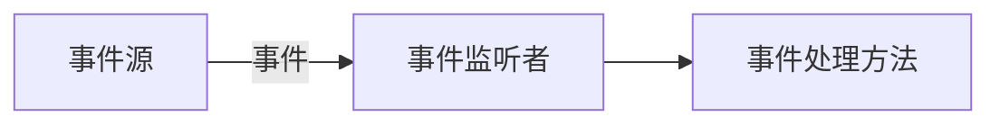

## Java绘图坐标体系

> Q:为啥突然开始这玩意
>
> A:准备开始做个坦克大战.jpg

在这之前先了解下Java的坐标体系,**坐标体系跟x/y为相对关系**

坐标原点位于左上角,以**像素**为单位,在Java坐标系中,第一个是x坐标,表示当前位置为水平方向;第二个是Y坐标,表示当前位置为垂直方向,距离坐标原点y个像素

下方图中的25均表示像素


比方说现在得到了一个坐标(55,10)表示在width55,height10处

> 补充一下像素的说明

计算机在屏幕上显示的内容都是由屏幕上的每一个像素组成的,例如:计算机显示器的分辨率是800x600,表示计算机屏幕上的每一行由800个点组成,共有600行,整个计算机屏幕共有48,000个像素,像素是一个密度单位,像常见的电脑是1920x1080分辨率,即为2,073,600个像素,一般来说,设计桌面端程序都得考虑各种分辨率之间的设计....(就跟Css中的media()做弹性响应一样)

## java绘图技术

### 快速入门

> 先看效果


一个窗口,左上角有个圆圈...如果你接触过`C#`,可能顿时就会想到,这是`.Net FrameWork`吗,emm没错,这玩意差不多就是那个,不过用的比较少,现在用Java的一般都是Web开发,桌面端(游戏一般是C#的Unity或者C++的UE)大部分都是交给C#了(谁让Visual Studio地表第一嘞)

> 上代码

```java
package com.draw;

import javax.swing.*;
import java.awt.*;
import java.awt.event.WindowAdapter;
import java.awt.event.WindowEvent;

//演示如何在面板上画出圆形
public class DrawCircle extends JFrame { //JFrame 对应一个窗口


    public static void main(String[] args) {
        DrawCircle circle = new DrawCircle();
    }

    //    定义一个面板
    private MyPanel mp;

    public DrawCircle() throws HeadlessException { //构造器
//        初始化面板
        mp = new MyPanel();
//        把面板放入到窗口
        this.add(mp);
//        设置窗口的大小
        this.setSize(400, 300);
//        设置可见性
        setVisible(true);
//        点击右上角的close,程序就完全退出
        this.setDefaultCloseOperation(JFrame.EXIT_ON_CLOSE);
    }
}

//1. 先定义一个面板Panel,继承JPanel类,画图形就在这个面板上画
class MyPanel extends JPanel {
    //    1. MyPanel 对象就是一个画板
//    2. Graphics 就是一支画笔
//    3. Graphics 提供了很多绘图的方法
    @Override
    public void paint(Graphics g) { //绘图方法 Graphics 可以理解为是一个画笔
        super.paint(g); //这一行不能去,调用父类的方法,完成初始化
//        画出一个圆形
        System.out.println("paint方法被调用了");
        g.drawOval(10, 10, 100, 100);

    }
}

```


### 绘图原理

- Comppnent类提供了两个和绘图相关最重要的方法
  - `paint(Graphics g)`绘制组件的外观
  - `repaint()`刷新组件的外观
- 当组件第一次在屏幕显示的时候,程序会自动调用`paint()`方法来绘制组件
- 当在以下情况`paint()`会再次调用
  - 窗口最小化,再最大化
  - 窗口的大小发生变化
  - `repaint`函数被调用

## Graphics类

> Graphics类可以理解为就是画笔,为我们提供了各种绘制图形的方法
>
> 父级:awt类,这个类后面再说(虽然基本用不上)

更全的可以去看[JDK文档](https://www.matools.com/file/manual/jdk_api_1.8_google/java/awt/Graphics.html)

接下来看看吧(下面中没有标明参数的默认都是:`int x,int y,int width,int height`)

1. 画直线`drawLine(int x1 ,int y1 ,int x1 ,int y2)` 起点 起点 终点 终点
2. 画矩形边框`drawRect`
3. 画椭圆边框`drawOval`
4. 填充矩形`fillRect`
5. 填充椭圆`fillOval`
6. 画图片`drawImage(Image img,int x,int y,...)`
7. 画字符串`drawString(String str,int x,int y)`
8. 设置画笔的字体`setFont(Font font)`
9. 设置画笔的颜色`setColor(Color c)`


```java
package com.draw;

import javax.swing.*;
import java.awt.*;
import java.awt.event.WindowAdapter;
import java.awt.event.WindowEvent;

//演示如何在面板上画出圆形
public class DrawCircle extends JFrame { //JFrame 对应一个窗口


    public static void main(String[] args) {
        DrawCircle circle = new DrawCircle();
    }

    //    定义一个面板
    private MyPanel mp;

    public DrawCircle() throws HeadlessException { //构造器
//        初始化面板
        mp = new MyPanel();
//        把面板放入到窗口
        this.add(mp);
//        设置窗口的大小
        this.setSize(400, 300);
//        设置可见性
        setVisible(true);
//        点击右上角的close,程序就完全退出
        this.setDefaultCloseOperation(JFrame.EXIT_ON_CLOSE);
    }
}

//1. 先定义一个面板Panel,继承JPanel类,画图形就在这个面板上画
class MyPanel extends JPanel {
    //    1. MyPanel 对象就是一个画板
//    2. Graphics 就是一支画笔
//    3. Graphics 提供了很多绘图的方法
    @Override
    public void paint(Graphics g) { //绘图方法 Graphics 可以理解为是一个画笔
        super.paint(g); //这一行不能去,调用父类的方法,完成初始化
//        画出一个圆形
        System.out.println("paint方法被调用了");

//        演示绘制不同的图形
//1. 画直线`drawLine(int x1 ,int y1 ,int x2 ,int y2)`
        g.drawLine(10, 10, 100, 100);
//2. 画矩形边框`drawRect`
        g.drawRect(20, 20, 50, 50);

//3. 画椭圆边框`drawOval`
        g.drawOval(50, 50, 100, 100);

//4. 填充矩形`fillRect`
        g.fillRect(100, 100, 50, 50);
//5. 填充椭圆`fillOval`
        g.fillOval(150, 150, 50, 50);
//6. 画图片`drawImage(Image img,int x,int y,int width,int height)`
//        1 获取图片资源 , /表示项目根目录的图片,要放在out目录下
        Image image = Toolkit.getDefaultToolkit().getImage(Panel.class.getResource("/test.jpg"));
        g.drawImage(image,200,10,500,300,this);

//7. 画字符串`drawString(String str,int x,int y)`
//8. 设置画笔的字体`setFont(Font font)`
//9. 设置画笔的颜色`setColor(Color c)`
        g.setColor(Color.RED);
//        读取系统中已安装的字体 直接用getfont即可
//        g.setFont(Font.getFont("Fira Code"));
//        进阶版本:设置字体是否为粗体,及设置字体大小
        g.setFont(new Font("微软雅黑",Font.BOLD,50));
        g.drawString("叶天帝永远滴神", 200, 300);
    }
}
```

> 好了,都到这里了,如果说你有过HTML或者.Net FrameWork的基础的话(OpenGl之类的也一样),应该能够轻松的掌握这个画笔,接下来,请尝试用它画出一个坦克


类似于这样的,也可以根据自己的想法自由发挥,方正是一个坦克就行..


最终效果图:


```java
    /**
     * 编写方法画出坦克
     *
     * @param x         坦克所在的x坐标(左上角)
     * @param y         坦克所在的y坐标(左上角)
     * @param paint     Graphics的实例
     * @param direction direction方向
     * @param type      坦克的类型:敌人的坦克或者自己的坦克
     */
public void drawTank(int x, int y, Graphics paint, int direction, int type) {
    //        x , y 就是原点  paint 画笔 direction 方向/朝向 type类型:自己的类型或者敌人的坦克类型
    switch (type) {
        case 0:
            //我们的坦克 青色
            paint.setColor(Color.CYAN);
            break;
        case 1:
            //敌人的坦克 橙色
            paint.setColor(Color.orange);
            break;
    }
    //        根据坦克的方向,来绘制坦克
    switch (direction) {
        case (0):
            //                向上
            //                3d 边缘有高亮
            //                最左边的
            paint.fill3DRect(x, y, 10, 60, false); // 左边的轮子

            paint.fill3DRect(x + 10, y + 10, 30, 40, false); //中间的矩形

            paint.fill3DRect(x + 40, y, 10, 60, false); //右边的轮子

            paint.fillOval(x + 14, y + 20, 20, 20); //中间的圆圈

            paint.drawLine(x + 24, y, x + 24, y + 20); //中间的炮筒
            break;
        default:
            System.out.println("暂时没有考虑到该方向");
    }
```

## Java事件处理机制

Java事件处理采取的是`委派事件模型`,当事件发生时,产生的事件的对象,会把此`消息`传递给`事件的监听者`处理,这里说说的信息实际上就是`java.awt.event`事件类库里某个类创建的对象,把它称为`事件对象`




> 一个让小球可以通过上下左右按键来移动的案例

```java
package com.event_;

import javax.swing.*;
import java.awt.*;
import java.awt.event.KeyEvent;
import java.awt.event.KeyListener;

public class BallMove extends JFrame {
    public BallMove() throws HeadlessException {
        Panel panel = new Panel();
        add(panel);
        setSize(400, 300);
        setDefaultCloseOperation(JFrame.EXIT_ON_CLOSE);
//        添加键盘监听事件 让Jframe可以监听键盘事件,即可以监听到面板上发生的键盘事件
        addKeyListener(panel);
        setVisible(true);
    }

    public static void main(String[] args) {
        new BallMove();
    }
}

//KeyListener 是监听事件,可以监听键盘事件
class Panel extends JPanel implements KeyListener {
    //    为了让小球可以移动,把他左上角的坐标设置为变量
    int x = 10;
    int y = 10;

    @Override
    public void paint(Graphics g) {
        super.paint(g);
        g.fillOval(x, y, 100, 100);
    }

    //   有字符输出时,该方法就会触发
    @Override
    public void keyTyped(KeyEvent e) {

    }

    //    当某个键被按下去的时候,该方法会触发
    @Override
    public void keyPressed(KeyEvent e) {
//        System.out.println("被按下的键:" + (char)e.getKeyCode());
//        返回的是keyCode(int)要转换成char

//        根据用户按下不同的键,来控制小球的移动
        switch (e.getKeyCode()) {
            case KeyEvent.VK_UP:
                this.y--;
                break;
            case KeyEvent.VK_DOWN:
                this.y++;
                break;
            case KeyEvent.VK_LEFT:
                this.x--;
                break;
            case KeyEvent.VK_RIGHT:
                this.x++;
                break;
        }
        this.repaint(); //重绘窗口


    }

    //    当松开某个键,这个方法会被触发
    @Override
    public void keyReleased(KeyEvent e) {

    }
}
```

### 事件处理机制深入理解

1. 前面我们提到了几个重要的概念 事件源  事件  事件监听器,下面我们来全面的介绍他们

2. `事件源` 事件源是一个产生事件的对象,比如按钮,窗口等

3. `事件` 事件就是称在事件源状态改变时的对象 比如当键盘事件 鼠标事件 窗口时间等等被触发时,会生成一个事件对象,该对象保存着当前事件的很多信息,比如`KeyEvent`对象有含义被按下的`Code`值

   1. `java.awt.event`包和`java.swing.event`包中定义了各种事件类型

4. `事件类型` 详情的可以查看JDK文档,这里做个简单的介绍

   | 事件类           | 说明                                                      |
   | :--------------- | --------------------------------------------------------- |
   | ActionEvent      | 通常在按下按钮时 或双击一个列表或选中某个菜单时发生       |
   | AdjustementEvent | 当操作一个滚动条时发生                                    |
   | ComponentEvent   | 当一个组件异常 移动 改变大小时发生                        |
   | ContainerEvent   | 当一个组件从容器中加入或者删除时发生                      |
   | FocusEvent       | 当一个组件获得或者失去焦点时发生                          |
   | ItemEvent        | 当一个复选框或列表项被选中时 但一个选择框或选择菜单被选中 |
   | KeyEvent         | 当键盘的按键被按下 松开时发生                             |
   | MouseEvent       | 当鼠标被拖动 移动 点击 按下....被发生                     |
   | TextEvent        | 当文本区和文本域的文本发生改变时发生                      |
   | WindowEvent      | 当一个窗口激活 关闭 失败 恢复 最小化时发生                |

5. `事件监听器接口`

   1. 当事件源产生一个事件,可以传递给事件监听者处理
   2. 事件监听者(实际上就是一个类),**该类实现了某个监听器接口** 比如前面小球案例中的`Panel`就是一个类,它实现了`KeyListener`接口,它就可以作为一个时间监听者,对接收到的事件进行处理
   3. 事件监听器接口有很多种,不同的事件监听器接口可以监听不同的事件,一个类可以实现多个监听接口
   4. 这些接口在`java.awt.event`包和`javax.swing.event`包中定义,列出常用的事件监听器接口,查看[JDK文档聚集了](https://www.matools.com/file/manual/jdk_api_1.8_google/java/awt/event/package-summary.html)
      

> 现在让我们通过事件处理机制让坦克可以变得移动起来,并且能实现转变方向的效果吧!(WSAD移动方式)


先看效果:


代码做了面对对象式编程:

第一个文件:`Tank.java`

```java
package com.tankGame2;

public class Tank {

    private int x; //坦克的横坐标

    private int y; //坦克的纵坐标

    private int direction; //坦克的朝向

    private int speed = 1; // 移动速度 默认为1

    public static final int TANK_UP = 0;
    public static final int TANK_DOWN = 1;
    public static final int TANK_LEFT = 3;
    public static final int TANK_RIGHT = 4;

    //    封装移动的方法
    public void moveUp() {
        direction = TANK_UP;
        y -= speed;
    }

    public void moveDown() {
        direction = TANK_DOWN;
        y += speed;
    }

    public void moveLeft() {
        direction = TANK_LEFT;
        x -= speed;
    }

    public void moveRight() {
        direction = TANK_RIGHT;
        x += speed;
    }

    public int getSpeed() {
        return speed;
    }

    public void setSpeed(int speed) {
        this.speed = speed;
    }

    public int getDirection() {
        return direction;
    }

    public Tank(int x, int y) {
        this.x = x;
        this.y = y;
    }

    public Tank(int x, int y, int speed) {
        this.x = x;
        this.y = y;
        this.speed = speed;
    }

    public int getX() {
        return x;
    }


    public int getY() {
        return y;
    }
}
```

第二个:`Hero.java`

```java
package com.tankGame2;

/**
 * @author Amayakite
 * @verions 1.0.0
 * 自己的坦克
 */
public class Hero extends Tank {
    public Hero(int x, int y) {
        super(x, y);
    }

    public Hero(int x, int y, int speed) {
        super(x, y, speed);
    }
}
```

第三个 :绘制区域`MyPanel.java`

```java
package com.tankGame2;

import javax.swing.*;
import java.awt.*;
import java.awt.event.KeyEvent;
import java.awt.event.KeyListener;

/**
 * 坦克大战的绘图区域
 */
public class MyPanel extends JPanel implements KeyListener { // 实现监听键盘事件
    //    定义用户的坦克
    Hero hero;
    //    坦克的方向约束
    public final int TANK_UP = 0;
    public final int TANK_DOWN = 1;
    public final int TANK_LEFT = 3;
    public final int TANK_RIGHT = 4;

    //    坦克的颜色约束
    public final int USER_TANK = 0;
    public final int COMPANY_TANK = 1;


    public MyPanel() {
        hero = new Hero(100, 100, 10); //初始化自己的坦克

    }

    /**
     * 绘图
     *
     * @param g event
     */
    @Override
    public void paint(Graphics g) {
        super.paint(g);
        g.fillRect(0, 0, 500, 600); //填充矩形,默认是黑色
        drawTank(hero.getX(), hero.getY(), g, hero.getDirection(), USER_TANK);
    }

    /**
     * 编写方法画出坦克
     *
     * @param x         坦克所在的x坐标(左上角)
     * @param y         坦克所在的y坐标(左上角)
     * @param paint     Graphics的实例
     * @param direction direction方向
     * @param type      坦克的类型:敌人的坦克或者自己的坦克
     */
    public void drawTank(int x, int y, Graphics paint, int direction, int type) {
//        x , y 就是原点  paint 画笔 direction 方向/朝向 type类型:自己的类型或者敌人的坦克类型
        switch (type) {
            case USER_TANK:
                //我们的坦克 青色
                paint.setColor(Color.CYAN);
                break;
            case COMPANY_TANK:
                //敌人的坦克 橙色
                paint.setColor(Color.orange);
                break;
        }
//        根据坦克的方向,来绘制对应形状的坦克 通过final值约束
        switch (direction) {
            case (TANK_UP):
                paint.fill3DRect(x, y, 10, 60, false); // 左边的轮子

                paint.fill3DRect(x + 10, y + 10, 30, 40, false); //中间的矩形

                paint.fill3DRect(x + 40, y, 10, 60, false); //右边的轮子

                paint.fillOval(x + 14, y + 20, 20, 20); //中间的圆圈

                paint.drawLine(x + 24, y, x + 24, y + 20); //中间的炮筒
                break;
            case (TANK_RIGHT): //右边的代码
                paint.fill3DRect(x, y, 60, 10, false); // 上边的轮子

                paint.fill3DRect(x + 10, y + 10, 30, 40, false); //中间的矩形

                paint.fill3DRect(x, y + 40, 60, 10, false); //下边的轮子

                paint.fillOval(x + 15, y + 14, 20, 20); //中间的圆圈

                paint.drawLine(x + 20, y + 24, x + 60, y + 24); //中间的炮筒
//                 这里中间的炮筒核心是x1,x2
                break;
            case (TANK_DOWN): //向下
                paint.fill3DRect(x, y, 10, 60, false); // 左边的轮子

                paint.fill3DRect(x + 10, y + 10, 30, 40, false); //中间的矩形

                paint.fill3DRect(x + 40, y, 10, 60, false); //右边的轮子

                paint.fillOval(x + 14, y + 20, 20, 20); //中间的圆圈

                paint.drawLine(x + 24, y + 20, x + 24, y + 60); //中间的炮筒
                //竖着的主要看Y
                break;
            case (TANK_LEFT): //向左
                paint.fill3DRect(x, y + 40, 60, 10, false); //下边的轮子

                paint.fill3DRect(x + 15, y, 30, 40, false); //中间的矩形
                paint.fill3DRect(x, y, 60, 10, false); // 上边的轮子


                paint.fillOval(x + 20, y + 14, 20, 20); //中间的圆圈

                paint.drawLine(x, y + 24, x + 20, y + 24); //中间的炮筒
//                 这里中间的炮筒核心是x1,x2
                break;

            default:
                System.out.println("暂时没有考虑到该方向");
        }


    }

    @Override
    public void keyTyped(KeyEvent e) {

    }

    @Override
    public void keyPressed(KeyEvent e) {
//        改变坦克的朝向
        switch (e.getKeyCode()) {
            case KeyEvent.VK_W:
                hero.moveUp();

                break;

            case KeyEvent.VK_S:
//                hero.setDirection(TANK_DOWN);
//                hero.setY(hero.getY() + hero.getSpeed());
//                System.out.println("改变了方向TANK_DOWN");
                hero.moveDown();
                break;

            case KeyEvent.VK_A:
                hero.moveLeft();
                break;

            case KeyEvent.VK_D:
                hero.moveRight();
                break;
        }
        this.repaint(); //重绘窗口
    }

    @Override
    public void keyReleased(KeyEvent e) {

    }
}
```

`Main`窗口

```java
package com.tankGame2;

import javax.swing.*;

public class TankGame02 extends JFrame {

    MyPanel mp = null;

    public static void main(String[] args) {
        new TankGame02();

    }

    public TankGame02() {
        mp = new MyPanel();
        this.add(mp);
        this.setBounds(100, 100, 500, 600);
        this.setVisible(true);
        //监听事件
        addKeyListener(mp);
//        关闭事件
        this.setDefaultCloseOperation(JFrame.EXIT_ON_CLOSE);
    }
}
```

### 本章作业

在刚刚的坦克游戏上,画出敌人(蓝色),自己为黄色,画出三个敌人

敌人的tank类继承tank类,后面要添加并发,结果类似于此即可


```java
package com.tankGame2;

import com.sun.org.apache.bcel.internal.generic.NEW;

import javax.swing.*;
import java.awt.*;
import java.awt.event.KeyEvent;
import java.awt.event.KeyListener;

/**
 * 坦克大战的绘图区域
 */
public class MyPanel extends JPanel implements KeyListener { // 实现监听键盘事件
    //    定义用户的坦克
    Hero hero;
    //    坦克的方向约束
    public final int TANK_UP = 0;
    public final int TANK_DOWN = 1;
    public final int TANK_LEFT = 3;
    public final int TANK_RIGHT = 4;

    //    坦克的颜色约束
    public final int USER_TANK = 0;
    public final int COMPANY_TANK = 1;

    //    初始化敌人坦克的数量
    public int enemyCount = 3;
    public Enemy[] enemies;

    public MyPanel() {
        hero = new Hero(200, 500, 10); //初始化自己的坦克
        enemies= new Enemy[enemyCount];
        for (int i = 0; i < enemyCount; i++) {
//            Enemy构造函数中加个朝下
            enemies[i] = new Enemy((1 + i) * 100, 20);

        }
    }

    /**
     * 绘图
     *
     * @param g event
     */
    @Override
    public void paint(Graphics g) {
        super.paint(g);
        g.fillRect(0, 0, 500, 600); //填充矩形,默认是黑色
        Enemy enemy0 = new Enemy(50, 50, 1);
        Enemy enemy1 = new Enemy(150, 50);
        Enemy enemy2 = new Enemy(250, 50);
        for (Enemy enemy : enemies) {
            drawTank(enemy.getX(), enemy.getY(), g, enemy.getDirection(), COMPANY_TANK);
        }

        drawTank(hero.getX(), hero.getY(), g, hero.getDirection(), USER_TANK);
    }

    /**
     * 编写方法画出坦克
     *
     * @param x         坦克所在的x坐标(左上角)
     * @param y         坦克所在的y坐标(左上角)
     * @param paint     Graphics的实例
     * @param direction direction方向
     * @param type      坦克的类型:敌人的坦克或者自己的坦克
     */
    public void drawTank(int x, int y, Graphics paint, int direction, int type) {
//        x , y 就是原点  paint 画笔 direction 方向/朝向 type类型:自己的类型或者敌人的坦克类型
        switch (type) {
            case COMPANY_TANK:
                //敌人的坦克 橙色
                paint.setColor(Color.CYAN);
                break;
            case USER_TANK:
                //我们的坦克 青色
                paint.setColor(Color.orange);
                break;
        }
//        根据坦克的方向,来绘制对应形状的坦克 通过final值约束
        switch (direction) {
            case (TANK_UP):
                paint.fill3DRect(x, y, 10, 60, false); // 左边的轮子

                paint.fill3DRect(x + 10, y + 10, 30, 40, false); //中间的矩形

                paint.fill3DRect(x + 40, y, 10, 60, false); //右边的轮子

                paint.fillOval(x + 14, y + 20, 20, 20); //中间的圆圈

                paint.drawLine(x + 24, y, x + 24, y + 20); //中间的炮筒
                break;
            case (TANK_RIGHT): //右边的代码
                paint.fill3DRect(x, y, 60, 10, false); // 上边的轮子

                paint.fill3DRect(x + 10, y + 10, 30, 40, false); //中间的矩形

                paint.fill3DRect(x, y + 40, 60, 10, false); //下边的轮子

                paint.fillOval(x + 15, y + 14, 20, 20); //中间的圆圈

                paint.drawLine(x + 20, y + 24, x + 60, y + 24); //中间的炮筒
//                 这里中间的炮筒核心是x1,x2
                break;
            case (TANK_DOWN): //向下
                paint.fill3DRect(x, y, 10, 60, false); // 左边的轮子

                paint.fill3DRect(x + 10, y + 10, 30, 40, false); //中间的矩形

                paint.fill3DRect(x + 40, y, 10, 60, false); //右边的轮子

                paint.fillOval(x + 14, y + 20, 20, 20); //中间的圆圈

                paint.drawLine(x + 24, y + 20, x + 24, y + 60); //中间的炮筒
                //竖着的主要看Y
                break;
            case (TANK_LEFT): //向左
                paint.fill3DRect(x, y + 40, 60, 10, false); //下边的轮子

                paint.fill3DRect(x + 15, y, 30, 40, false); //中间的矩形
                paint.fill3DRect(x, y, 60, 10, false); // 上边的轮子


                paint.fillOval(x + 20, y + 14, 20, 20); //中间的圆圈

                paint.drawLine(x, y + 24, x + 20, y + 24); //中间的炮筒
//                 这里中间的炮筒核心是x1,x2
                break;

            default:
                System.out.println("暂时没有考虑到该方向");
        }


    }

    @Override
    public void keyTyped(KeyEvent e) {

    }

    @Override
    public void keyPressed(KeyEvent e) {
//        改变坦克的朝向
        switch (e.getKeyCode()) {
            case KeyEvent.VK_W:
                hero.moveUp();

                break;

            case KeyEvent.VK_S:
//                hero.setDirection(TANK_DOWN);
//                hero.setY(hero.getY() + hero.getSpeed());
//                System.out.println("改变了方向TANK_DOWN");
                hero.moveDown();
                break;

            case KeyEvent.VK_A:
                hero.moveLeft();
                break;

            case KeyEvent.VK_D:
                hero.moveRight();
                break;
        }
        this.repaint(); //重绘窗口
    }

    @Override
    public void keyReleased(KeyEvent e) {

    }
}
```

### 小结

1. 绘制出了我方的坦克
2. 通过按键可以控制我方坦克上下左右移动
3. 接下来将持续完成这个小游戏
