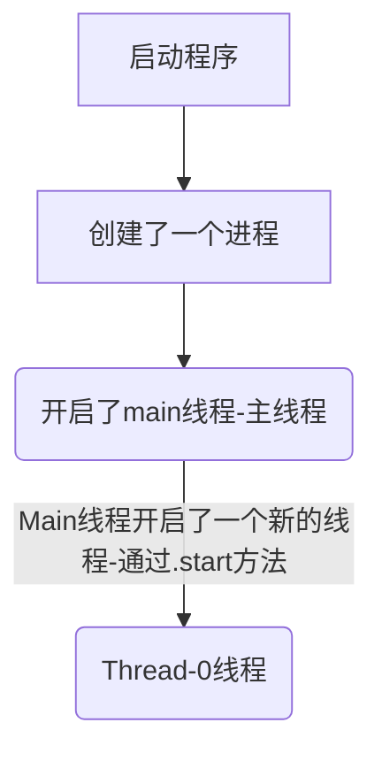

## 线程介绍

线程这玩意应该是整个Java中最重要的部分了，能掌握多线程高并发者得天下也不是白说的...

md终于学到这里了

在正式开始前，先回顾下几个点

- 程序(Program)

  - 是为我们完成特定任务，用某种语言编写的一直输指令的集合

  - 简单来说 *就是我们写的代码*

  - ```java
    public class HelloWorld{
     public static void main(String[] args){
            System.out.println("Hello World!");
        }
    }
    ```

- 进程

  1. 进程是指运行中的程序，比如我们使用**QQ**，就启动了一个进程，**操作系统就会为该进程分配内存空间**，当我们使用**迅雷**，又启动了一个进程，**操作系统将会为迅雷分配新的内存空间**，再或者说，我们使用Java运行了了一个`java HelloWorld`，又启动了一个进程，操作系统也将会为他分配新的内存空间
  2. **进程是程序的一次执行过程，或是正在运行的一个程序，是动态过程:有它自身的产生，存在和消亡的过程**
  3. 也就是说，**正在运行的程序叫做进程**，一个进程是一定会占用内存空间的，只是占用的多与少的问题，进程结束后，系统会自动释放其资源，打个比方：人生存一定要占用地球的空间，只是小孩占用的空间小一点，大人占用的空间多一点，安息后就火化尘归尘土归土，本身就不占用空间了，它住的房子就可以挪出来给别人用
  4. 再比如说，**我现在打开了原神，一个进程就被创建了，当我关闭原神时，一个线程就销毁了，这就是线程**
     
     - 当然如果感觉抽象的话，可以打开任务管理器看看
     - 我还没开原神时，我电脑上有这些线程
       
     - 当我打开原神时 可以看到任务管理器中多出了一个线程，名为launcher
       
     - 当我关闭原神时 这个线程就没了
       
     - 它占用的空间也可以在上图中看到，70.6MB(当然这是我还没有启动游戏本体的情况下)，也会吃掉我们的Cpu，也就是说，只要启动了一个进程，就一定会吃掉CPU和内存的空间

- 线程

  - 什么是线程？
    1. 线程是由进程创建的，是进程的一个实体
    2. **一个进程可以拥有多个线程**，比如：迅雷/百度云/阿里云/OneDrive/GoogleDrive...等，这些进程在同时下载/上传多个文件时，会开启多条线程，比如：当我使用阿里云同时上传多个文件：这其实就是创建了多个线程来同时进行，以让我的上传效率最大化
       
    3. 线程可以套娃创建：一个线程中再创建一个线程--之后会了解到
  - 其他相关概念
    1. 单线程：同一个时刻，只允许执行一个线程
    2. 多线程：同一个时刻，可以执行多个线程：比如，一个QQ进程，可以同时打开多个聊天窗口，一个迅雷进程，可以同时下载多个文件
  - 并发
    - 同一时刻，**多个任务交替执行**，造成一种`貌似同时`的错觉，简单的说，单核CPU                                      实现的多任务就是并发  比方说：有个人再开车时打电话，你可能会认为它正在边开车边打电话，实际上它的大脑再某个瞬间只再做一件事情-要么正在操控方向盘开车，要么正在跟电话另一头的人说话(所以说我国法律规定开车的时候不能打电话，因为它在跟人交流的时候，就有可能忽略了踩刹车)
      

  - 并行
    - 同一时刻，多个任务同时执行，多核CPU可以实现并行 比方说：一个人开车，一个人接电话，互不干扰，都在专心干自己的事情
      

  - 当然程序的世界不可能这么简单，**程序有可能正在并行+并发**，他们两是可以同时存在的，比如说电脑上开了500个QQ和500个原神，但是CPU只有8个，电脑就会让CPU一会儿执行CPU，一会儿执行原神，这种情况下，对于单个CPU的视角来看，他正在并发，对于多个CPU的视角来看，他们正在并行

  那么，提出一个简单的问题，如何通过Java来知道我们的电脑中有多少个**可用的**CPU(多少核)呢，只需要编写以下代码即可：

  ```java
  package com;
  
  public class CpuNumber {
      public static void main(String[] args) {
          Runtime runtime = Runtime.getRuntime();
          // available 获取 Processors 处理器  available Processors 可用处理器
          int cpuNumber = runtime.availableProcessors();
          System.out.println(cpuNumber);
      }
  }
  ```

  通过这两句话就可以轻松的获取电脑上可用的CPU的个数，当然原理先不谈

### 进程的详解

进程是操作系统对于一个正在运行的程序的抽象，进程是操作系统资源分配的基本单位，我们编写的源程序在被编译之后只不过是位于磁盘的静态的二进制数据，他们需要被加载到内存，运行在进程的上下文中。

操作系统通过`PCB`对于进程进行管理，PCB中包含了进程的`PID`，优先级，创建者，状态，进程占用CPU的时候，权限相关信息，进程的文件描述符表等信息，进程之间通过虚拟地址空间实现地址隔离保护，操作系统同样提供的`fork`系统调用就可以创建进程，当fork执行的时候子进程会复制父进程的页表，同时基于`Copy on Write`机制，父子进程拥有相同的内存镜像，子进程和父进程拥有相同的文件描述符表等信息。

因为进程需要的资源比较多，所以创建进程，进程的上下文切换效率比较低。但是也正是因为进程的这一个抽象，使得的操作系统实现了程序并发执行！！！。在`Linux`系统中，可以通过`ps`，`pstree`，`top`等指令查看系统当前进程。同样可以使用`jps`来查看`JVM`进程

当然，上面说的都是抽象的，下面说点实在的

## 线程的概念(Thread)

由进程创建是进程的一个实体，进程可进一步细化为线程，一个进程可以拥有多个线程，线程是一个程序内部的一条执行路径。

若一个进程同一时间并行执行多个线程，就是支持多线程的

线程作为调度和执行的单位，每个线程拥有独立的运行栈和程序计数器（pc），线程切换的开销小

一个进程中的多个线程共享相同的内存单元/内存地址空间-它们从同一堆中分配对象，可以访问相同的变量和对象。这就使得线程间通信更简便、高效；但多个线程燥作共享的系統资源可能就会带来安全的隐患。

## 线程基本使用

在Java中线程来使用有两种方式（有两种方式创建线程）：

1. 继承`Thread`类，重写run方法
2. 实现`Runnable`接口，重写run方法

先来看看`Thread`类把，首先看看它的构造图：


可以看到，`Thread`这个类，实际上也实现了`Runnable`这个接口，这之上还有个不知道是啥的接口(没啥用，先不管那个)

## Thread

> 下面使用线程来完成一个简单的案例
>
> 编写程序，开启一个线程，该线程每隔一秒，在控制台输出`喵喵，我是小猫咪`

```java
package com.trreaduse;

/**
 * 演示通过继承Thread创建线程
 */
public class testThread01 {
    public static void main(String[] args) {
//        创建一个Cat对象,可以当作线程使用
        Cat cat = new Cat();
        cat.start();// 启动线程 就有点类似于迅雷中新建了一个下载文件
//        在调用start时,会自动调用该类中的run方法

    }
}

//1. 当一个类继承了Thread类，该类就可以当作线程使用
//2. 我们会去重写这个run方法，写上自己的业务代码
//3. run Thread类 实现了Runnable 的run方法 也就是说下面的代码本质上也是实现了Runnable接口的run方法
class Cat extends Thread {

    //    设置一个变量,统计次数
    private int count = 0;

    @Override
    public void run() {
//        重写run方法，写上自己的业务逻辑
//        该线程每隔一秒，在控制台输出`喵喵，我是小猫咪`
        while (true) {
//            每输出一次,更新一下计数
            System.out.println("喵喵，我是小猫咪" + (++count));
//        让该线程休眠一秒钟
            try {
                Thread.sleep(1000); //这个方法可能会抛出InterruptedException异常
            } catch (InterruptedException e) {
                e.printStackTrace();
            }
        }

    }
}
```

> 对上题进行改进：当输出80次`喵喵，我是小猫咪`，结束该线程

```java
package com.trreaduse;

/**
 * 演示通过继承Thread创建线程
 */
public class testThread01 {
    public static void main(String[] args) {
//        创建一个Cat对象,可以当作线程使用
        Cat cat = new Cat();
        cat.start();// 启动线程 就有点类似于迅雷中新建了一个下载文件
//        在调用start时,会自动调用该类中的run方法

    }
}

//1. 当一个类继承了Thread类，该类就可以当作线程使用
//2. 我们会去重写这个run方法，写上自己的业务代码
//3. run Thread类 实现了Runnable 的run方法 也就是说下面的代码本质上也是实现了Runnable接口的run方法
class Cat extends Thread {

    //    设置一个变量,统计次数
    private int count = 0;

    @Override
    public void run() {
//        重写run方法，写上自己的业务逻辑
//        该线程每隔一秒，在控制台输出`喵喵，我是小猫咪`
        while (true) {
//            每输出一次,更新一下计数
            System.out.println("喵喵，我是小猫咪" + (++count));
//        让该线程休眠一秒钟
            try {
                Thread.sleep(100); //这个方法可能会抛出InterruptedException异常
            } catch (InterruptedException e) {
                e.printStackTrace();
            }
//            当count到80时,就退出while循环
//            退出while时,线程也就退出了(结束了)
            if(count==80){
                break;
            }

        }

    }
}
```

> 使用JConsole监控线程情况

在这之前，我们再来回顾一下进程和线程，何为进程？

当我们的程序启动的时候，即：


运行这个程序的时候，就创建了一个进程，在启动了这个进程之后，它马上会进入到我们的主方法

**进入到主方法之后，其实这个进程就开启了一个线程，叫主线程**

在这个线程创建过后，我们又创建了一个`Cat`对象，这个对象可以当作线程来使用，因为它继承了`Thread`，所以在这个时候我们运行`cat.start()`的时候，它又启动了一个子线程，这个子线程还可以通过`Thread.currentThread().getName()`来获取其线程名：

```java
System.out.println("喵喵，我是小猫咪" + (++count)+";线程名称:"+Thread.currentThread().getName());
//喵喵，我是小猫咪1;线程名称:Thread-0
```

注意，**main线程启动一个线程，主线程并不会因此而阻塞**，剩余代码并不会在子线程内的方法执行完毕后再执行，而是会继续执行--**这时主线程和子线程是交替执行**(有点JavaScript中Promise的那种味道了)，比如：

```java
Cat cat = new Cat();
cat.start();
System.out.println("这是main方法的一条语句");
//Out:
//这是main方法的一条语句
//喵喵，我是小猫咪1;线程名称:Thread-0
//喵喵，我是小猫咪2;线程名称:Thread-0
//...
//又或者：

Cat cat = new Cat();
cat.start();
for (int i = 0; i < 80; i++) {
System.out.println("主线程的ForI:"+i+";线程名称："+Thread.currentThread().getName());
    //让主线程也休眠一下
    Thread.sleep(100); //异常用throws抛出
}
//Out： 可以看到他们是一种同时运行的状态（这个优先度是由CPU来负责管理的）
//主线程的ForI:0;线程名称：main
//喵喵，我是小猫咪1;线程名称:Thread-0
//喵喵，我是小猫咪2;线程名称:Thread-0
//主线程的ForI:1;线程名称：main
//主线程的ForI:2;线程名称：main
//喵喵，我是小猫咪3;线程名称:Thread-0
//喵喵，我是小猫咪4;线程名称:Thread-0
//主线程的ForI:3;线程名称：main
//喵喵，我是小猫咪5;线程名称:Thread-0
//...
```



再举个例子：我在今早玩原神的时候，我的胡桃（MD想抽个早柚就这么难吗）正在和丘丘人激情对A，假设我的胡桃就是主线程，丘丘人就是子线程，我在A它，它在A我，我们互不影响，并不会存在我A它的时候它没法A我，它A我的时候我没法A它

那么，如何让我能够实实在在的看到正在运行的线程呢？这就要用到`JConsole`了：

在这之前，将Sleep(两处)改成1000，让我们更直观的查看线程：

### jconsole的使用

第一步，启动进程：


第二部，打开终端，输入`jconsole`并按回车运行


第三步：可以看到在`JConsole`中看到一个和我们**主线程所在类名相同(和文件名字一致)**的进程：直接连接，不管SSL证书什么的问题


连接上去后，可以清晰的看到我们此刻正有两个线程在跑，一个`main`一个`Thread-0`，而进程正是他们上方的线程坐标图


此时我们再将主线程(main线程)中的循环次数改成比子线程少30次，看看他们的运行情况：


可以看到，当主线程中的for循环结束完毕后，在`jconsole`的面板上`main`就消失了，说明它已经挂了，但是子线程仍然在运行，也可以在IDEA的控制台上看到后面输出的全都是子线程`Thread-0`中的语句(全都是它在跑)

当`Thread-0`进程结束时，可以看到整个进程也结束，此时尝试连接时连不上去的（进程已经挂了，这里的8760表示它的进程号）


由JConsole的帮助我i们可得出：

1. 当我们运行程序的时候就开启了一个**`进程`**

2. 这个进程启动了一个主线程`main`

3. 这个`main`线程又启动了一个子线程`Thread-0`

4. 在主线程`main`中，因为我们设定了50次循环，即50s，所以在50s后这个`main`线程就结束了(退出了)

5. 而子线程`Thread-0`这个线程因为我们设定的是80次，即80s，在主线程`main`指向完毕后它还没有执行完，所以它还在继续工作，所以造成这个**`进程`**还活着

6. 等到子线程`Thread-0`的循环执行完毕后，他也挂了，**此时进程中没有任何正在执行的线程，所以它也退出来了(结束了)**

7. 在上一步进程退出来的时候，也可以明显的在`Jconsole`中看到，这个进程已经没有响应了，所以`JConsole`再次试图连接这个进程就会发现连接不到了，打个比方：

   我打开了原神，开始锄大地，当我把一个区域（蒙德）全都锄完时候，我并不一定会退出游戏，而是继续去锄其他区域的怪，当我把全部区域的怪和资源都锄完了，我也无事可做，这就会造成我退出游戏，此时若再想去打怪，已经没法打了（我已经退出游戏了）

8. 如果说在子线程中又创建了一个线程`Thread-1`，循环次数为120次，即120s，那么在`Thread-0`结束后（80s时），进程并不会退出，而是等到`Thread-1`的120s结束后才会退出

9. 综上所述：**如果我们的主线程结束了，但是还有其他的线程正在运行，这并不会造成我们的进程结束，直到我们的所有线程都执行完毕后（没有任何正在执行的线程时），进程才会退出**

10. **总结：只要程序中有正在运行的线程，那么程序就不会退出，当所有线程都执行完毕后，我们的程序才会退出（进程才会结束）**

## start()的深入了解

在刚刚开启线程的时候，可能会有疑惑的地方：调用`cat`的`run`方法不应该是直接`cat.run()`吗？为什么要用一个跟他八竿子打不着边的`start()` ，而不是调用`run()`

接下来尝试下直接用主线程调用`run()`方法`cat.run()`：

然后运行程序，可以非常直观的看到输出：

```md
cat.run()； //run方法就是一个普通的方法，没有正在的启动一个线程，所以主线程会将这个方法执行完毕才会继续执行之后的代码
-------
喵喵，我是小猫咪1;线程名称:main
喵喵，我是小猫咪2;线程名称:main
喵喵，我是小猫咪3;线程名称:main
喵喵，我是小猫咪4;线程名称:main
喵喵，我是小猫咪5;线程名称:main
......
可以看到，它的线程名从原本的Thread-0变成了main，并且造成了堵塞(主线程的的for循环将在它完全执行完毕后才会调用)，也就是说，在主线程中直接调用run方法没有额外开启线程，只是普通的执行了一个函数而已
这就跟我们写一个单线程程序没有任何区别，完全没用到多线程的特点-并发运行
-----
此时的流程:
进程---->Main方法
    |
    ↓
  cat.run()---->(执行完毕cat.run后)才会继续执行main方法中的剩余的代码--for循环

```

接下来通过start()的源码来分析下它是怎么个执行流程

### 分析Start的源码

> 先看看start()的源码

```java
public synchronized void start() {
    /**
         * This method is not invoked for the main method thread or "system"
         * group threads created/set up by the VM. Any new functionality added
         * to this method in the future may have to also be added to the VM.
         *
         * A zero status value corresponds to state "NEW".
         */
    if (threadStatus != 0)
        throw new IllegalThreadStateException();

    /* Notify the group that this thread is about to be started
         * so that it can be added to the group's list of threads
         * and the group's unstarted count can be decremented. */
    group.add(this);

    boolean started = false;
    try {
        //这个start0是最为核心的方法，其他的都先不管
        //并且在这里还可以看到：start()方法中并没有出现任何run的相关字眼
        start0();
        started = true;
    } finally {
        try {
            if (!started) {
                group.threadStartFailed(this);
            }
        } catch (Throwable ignore) {
            /* do nothing. If start0 threw a Throwable then
                  it will be passed up the call stack */
        }
    }
}
```

> 看看这个start0都做了什么

```java
private native void start0();
```

1. `native`表示是一个本地方法（底层方法），这个方式是直接由`JVM机`来调用的
2. **它的底层是C/C++**实现
3. 真正实现多线程的效果，是`start0()`，而不是`run()`方法
4. **也就是说，在`start0()`里面，它用多线程的机制来调用我们的`run()`方法**

**`start()`方法调用`start0()`方法后，该线程并不会立马执行，只是将线程变为了可运行的状态（线程的状态后面会了解到），具体什么时候执行，取决于CPU，由CPU统一调度**


也就是说，线程的机制要真正的搞懂，其实是要涉及到操作系统之中的一些机制的

> 扩展：Thread类中private native void start0();方法是一个底层调用方法直接调用操作系统的接口，这个属于历史问题，当时Java刚出来的时候，C语言号称“我就是程序”，所以Java就必须向大佬低头，要与C语言可以互通然后就出现了JVM的本地库接口 Java Native Interface 江湖人称JNI

扩展：start0()的源码（看看就好）：

```c
hotspot thread.cpp :

void Thread::start(Thread* thread) {
 trace("start", thread);
// Start is different from resume in that its safety is guaranteed by context or
// being called from a Java method synchronized on the Thread object.
    if (!DisableStartThread) {
        if (thread->is_Java_thread()) {
        // Initialize the thread state to RUNNABLE before starting this thread.
        // Can not set it after the thread started because we do not know the
        // exact thread state at that time. It could be in MONITOR_WAIT or
        // in SLEEPING or some other state.
            java_lang_Thread::set_thread_status(((JavaThread*)thread)->threadObj(),
            java_lang_Thread::RUNNABLE);
        }
     os::start_thread(thread);
    }
}
```

## 实现Runnable接口

前面的代码中可以了解到，我们可以通过继承`Thread`来**开发一个线程类**，但实际上有个问题：

- Java是单继承的，在某些情况下一个类可能已经继承了某个父类，这时再用继承Thread类方法来创建线程显然是不可能的了

  ```java
  class A extends B{}
  class A extends B,Thread{} //这显然是不可行的
  ```

所以Java设计者提供了另一个方式来创建线程，就是通过`Runnable`接口来创建线程

接下来使用`Runnable`来实现一个程序，该程序每隔一秒，可以在控制台输出`"hi!"`，当输出10次后，自动退出 Thread02.java

```java
package com.trreaduse;

/**
 * 通过实现接口Runnable来开发线程
 */
public class Thread02 {
    public static void main(String[] args) {
        Dog dog = new Dog();
//        dog.start(); 这里不能调用start() 因为 Runnable接口中根本没有start()这个方法
//        这时就需要：
//        创建Thread对象，把dog对象（实现了Runnable）放入Thread
        Thread thread = new Thread(dog);
//        然后调用Thread中的start()
//        这里底层使用了设计模式【代理模式(也称静态代理)】来实现
        thread.start();
    }
}

//通过实现Runnable接口，开发线程
class Dog implements Runnable {
    int count = 0;

    @Override
    public void run() {
        while (true) {
            System.out.println("小狗狗汪汪叫~hi~" +
                    (++count) +
                    ";线程名称：" +
                    Thread.currentThread().getName());
            if (count == 10) {
                break;
            }
//            休眠1s
            try {
                Thread.sleep(1000);
            } catch (InterruptedException e) {
                e.printStackTrace();
            }

        }
    }
}
```

可以看到，上面使用了`Thread`的有参构造，来完成的`strat()`的运行，这之中用了一种新的设计模式[代理模式]，接下来用代码来模拟一下这个代理模式是怎么个流程（这个也加静态代理）

```java
package com.trreaduse;

/**
 * 通过实现接口Runnable来开发线程
 */
public class Thread02 {
    public static void main(String[] args) {
        Tiger tiger = new Tiger();
        new ThreadProxy(tiger).start();
    }
}

class Animal {
}

class Tiger extends Animal implements Runnable {

    @Override
    public void run() {
        System.out.println("DO Noting");
    }
}

//模拟一个线程代理类     实现极简的Thread
class ThreadProxy implements Runnable {
    //    可以把Proxy这个类当作Thread类来对待
    private Runnable target = null; //属性，类型是Runnable

    @Override
    public void run() {
        if (target != null) {
            target.run(); //根据动态绑定机制运行run
        }
    }
    //    构造器
    public ThreadProxy(Runnable target) {
        this.target = target;
    }
    public void start() {
        start0(); //这个方法是真正实现多线程的方法
    }
    public void start0() {
        run();
    }
}
```

### 线程的应用案例-多线程执行

一个程序，创建两个线程，一个线程每隔一秒输出"hello world"，输出10次，退出，另一个线程每一秒输出“hi”，输出5次，退出

```java
package com.trreaduse;

public class Thread03 {
    public static void main(String[] args) {
        new T3().start();// 线程1
        new T4().start();// 线程2
    }
}

class T3 extends Thread {
    @Override
    public void run() {
        for (int i = 0; i < 10; i++) {
            System.out.println("Hello World " + (i + 1) + " name:" + Thread.currentThread().getName());
            try {
                Thread.sleep(1000);
            } catch (InterruptedException e) {
                e.printStackTrace();
            }
        }
        System.out.println("线程" + Thread.currentThread().getName() + "执行完毕");
    }
}

class T4 extends Thread {

    @Override

    public void run() {

        for (int i = 0; i < 5; i++) {
            System.out.println("hi " + (i + 1) + " name:" + Thread.currentThread().getName());
            try {
                Thread.sleep(1000);
            } catch (InterruptedException e) {
                e.printStackTrace();
            }
        }
        System.out.println("线程" + Thread.currentThread().getName() + "执行完毕");

    }
}
```


### 一个经典的问题-多个线程同时操控一个变量

来看看下面这个代码在运行过程中会出现的问题：

```java
package com.trreaduse;

/**
 * 模拟三个窗口同时售票一百张
 */
public class Sellticker {
    public static void main(String[] args) {
        SellTicker01 sellTicker01 = new SellTicker01();
        SellTicker01 sellTicker02 = new SellTicker01();
        SellTicker01 sellTicker03 = new SellTicker01();

//        启动线程售票
//        sellTicker01.start();
//        sellTicker02.start();
//        sellTicker03.start();
//        可以看到一个严重的问题，再执行的时候，可以看到很多相同的数值，以及最后剩余的票数竟然是-1了....

//        这个情况是怎么导致的？
//        先分析下这种情况是怎么出现的
//        我们创建了三个线程（三个抢票窗口）他们都同时去调用tickerNumber
//        现在就是出现了一个情况，第一个线程进入到了while循环中，到了判断阶段，它要判断票数是否小于等于0
//        如果没有小于等于0，则继续执行，如果小于等于0，则break
//        假设我们现在的票只剩下两张，但是三个线程都是同时执行到了这句话，访问到了number，他们访问到的结果均为2
//        所以他们都会执行一次number--
//        最终就导致了票数异常的情况

        SellTicker02 sellTicker021 = new SellTicker02();
//        同一个对象，创建三个线程 所以他们的number应该是共享的
        new Thread(sellTicker021).start();
        new Thread(sellTicker021).start();
        new Thread(sellTicker021).start();
//        可以看到，问题依旧，最主要的原因就是他们再某个时间段统一执行了判断语句，导致得到相同的结果，最后导致票数异常的问题

    }
}

//使用Thread
class SellTicker01 extends Thread {
    private static int tickerNumber = 100; //让多个线程共享num

    @Override
    public void run() {
        while (true) {
            if (tickerNumber <= 0) {
                System.out.println("售票结束....");
                break;
            }
//        休眠50ms
            try {
                Thread.sleep(50);
            } catch (InterruptedException e) {
                e.printStackTrace();
            }
            System.out.println("窗口" + Thread.currentThread().getName() + "售出了一张票，剩余票数" + (--tickerNumber));
        }
    }
}

//实现接口的方式看下能否解决这个问题
class SellTicker02 implements Runnable {
    private int tickerNumber = 100; //让多个线程共享num

    @Override
    public void run() {
        while (true) {
            if (tickerNumber <= 0) {
                System.out.println("售票结束....");
                break;
            }
//        休眠50ms
            try {
                Thread.sleep(50);
            } catch (InterruptedException e) {
                e.printStackTrace();
            }
            System.out.println("窗口" + Thread.currentThread().getName() + "售出了一张票，剩余票数" + (--tickerNumber));
        }
    }
}
```

在解决这个问题之前，我们回顾下线程的基本特点：

#### 线程的终止

1. 当线程完成任务后，会自动退出
   
2. 还可以通过**使用变量**来**控制run方法退出**的方式停止线程，即通知方式

通过变量来停止线程：案例：*`启动一个线程t，要求在main线程中去停止线程t`*

```java
package com.exit_;

public class ThreadExit_ {
    public static void main(String[] args) throws InterruptedException {
        T t1 = new T();
        t1.start();
//        如果希望主线程去控制t1线程的终止
//        就必须可以去loop变量 让t1退出run方法，从而终止t1线程

//        让主线程休眠10秒，再通知t1退出
        Thread.sleep(10 * 1000);
        t1.setLoop(false);
    }
}

class T extends Thread {
    private int count = 0;
    //    设置一个控制变量
    private boolean loop = true;

    //    通过变量来退出
    public void setLoop(boolean loop) {
        this.loop = loop;
    }

    @Override
    public void run() {
        while (loop) {
            try {
                Thread.sleep(50);
            } catch (InterruptedException e) {
                e.printStackTrace();
            }
            System.out.println("T 运行中:" + (++count));
        }
    }
}
```

## 线程常用的方法

### 基本方法

1. `setName` 设置线程名称 使之与参数name相同
2. `getName` 返回该线程的名称
3. `start` 使该线程开始执行 Java虚拟机底层调用`start0`方法
4. `run`调用线程对象的run方法
5. `setPriority` 更该线程的优先级
6. `getPriority` 获取线程的优先级
7. `sleep` 在指定的毫秒数内让正在执行的线程休眠(暂停执行)
8. `interrupt`中断线程(如果线程正在休眠 则让它继续执行（结束线程的`sleep()`，也就是`WATTING`状态）)
8. `isAlive` 获取线程是否处于活动状态(`RUNNING`) 返回布尔值

#### 注意事项和细节

1. `start`底层会创建新的线程,调用run,run就是一个简单的方法调用,不会启动新的线程
2. 线程优先级的范围
   1. `Thread.MAX_PRIORITY` 最高优先级 10
   2. `Thread.MIN_PRIORITY`最低优先级 1
   3. `Thread.NORM_PRIORITY` 默认优先级 5
3. `interrupt` 中断线程 但并没有真正的结束线程 所以一般用于中断正在休眠的线程（结束线程内的`Thread.sleep()`状态）
4. `sleep` 线程的静态方法 使当前线程休眠

```java
package com.method;

public class ThreadMethod01 {
    public static void main(String[] args) throws InterruptedException {
        T t = new T();
//        设置线程的名称
        t.setName("张三");
//        启动子线程
        t.start();
//        获取线程名称
        System.out.println(t.getName());

//        主线程打印5个 hi 然后 终端子线程的休眠
        for (int i = 0; i < 5; i++) {
            Thread.sleep(1000);
            System.out.println("hi~" + i);

        }

        System.out.println(t.getName()+"的优先级是:"+t.getPriority()); //张三的优先级是:5
        
        
        t.interrupt(); // 当执行到这里时，就会中断t线程的休眠 让t中未完成的代码继续执行


    }
}

class T extends Thread { //我们的自定义线程类
    @Override
    public void run() {
        while (true) {
            for (int i = 0; i < 100; i++) {
//            Thread.currentThread().getName() 获取当前线程的名称
                System.out.println(Thread.currentThread().getName() + "  吃包子：" + i);
            }
            try {
                System.out.println(Thread.currentThread().getName() + "  休眠中");
                Thread.sleep(20000);
            } catch (InterruptedException e) {
//            当线程执行到一个interrupt方法时，就会catch一个异常，可以加入自己的业务代码
//            InterruptedException 是捕获到一个中断异常
                System.out.println(Thread.currentThread().getName() + "被interrupt了");
            }
        }

    }
}
```

### 礼让和插队

1. `yield` 线程的礼让。让出CPU，让其他线程执行，**但礼让的时间不确定，所以也不一定礼让成功**(礼让是由CPU来决定要不要进行的，理论来说，单个CPU中线程越多，越容易礼让成功)，要让哪个线程礼让，就在该线程run方法的某处加上(`Thread.yield()`)如果是main方法,直接调用`Thread.yield();`
2. `join` 线程的插队。插队的线程一旦插队成功，则肯定先执行插完插入的线程的所有任务(要让哪个线程插队，就调用哪个线程的join)


```java
package com.method;

public class ThreadMethod02 {
    public static void main(String[] args) throws InterruptedException {
        T2 t2 = new T2();
        t2.start();
        for (int i = 1; i <= 20; i++) {
            Thread.sleep(1000);
            System.out.println("主线程吃了" + i + "个包子");
//            让主线程吃了五个包子后剩余的先让子线程吃完，主线程再吃
            if (i == 5){
                System.out.println("主线程让子线程先吃");
//                join() 插队
//                t2.join(); //这里相当于让t2先执行完毕
                Thread.yield(); //礼让，将当前线程搁置，不一定成功

                System.out.println("子线程吃完了，主线程接着吃");
            }
        }
    }
}

class T2 extends Thread { //我们的自定义线程类
    @Override
    public void run() {
        for (int i = 1; i <= 20; i++) {
//            Thread.currentThread().getName() 获取当前线程的名称
            try {
                Thread.sleep(1000);
            } catch (InterruptedException e) {
                System.out.println(Thread.currentThread().getName() + "被interrupt了");
            }
            System.out.println(Thread.currentThread().getName() + "  吃包子：" + i);
        }

    }
}
```

### 用户线程和守护线程

1. 用户线程：也叫工作线程，当线程的任务执行完或通知的方式结束
2. 守护线程：一般是为工作线程服务的,当所有的用户线程结束，守护线程自动结束
3. 常见的守护线程：垃圾回收机制

正常来说,当我们的主线程结束以后,若还有未能结束的子线程,则进程将要等到子线程执行完毕后才会退出,但是守护线程可以帮助我们让子线程在主线程结束时也一并结束

> 下面先来看个没有守护进程的代码 普普通通 主线程执行10次后将不再执行 而子线程将会一直持续的执行下去

```java
package com.method;

public class ThreadMethod03 {
    public static void main(String[] args) throws InterruptedException {
        MyDaemonThread daemonThread = new MyDaemonThread();
        daemonThread.start();
        for (int i = 1; i <= 10; i++) {
            System.out.println("主线程runrun" + i);
            Thread.sleep(1000);
        }
        System.out.println("主线程End------------");
    }
}

class MyDaemonThread extends Thread {
    @Override
    public void run() {
        for (; ; ) { //等价于while(true)
            try {
                Thread.sleep(1000);
            } catch (InterruptedException e) {
                e.printStackTrace();
            }
            System.out.println("子线程runrun");
        }
    }
}
```

> 接下来将一个线程设置为守护线程:非常简单, 总而言之

```java
package com.method;

public class ThreadMethod03 {
    public static void main(String[] args) throws InterruptedException {
        MyDaemonThread daemonThread = new MyDaemonThread();
//        若我们希望当main线程结束后,子线程自动结束
//        只需要将子线程设置为守护线程即可
//        需要先设置,再启动
        daemonThread.setDaemon(true);

        daemonThread.start();

        for (int i = 1; i <= 10; i++) {
            System.out.println("主线程runrun" + i);
            Thread.sleep(1000);
        }
        System.out.println("主线程End------------");
    }
}

class MyDaemonThread extends Thread {
    @Override
    public void run() {
        for (; ; ) { //等价于while(true)
            try {
                Thread.sleep(1000);
            } catch (InterruptedException e) {
                e.printStackTrace();
            }
            System.out.println("子线程runrun");
        }
    }
}
```

#### 守护线程注意点

守护线程只能用户守护主线程,即无论我在哪里设置的守护线程,他的结束时间均为主线程结束

下面的代码中,我在`TestFace`中创建的守护线程并不会在它执行完毕后结束,而是直至主线程结束才会结束

```java
package com.method;

public class ThreadMethod03 {
    public static void main(String[] args) throws InterruptedException {
        TestFace testFace = new TestFace();
        testFace.start();
        for (int i = 1; i <= 10; i++) {
            System.out.println("主线程runrun" + i);
            Thread.sleep(1000);
        }
        System.out.println("主线程End------------");
    }
}

class MyDaemonThread extends Thread {
    @Override
    public void run() {
        for (; ; ) { //等价于while(true)
            try {
                Thread.sleep(1000);
            } catch (InterruptedException e) {
                e.printStackTrace();
            }
            System.out.println("子线程runrun");
        }
    }
}

class TestFace extends Thread {
    @Override
    public void run() {
        MyDaemonThread myDaemonThread = new MyDaemonThread();
        myDaemonThread.setDaemon(true);
        myDaemonThread.start();
        for (int i = 0; i < 3; i++) {
            System.out.println("测试下二级守护线程"+i);
            try {
                Thread.sleep(1000);
            } catch (InterruptedException e) {
                e.printStackTrace();
            }
        }
        System.out.println("二级线程结束");
    }
}
```

## 线程的生命周期

JDK中使用了`Thread.State`枚举表现了线程的几种状态，线程可以处于以下状态之一

- `NEW`尚未启动的线程处于此状态
- `RUNNABLE`在Java虚拟机中执行的线程处于此状态
- `BLOCKED`被阻塞等待监视器锁定的线程处于此状态
- `WAITING`正在等待另一个线程执行特定的动作的线程处于此状态
- `TIMED_WAITING`正在等待另一个线程执行动作到达指定等待时间的线程处于此状态
- `TERMINATED`已退出的线程处于此状态

Ready和Running是属于内核的状态,由系统来决定它是处于Ready还是Running,只要知道,他们两都是处于`Runnable`状态下即可

完整版生命周期：


简化版生命周期:


> 一个简单的查看状态的代码

```java
package com.state_;

public class ThreadState {
    public static void main(String[] args) throws InterruptedException {
        T t = new T();
        System.out.println(t.getName() + "当前状态" + t.getState()); //NEW
        t.start();
//        只要状态不处于退出的情况下就执行主线程我while循环
        while (t.getState() != Thread.State.TERMINATED) {
//            可以发现直接运行有时候能获取到TIMED_WAITING
//            TIMED_WAITING 就是在线程处于sleep下的状态
            System.out.println(t.getName() + "当前状态" + t.getState());
            //TIMED_WAITING 和 RUNNABLE交替
            
            Thread.sleep(500);
        }
        System.out.println(t.getName() + "当前状态" + t.getState()); //TERMINATED

    }
}

class T extends Thread {
    @Override
    public void run() {
        while (true) {
            for (int i = 0; i < 10; i++) {
                System.out.println("hi" + i);
                try {
                    sleep(1000);
                } catch (InterruptedException e) {
                    e.printStackTrace();
                }
            }
            break;
        }
    }
}
```

## 线程的同步

还记得前面的那个窗口买票的案例吗，三个窗口同时操控一个变量，正常情况下往往会出现预期之外的问题，而且无论是通过继承`Thread`方式或者实现`Runnable`的方式最终得到的效果都是一样的--->都存在超卖的行为，且可以在卖票过程中发现某些时间段他们三同可能时卖出的是同一张票，这时就得通过线程的同步来解决问题了

### 线程的同步机制

1. 在多线程编程，一些敏感数据不允许被多个线程同时访问，此时就可以使用线程同步技术，保证数据在任何时刻，最多只有一个线程访问，以保证数据的完整性
2. 也可以理解为：**线程同步，即当有一个线程在对内存进行操作时，其他线程都不可以对这个内存地址进行操作，知道该线程完成操作，其他线程才能对该内存地址进行操作**

同步的核心理念就是：**不管此时程序有多少个线程来操作这个数据，在同一时刻，只允许有一个线程来真正的对这个数据进行操作，其他的线程均在它的后面排队，直到这个线程执行完毕后，其他线程依次的进来操作**~~我好像想到了什么奇怪的东西~~

## 同步具体方法-Synchronized(互斥锁)

1. 同步代码块

   ```java
   synchronize (对象){ //得到对象的锁，才能同步操作代码
       //需要被同步的代码
   }
   ```

2. `synchronized`还可以放在方法申明中，表示整个方法为同步方法

   ```java
   public synchronize void m(String name){
       //需要被同步的代码
   }
   ```

3. 如何理解：

   - 就好像 某人上厕所先把门关上（上锁），完事后再出来（解锁），那么其他人就可以在使用厕所了
   - 

4. **使用`synchronized`时，一定要确保操纵的方法或者数据是几个线程之间共享的！**

使用`synchronized`来解决之前售票的问题

### synchronize锁-同步方法的实现

```java
package com.sync_;

public class testSyncTicket {
    public static void main(String[] args) {
        SellTicket01 ticket01 = new SellTicket01();
        SellTicket01 ticket02 = new SellTicket01();
        SellTicket01 ticket03 = new SellTicket01();
//        普通的Thread 让三个SellTicker同时抢夺（运行）一个静态的synchronized  (因为这里实际上是new了三个SellTicket01对象)
//        ticket01.start();
//        ticket02.start();
//        ticket03.start();

//        用Runnable接口的实现类 因为这里是只new了一个，所以实际上下面三个new Thread实际上访问到的都是同一个sell方法和同一个count
        SellTicket ticket = new SellTicket();
        new Thread(ticket).start();
        new Thread(ticket).start();
        new Thread(ticket).start();

    }
}

class SellTicket01 extends Thread {
    public static int count = 100;
    public static boolean loop = true;
    //这个锁是加在SellTicket01.class上
    public synchronized static void sell() { 
        if (count <= 0) {
            System.out.println("售票结束1");
            loop = false;
            return;
        }
//            休眠50ms
        try {
            Thread.sleep(100);
        } catch (InterruptedException e) {
            e.printStackTrace();
        }
        System.out.println("当前的票数:" + (--count) + ";当前的线程名称：" + Thread.currentThread().getName());
    }

    //    真正的问题是有三个线程同时来执行这个run方法
    @Override
    public void run() {
        while (loop) {
            sell();
        }

    }
}

//接口的sync实现
class SellTicket implements Runnable {
    private int count = 100;
    private boolean loop = true;
    //这个锁是加在this上(实例对象)
    public synchronized void sell() { //同步方法 在同一个时刻，只能有一个线程来执行我们的sell方法
        if (count <= 0) {
            System.out.println("售票结束");
            loop = false;
            return;
        }
//            休眠50ms
        try {
            Thread.sleep(100);
        } catch (InterruptedException e) {
            e.printStackTrace();
        }
        System.out.println("当前的票数:" + (--count) + ";当前的线程名称：" + Thread.currentThread().getName());
    }

    //    真正的问题是有三个线程同时来执行这个run方法
    @Override
    public void run() {
        while (loop) {
            sell();
        }

    }
}
```

### synchronize锁-代码块的实现

可以很明显的感觉到放在代码块上比在同步方法效率貌似要高那么一丢丢（大概吧）

```java
class SellTicket implements Runnable {
    private int count = 100;
    private boolean loop = true;
    private final Object object = new Object();


//    1 public synchronized void sell(){} 就是一个同步方法
//    2 这时锁在this对象
//    3 也可以在代码块上写synchronized，同步代码块，互斥锁，还是在this对象
//    4 这个代码块上的()中不一定要放this，也可以是其他对象，但必须得保证线程之间访问的是同一个对象
    public /*synchronized*/ void sell() {
        synchronized (/*this*/object) {
            if (count <= 0) {
                System.out.println("售票结束");
                loop = false;
                return;
            }
            try {
                Thread.sleep(100);
            } catch (InterruptedException e) {
                e.printStackTrace();
            }
            System.out.println("当前的票数:" + (--count) + ";当前的线程名称：" + Thread.currentThread().getName());
        }
    }

    //    真正的问题是有三个线程同时来执行这个run方法
    @Override
    public void run() {
        while (loop) {
            sell();
        }

    }
}
```

`synchronized`就像是一个厕所，三个实例就像是三组急着要上厕所的人，想开厕所的门，就得有**钥匙**，厕所的门前自带一把钥匙，当一组人中的某个人抢到了钥匙，并进去上厕所（并在里面把门**锁**上），其他人将无法进入这个厕所，直到这个人出来，把钥匙插回门上，其他人才能继续使用这个厕所，然后三组人员又继续抢夺（拼手速一样）钥匙并进入，直到三组人全部上完厕所


`synchronized`是非公平**锁**，也就是说，他之中并不存在什么顺序，多个线程调用，谁先抢到，谁先执行里面的内容，其他的人则后执行里面的内容，这样的好处是，操纵一个代码块的时候，始终是只让一个线程在操纵，就不会出现超卖等行为了

这把锁也叫对象互斥锁（一般叫互斥锁），接下来详细介绍下它

### 互斥锁的原理

1. Java在Java语言中，引入了对象互斥锁的概念，来保证共享数据操作的完整性

2. 每个对象都应用于一个可称为“互斥锁”的标记，这个标记来保证在**任一**时刻，只能有一个线程来访问该对象

3. 关键字`synchronized`来与对象的互斥锁联系。当某个对象用`synchronized`修饰时，表明该对象在**任一**时刻只能由一个线程访问

4. 同步的局限性：**导致程序的执行效率要降低**，所以说锁并不是加的越多越好

   就好像有100辆赛车要到赛道上跑一样，赛道本身是非常宽的，但是在赛道前有一个收费站，每次只能通过一辆赛车，也就是说，这个赛车通过收费站的时候还得一个一个出，所以就会在收费站这个地方行程一个瓶颈

5. 同步方法（非`static`）的锁可以是this，也可以是其他对象（**操纵的对象必须是同一个对象(同一个对象指的是多个线程之间操纵的必须是同一个数据，方法等)**）

   - 同步方法

     ```java
     class SellTicket implements Runnable {
         private int count = 100;
         private boolean loop = true;
         //这个锁是加在this上(实例对象)
         public synchronized void sell() { 
             if (count <= 0) {
                 System.out.println("售票结束");
                 loop = false;
                 return;
             }
     //            休眠50ms
             try {
                 Thread.sleep(100);
             } catch (InterruptedException e) {
                 e.printStackTrace();
             }
             System.out.println("当前的票数:" + (--count) + ";当前的线程名称：" + Thread.currentThread().getName());
         }
     
         @Override
         public void run() {
             while (loop) {
                 sell();
             }
     
         }
     }
     ```

   - 同步代码块

     ```java
     class SellTicket implements Runnable {
         private int count = 100;
         private boolean loop = true;
         private final Object object = new Object();
     
     //    1 public synchronized void sell(){} 就是一个同步方法
     //    2 这时锁在this对象
     //    3 也可以在代码块上写synchronized，同步代码块，互斥锁，还是在this对象
     //    4 这个代码块上的()中不一定要放this，也可以是其他对象，但必须得保证线程之间访问的是同一个对象
         public /*synchronized*/ void sell() {
             synchronized (/*this*/object) {
                 if (count <= 0) {
                     System.out.println("售票结束");
                     loop = false;
                     return;
                 }
                 try {
                     Thread.sleep(100);
                 } catch (InterruptedException e) {
                     e.printStackTrace();
                 }
                 System.out.println("当前的票数:" + (--count) + ";当前的线程名称：" + Thread.currentThread().getName());
             }
         }
     
         @Override
         public void run() {
             while (loop) {
                 sell();
             }
     
         }
     }
     ```

6. 同步方法（`static`）的锁为当前类本身

   - 在静态同步方法

     ```java
     class SellTicket01 extends Thread {
         public static int count = 100;
         public static boolean loop = true;
         //在静态同步方法中
         //这个锁是加在SellTicket01.class上
         public synchronized static void sell() { 
             if (count <= 0) {
                 System.out.println("售票结束1");
                 loop = false;
                 return;
             }
     //            休眠50ms
             try {
                 Thread.sleep(100);
             } catch (InterruptedException e) {
                 e.printStackTrace();
             }
             System.out.println("当前的票数:" + (--count) + ";当前的线程名称：" + Thread.currentThread().getName());
         }
         @Override
         public void run() {
             while (loop) {
                 sell();
             }
     
         }
     }
     ```

   - 在静态同步代码块（如果要指向this，应该指向这个类本身，而不是This）

     ```java
     class SellTicket01 extends Thread {
         public static int count = 100;
         public static boolean loop = true;
         //在静态同步代码块中
         public void test(){
             //这里如果想要指向this的话，因为静态代码块是无法获取到this的，所以需要SellTicket01.class
             synchroized(SellTicket01.class){
                 //运行的代码
                 System.out.println("Hello")
             }
         }
         @Override
         public void run() {
             while (loop) {
                 sell();
             }
     
         }
     }
     ```

### 互斥锁的注意事项和细节

1. 同步方法如果**没有使用**`static`修饰：默认锁对象为**this**
2. 如果方法**使用**`static`修饰：默认锁对象为为**当前类.class**
3. 实现的落地步骤
   - 需要先分析上锁的代码
   - 选择**同步代码块**或同步方法（尽量选择同步代码块）
     - 同步的范围越小，效率越高
   - 要求多个线程的锁对象为同一个（对象）

### 线程的死锁

多个线程抖占用了对方的锁资源，但不肯相让，导致了死锁，**在编程中是一定要避免死锁的发生**

例如：

- 母：你先完成作业，才让你玩手机
- 子/女：你先让我玩手机，我才完成作业

接下来简单模拟下死锁

```java
package com.sync_;

/**
 * 模拟线程死锁
 */
public class DeadLock_ {
    public static void main(String[] args) {
//        模拟死锁现象
        DeadLockDemo demoTrue = new DeadLockDemo(true);
        DeadLockDemo demoFalse = new DeadLockDemo(false);
        demoTrue.setName("A线程");
        demoFalse.setName("B线程");

        demoTrue.start();

        demoFalse.start();
//        这样就会造成死锁，都得不到自己想得到的锁..
//        A进入1
//        B进入2
//        然后就不动了，形成死锁
//        A 线程想拿B线程的对象锁obj2，B线程想拿A线程的对象锁obj1
    }
}

class DeadLockDemo extends Thread {
    static Object obj1 = new Object();
    static Object obj2 = new Object();
    boolean flag = false;

    public DeadLockDemo(boolean flag) {
        this.flag = flag;
    }

    @Override
    public void run() {
        /*
        * 下面代码的业务逻辑分析
        * 1. 如果flag为true，线程A就会先得到（持有）obj1对象锁，让后尝试去获取obj2对象所
        * 2. 如果线程A得不到obj2对象锁就会Blocked
        * 3. 如果flag为false，线程B就会得到（持有）obj2对象所，让后去尝试获取obj1对象锁
        * 4. 如果线程B得不到obj1对象锁就会Blocked
        * */
        if (flag) {
            synchronized (obj1) { //对象互斥锁，下面就是同步代码
                System.out.println(Thread.currentThread().getName() + "进入1");
                synchronized (obj2) { //这里获取obj2的监视权
                    System.out.println(Thread.currentThread().getName() + "进入2");

                }
            }
        } else {
            synchronized (obj2) {
                System.out.println(Thread.currentThread().getName() + "进入2");
            synchronized(obj1){ //这里获取obj1的监视权
                System.out.println(Thread.currentThread().getName() + "进入1");

            }
            }
        }
    }
}
```

### 如何避免死锁

产生死锁的四个必要条件：

1. 互斥条件：一个资源每次只能被一个进程使用
2. 请求与保持条件：一个进程因请求资源而堵塞时，对已获得的资源保持不放
3. 不剥夺条件：进程已获得的资源，在未使用完成之前，不得强制剥夺
4. 循环等待条件：若干个进程之间行程一种头尾相连的循环等待资源关系

## Lock锁

- 从JDK5.0开始，Java提供了更强大的线程同步机制-通过显示定义同步锁对象来实现同步。同步锁使用`Lock`对象充当
- `java.util.concurrent.locks.Lock`接口是控制多个线程对共享资源进行访问的工具
  - 提供了对共享资源的独占访问，每次只能有一个线程对`Lock`对象加锁，线程开始访问共享资源前应先获得`Lock`对象
  - 记住这个`java.util.concurrent`，真正的多线程高并发全都是靠他来实现的...它的简称是`JUC`
- `ReentrantLock`（可重入锁）类实现了Lock，它拥有与`synchronized`相同的并发性和内存语义，在实现线程安全的控制中，比较常用的是`ReentrantLock`，可以显示加锁，释放锁
- 也就是说，`Lock`锁的出现很好的解决了`synchronized`是隐式调用的问题

语法：

```java
class A{
    private final ReentrantLock lock = new ReentrantLock();
    public void run(){
        lock.lock(); //加锁
        try{
            //主要运行的代码
        }catch（Exception e）{
            //错误处理代码
        }finally{
            //防止出现异常后不能解锁导致程序崩溃的问题
            lock.unlock();
        }
    }
}
```

> 实例：模拟抢票：

```java
package com.lock_;

import java.text.MessageFormat;
import java.util.concurrent.locks.ReentrantLock;

public class testLock {
    public static void main(String[] args) {
        TestLockDemo demo = new TestLockDemo();
        new Thread(demo).start();
        new Thread(demo).start();
        new Thread(demo).start();
        new Thread(demo).start();
    }
}

class TestLockDemo implements Runnable {

    private int numbers = 1000;
    //    定义lock锁
    private final ReentrantLock lock = new ReentrantLock();

    @Override
    public void run() {
        while (true) {
            lock.lock(); // 加锁， 这里官方是建议将线程的代码丢进try中运行
            try {
                if (numbers <= 0) {
                    System.out.println("票都买完了，现在没票了");
                    break;
                }
                System.out.println(
                        MessageFormat.format("{0}进行了抢票，抢到了一张票，现在还剩余:{1}张票",
                                Thread.currentThread().getName(), --numbers));
            } catch (Exception e) {
                e.printStackTrace();
            } finally {
                lock.unlock(); //解锁 这里官方是建议丢进finally中运行
            }

        }
    }
}
```

## Synchronized和Lock的对比

|              | 锁的可见性                   |      上锁的方式      |                                       性能                                        |
| :----------- | :--------------------------- | :------------------: | :-------------------------------------------------------------------------------: |
| Synchronized | 隐式锁，出了作用域自动释放   | 代码块锁<br />方法锁 |                           JVM需要画一定的时间来调度线程                           |
| Lock         | 显示锁，需要手动开启和关闭锁 |     只有代码块锁     | JVM将话费较少的时间来调度线程，性能更好<br />且具有更好的扩展性（提供更多的子类） |

他们的优先使用顺序：

`Lock` **>** `synchronized同步代码块`(已经进入了方法体，分配了相应的资源) **>** `synchronized同步方法`(在方法体之外)

## 如何释放锁

> 下面的操作会释放锁

1. 当线程的同步方法，同步代码块执行结束
   例如：上厕所，完事出来
2. 当前线程在同步代码块、同步方法中遇到`break`、`return`
   例如：没有正常的完事，经理叫他修改bug，不得已出来
3. 当前线程正在同步代码块，同步方法中出现了未处理的`Error`或`Exception`，导致异常结束
   例如：没有正常的完事，发现忘带纸，不得已出来
4. 当前线程在同步代码块、同步方法中执行了线程对象的`wait()`方法，当前线程暂停，并释放锁
   例如：没有正常完事，觉得需要酝酿下，所以出来等会再进去

> 下面的方法不会释放锁

1. 线程执行同步代码块或同步方法时，程序要调用`Thread.sleep()`、`Thread.yield()`方法暂停当前线程的执行，不会释放锁
   案例：上厕所，太困了，在坑位上眯了一会
2. 线程执行同步代码块时，其他线程调用了该线程的`suspend()`方法将该线程挂起，该线程不会释放锁
   注意：应尽量避免使用`suspend()`和`resume()`来控制线程，方法不再推荐使用

### 扩展-小练

1. `HomeWork01.java`

   1. 在main方法中启动两个线程
   2. 在1个线程循环随机打印100以内的整数
   3. 直到第二个线程从键盘读取了“Q”命令

   ```java
   package com.work_;
   
   import java.util.Scanner;
   
   public class HomeWork01 {
       public static void main(String[] args) {
           PrintWork01 printWork01 = new PrintWork01();
           PrintWork02 printWork02 = new PrintWork02(printWork01);
           printWork01.start();
           printWork02.start();
       }
   }
   
   class PrintWork01 extends Thread {
       private boolean loop = true;
   
       public void setLoop(boolean loop) {
           this.loop = loop;
       }
   
       @Override
       public void run() {
           while (loop) {
               System.out.println((int) (Math.random() * 100 + 1));
               try {
                   sleep(2000);
               } catch (InterruptedException e) {
                   e.printStackTrace();
               }
           }
       }
   }
   
   class PrintWork02 extends Thread {
       private PrintWork01 work;
   
       public PrintWork02(PrintWork01 work) {
           super();
           this.work = work;
       }
   
       @Override
       public void run() {
           Scanner scanner = new Scanner(System.in);
           while (true) {
               char userInput = scanner.next().toUpperCase().charAt(0);
               System.out.println("UserInput=" + userInput);
               if (userInput=='Q') {
                   work.setLoop(false);
                   System.out.println("输出完毕，程序退出");
                   break;
               }
           }
       }
   }
   ```

2. `HomeWork02.java`

   1. 有2个用户分别从同一个卡上取钱（总额：10000）
   2. 每次都取1000，当余额不足时，就不能取款了
   3. 不能出现超取现象

## 线程协作-生产者消费者模式

先要了解的是，生产者消费者模式并不是我们的23大设计模式之一，是一个**问题**：

比如说：

- 我是一个**消费者**，我现在去麦当劳吃东西，到了前台点餐
- 我点了一个脆皮炸鸡，此时如果店内有现成的炸鸡，他们将会把鸡直接给我，我结账，走人
- 但如果他们此时并没有一只炸好了的鸡，麦当劳的前台就会通知厨子(**生产者**)，让大厨去做好一只鸡来给我
- 我此时就要在店里面干等大厨做好了并让前台通知我：你的炸鸡好了，过来拿下

把他们放到线程里面的话：

1. 生产者是一条线程
2. 消费者是一条线程
3. 生产者和消费者之间有一个产品，如果有产品的话就通知，没有的话就等待
4. 这两个线程就相当于一种互相等待的状态（你等我，我等你）产生了一些协作，就是我们的生产者和消费者模式

> 应用场景：生产者和消费者问题

- 假设仓库中只能存放一件商品，生产者将生产出来的产品放入仓库，消费者将仓库中产品取走消费
- 如果仓库中没有产品，则生产者将产品放入仓库，否则停止生产等待，直到仓库中的产品被消费者取走为止
- 如果仓库中放有产品，则消费者可以将产品取走消费，否则停止消费并等待
- 直到仓库中再次放入产品为止


首先：**这是一个线程同步问题，生产者和消费者共享一个资源，并且生产者和消费者之间相互依赖，互为条件**

- 对于生产者，没有生产产品之前，要通知消费者等待，而生产了产品之后，又需要马上通知消费者消费
- 对于消费者，在消费之后，要通知生产者已经结束消费，需要生产新的产品以供消费
- 在生产者消费者问题中，仅有`synchronized`是不够的
  - `synchronized`可阻止并发更新了同一个资源，实现了同步
  - `synchronized`不能用来实现不同之间的线程消息传递（通信）

Java提供了几个方法解决线程之间通信的方法

### Wait、Notify--让线程可以通信（Object类中的方法）

这也是Object类中之前没提起的最后两个方法，它们两个方法就是来解决线程之间通信的问题的

|        方法名        | 作用                                                                   |
| :------------------: | ---------------------------------------------------------------------- |
|       `wait()`       | 表示线程一直**等待**，直到其他线程通知，与sleep不同，**会释放锁**      |
| `wait(long timeout)` | 指定等待的毫秒数                                                       |
|      `notify()`      | **唤醒**一个处于等待状态的线程                                         |
|    `notifyAll()`     | 唤醒同一个对象上所有调用wait()方法的线程，**优先级别高的线程优先调度** |

注意：**均是Object类的方法**，都只能在同步方法或者同步代码块中使用
否则会抛出异常`IllegalMonitorStateException`

接下来，使用它们来完成对生产消费者模式的管理（并发协作）

### 生产消费者解决方式1-管程法

- 生产者，负责胜场数据的模块（可能是方法，对象，线程，进程）
- 消费者，负责处理数据的模块（可能是方法，对象，线程，进程）
- 缓冲区：消费者不能直接使用生产者的数据，他们之间有个`缓冲区`


**生产者将生产好的数据放入缓冲区，消费者从缓冲区拿出数据**

```java
package com.wait_;

/**
 * 测试：生产者消费者模型：利用缓冲区解决
 * 管程法
 * 生产者 消费者 产品 缓冲区
 */
public class TestPC {
    public static void main(String[] args) {
        SynContainer container = new SynContainer();
        Producer producer = new Producer(container);
        Consumer consumer = new Consumer(container);
        producer.start();
        consumer.start();
    }
}

//生产者
class Producer extends Thread {
    SynContainer container;

    public Producer(SynContainer container) {
        super();
        this.container = container;
    }

    //   生产鸡：
    @Override
    public void run() {
        for (int i = 1; i <= 100; i++) {
            System.out.println("生产了" + i + "只鸡");
            container.push(new Chicken(i));
        }
    }
}

//消费者
class Consumer extends Thread {
    SynContainer container;

    public Consumer(SynContainer container) {
        super();
        this.container = container;
    }


    //    消费
    @Override
    public void run() {
        for (int i = 1; i <= 100; i++) {
//        取出鸡
            System.out.printf("消费者拿得到了第%d只鸡%n", container.pop().id);
        }
    }
}

//产品--一只鸡
class Chicken {
    int id;

    public Chicken(int id) {
        this.id = id;
    }
}

//缓冲区
class SynContainer {
    //    需要一个容器大小
    Chicken[] children = new Chicken[10];

    //    容器计数器
    int count = 0;

    //    生产者放入产品
    public synchronized void push(Chicken child) {
//        如果容器满了，就需要等待消费者消费
        if (count == children.length) {
//            商品铺满了
//            通知消费者消费
            try {
//                wait 当这个线程处于WATTING状态
                this.wait();
            } catch (InterruptedException e) {
                e.printStackTrace();
            }
        }
//        如果没有满，我们就需要丢入产品
        children[count++] = child;
//        有商品了 可以通知消费者消费了
//        结束消费者的WATTING状态：唤醒同一个对象上所有调用wait()方法的线程，优先级别高的线程优先调度
        this.notifyAll();
    }

    //    消费者消费产品
    public synchronized Chicken pop() {
//        判断能否消费
        if (count == 0) {
//            不能消费了，等待生产者生产通知
            try {
                this.wait();
            } catch (InterruptedException e) {
                // TODO Auto-generated catch block
                e.printStackTrace();
            }
        }
//        如果有生产出来的，则： 取出一只鸡
//                Chicken child = children[--count];
//        吃完了 通知生产者生产：
        this.notifyAll();
        return children[--count];

    }
}
```

### 生产消费者解决方式2-信号灯法

- 判断一个标致位，如果为true则让他等待，如果为false就让他去通知另外一个人
- 就像是红黄绿灯一样，只要让它来判断什么时候等待，什么时候去监听，什么时候让他来唤醒就OK了，

```java
package com.wait_;

/**
 * 测试生产者-消费者问题2：信号灯法：标志位解决
 */
public class TestPc2 {
    public static void main(String[] args) {
        TV tv = new TV();
        new Player(tv).start();
        new Weather(tv).start();

    }
}

//生产者：演员
class Player extends Thread {
    TV tv;

    public Player(TV tv) {
        this.tv = tv;
    }

    //   演员 生产
    @Override
    public void run() {
        for (int i =1; i <= 100; i++) {
            tv.play("大型电视剧" + i);
        }
    }
}

//消费者：观众
class Weather extends Thread {
    TV tv;

    public Weather(TV tv) {
        this.tv = tv;
    }

    //   观众 观看
    @Override
    public void run() {
        for (int i = 0; i < 100; i++) {
            tv.watch();
        }
    }
}

//产品：节目
class TV {
    //    演员表演的时候，观众等待
//    观众观看，演员等待
    String voice; //表演的节目
    boolean flag = true; // true  有节目 false 没有节目

    //    表演
    public synchronized void play(String voice) {
        if (!flag) {
//            等待观众通知表演
            try {
                wait();
            } catch (InterruptedException e) {
                e.printStackTrace();
            }
        }
        System.out.println("演员表演了：" + voice);
//        通知观众观看表演
        this.notifyAll(); //通知唤醒

        this.voice = voice;
        flag = false;

    }

    public synchronized void watch() {
//        如果还没有节目
        if (flag) {
            try {
                this.wait();
            } catch (InterruptedException e) {
                e.printStackTrace();
            }

        }
        System.out.println("观众观看了:" + voice);
        flag = true;
//        通知演员表演
        notifyAll();

    }

}
```

## Wait Notify使用细节

1. wait()、notify/notifyAll() 方法是Object的本地final方法，无法被重写。

2. wait()使当前线程阻塞，前提是 必须先获得锁，一般配合synchronized 关键字使用，即，一般在synchronized 同步代码块里使用 wait()、notify/notifyAll() 方法。

3. 由于 wait()、notify/notifyAll() 在synchronized 代码块执行，说明当前线程一定是获取了锁的。

- 当线程执行wait()方法时候，会释放当前的锁，然后让出CPU，进入等待状态。

- 只有当 notify/notifyAll() 被执行时候，才会唤醒一个或多个正处于等待状态的线程，然后继续往下执行，直到执行完synchronized 代码块的代码或是中途遇到wait() ，再次释放锁。

- **也就是说，notify/notifyAll() 的执行只是唤醒沉睡的线程，而不会立即释放锁，锁的释放要看代码块的具体执行情况。所以在编程中，尽量在使用了notify/notifyAll() 后立即退出临界区，以唤醒其他线程让其获得锁**

4. wait() 需要被try catch包围，以便发生异常中断也可以使wait等待的线程唤醒。

5. notify 和wait 的顺序不能错，如果A线程先执行notify方法，B线程在执行wait方法，那么B线程是无法被唤醒的。

6. notify 和 notifyAll的区别
   - notify方法只唤醒一个等待（对象的）线程并使该线程开始执行。所以如果有多个线程等待一个对象，这个方法只会唤醒其中一个线程，选择哪个线程取决于操作系统对多线程管理的实现。
   - notifyAll 会唤醒所有等待(对象的)线程，尽管哪一个线程将会第一个处理取决于操作系统的实现。如果当前情况下有**多个线程需要被唤醒**，**推荐使用notifyAll 方法**。比如在生产者-消费者里面的使用，每次都需要唤醒所有的消费者或是生产者，以判断程序是否可以继续往下执行。

7. 在多线程中要测试某个条件的变化，使用if 还是while？
   - 要注意，notify唤醒沉睡的线程后，线程会接着上次的执行继续往下执行。
   - 所以在进行条件判断时候，可以先把 wait 语句忽略不计来进行考虑；显然，要确保程序一定要执行，并且要保证程序直到满足一定的条件再执行，要使用while进行等待，直到满足条件才继续往下执行：

```java
public class K {
    //状态锁
    private Object lock;
    //条件变量
    private int now,need;
    public void produce(int num){
        //同步
        synchronized (lock){
           //当前有的不满足需要，进行等待，直到满足条件
            while(now < need){
                try {
                    //等待阻塞
                    lock.wait();
                } catch (InterruptedException e) {
                    e.printStackTrace();
                }
                System.out.println("我被唤醒了！");
            }
           // 做其他的事情
        }
    }
}
```

## 线程的第三种创建方式-Callable接口

这个玩意跟线程中一个重要的东西挂钩---`线程池`

工作流程：

1. 实现`Callable`接口，**需要**返回值
2. 重写`call`方法，需要抛出异常
3. 创建目标对象
4. 创建执行服务`ExecutorService ser = Executors.newFixedThreadPool(1)`
5. 提交执行`Future<Boolean> result1 =ser.submit(t1)`
6. 获取结果`boolean r1 = result1.get()`
7. 关闭服务`ser.shutdownNow()`

我相信无论是任何人，只要没有相关基础，看到下面的代码都会有点懵：本来一个run就能解决的事情，为什么要怎么麻烦的创建`线程池`？

```java
package com.sync_;

import java.util.concurrent.*;

public class testThread03 {
    public static void main(String[] args) throws ExecutionException, InterruptedException {
//        3 使用callable接口 创建对象
        TestCallable testCallable1 = new TestCallable();
        TestCallable testCallable2 = new TestCallable();
        TestCallable testCallable3 = new TestCallable();

//        4 创建执行服务（线程池） 这个原理之后再说
        ExecutorService service = Executors.newFixedThreadPool(3);
//        这一步解读：创建线程池，池中线程数量为3 个

//        5 执行 跟之前run方法有点类似，左边接收返回值，
        Future<Boolean> submit1 = service.submit(testCallable1);
        Future<Boolean> submit2 = service.submit(testCallable1);
        Future<Boolean> submit3 = service.submit(testCallable1);

//       6 获取结果 这里可能会抛出两个异常：ExecutionException, InterruptedException
        boolean r1 = submit1.get(); //注意，get是会造成线程堵塞的...
        boolean r2 = submit2.get(); //注意，get是会造成线程堵塞的...
        boolean r3 = submit3.get(); //注意，get是会造成线程堵塞的... 原理先不管

//        7 关闭服务(线程池) 这个原理也先不管
        service.shutdownNow();
    }
}


//线程创建方式3 实现callable接口
class TestCallable implements Callable<Boolean> {
//1 创建 Callable接口需要一个返回值

    //   2. 必须得实现call方法，并提供返回值
    @Override
    public Boolean call() throws Exception {
//        这里就先不写复杂的业务逻辑，直接来个简单的：
        System.out.println(Thread.currentThread().getName() + "执行了~");
//        指定返回值
        return true;
    }
}
```

接下来先看看这个Callable的源码：

```java
@FunctionalInterface
public interface Callable<V> {
    /**
     * Computes a result, or throws an exception if unable to do so.
     *
     * @return computed result
     * @throws Exception if unable to compute a result
     */
    V call() throws Exception;
}
//可以看到，是一个非常纯粹的接口...不过线JUC就不那么纯粹了
```

## 线程池的基本介绍

这里只是做个抛转引玉，实际上得到`JUC`才能真正的了解这些(前面的wait notify也是如此)

实际上线程池是个非常简单的东西：**重复利用线程，防止一直new和销毁线程占用过多的资源**

- 背景：经常创建和销毁，使用量特别大的资源，比如并发情况下的线程，对性能影响很大
- 思路：提前创建好多个线程，放入线程池中，使用时直接获取，使用完放回池中，可以避免频繁创建销毁，实现重复利用---类似于生活中的交通工具
- 好处：
  - 提高响应速度（减少了创建新线程的时间）
  - 降低资源损耗，重复利用线程池中的线程，不需要每次都再创建
  - 便于线程管理等等
- `corePoolSize` 核心池的大小
- `maximumPoolSize` 最大线程数
- `keepAliveTime` 线程没有任务时最多保存多长时间后会终止

### 使用线程池

- JDK5.0起提供了线程池相关API：`ExecutorService`和`Executors`
- `ExcutorService` 真正的线程池接口
  - `void execute(Runnable command)`执行任务、命令，没有返回值，一般用来执行`Runnable`
  - `<T> Futrue<T> submit(Callable<T> task)` 执行任务 有返回值，一般用来执行`Callable`
  - `void shutdonw()`关闭连接池
- `Executors` 工具类 线程池的工厂类，用于创建并返回不同类型的线程池

接下来用线程池来制作一个简单的`Runnable`线程池

```java
package com.work_;

import java.util.concurrent.ExecutorService;
import java.util.concurrent.Executors;

//测试线程池
public class TestPool {
    public static void main(String[] args) {
//        创建服务 创建池子
//        Executors.newFixedThreadPool 参数为线程池大小
//        这个参数决定了能丢多少线程进去
        ExecutorService service = Executors.newFixedThreadPool(10);
//        将线程丢入线程池 并执行
        service.execute(new MyThread());
        service.execute(new MyThread());
        service.execute(new MyThread());
        service.execute(new MyThread());
        service.execute(new MyThread());
        service.execute(new MyThread());
        service.execute(new MyThread());
        service.execute(new MyThread());
        service.execute(new MyThread());
        service.execute(new MyThread());

//        关闭连接（关闭池子）
        service.shutdown();
    }
}

//创建一个简单的线程类
class MyThread implements Runnable {

    @Override
    public void run() {
        for (int i = 0; i < 10; i++) {
            System.out.println(
                    Thread.currentThread().getName()+" RUN：" + i
                    +" Over"
            );
        }
    }
}
```

当然，这玩意到这里也就浅尝即止了，因为再深入的话就得涉及到其他东西，等学完了IO，SQL之类的再继续搞线程。

在这之前，先把之前遗落的代码完善下：实现让坦克大战的敌人动起来，并且是几个敌人一起动
