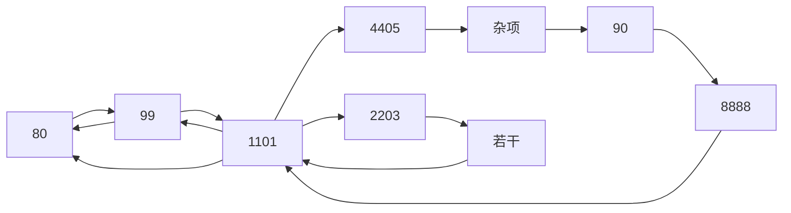

## Stream概述

先说说为啥要有这玩意

消息中间件不止有RabbitMQ一个，还有ActiveMQ、RocketMQ、Kafka等

实际开发中，有概率存在两种中间件，例如RabbitMQ和Kafka，众所周知，中间件想搞明白并不简单（Kafka也不是那么简单滴）但是又不能追求统一而始终使用相同的中间件，导致我们在技术切换、技术使用的过程中遇到了一堆麻烦

所以这时候 Spring Cloud Stream来了，它可以让我们不再关注具体MQ的细节，我们只需要用一种适配绑定的方式自动的给我们在各种的MQ内切换，就类似于JDbc的理念，我们只需要一个Spring Jdbc并配合上相关的数据库配置，即可使用，无须在意底层细节


它的作用就是屏蔽底层消息中间件的差异，降低切换成本，统一消息的编程模型

官网<https://spring.io/projects/spring-cloud-stream#overview>

它就是靠这个绑定器对象来屏蔽了底层的消息模型


截止至今，已经支持如下


### 为什么用Cloud Stream


这些中间件的差异性导致我们实际项目开发给我们造成了一定的困扰，如果用了两个消息队列的其中一种，后面的业务需求，我们想往另一种消息队列进行迁移，这时候无疑就是一个灾难性的，一大堆东西都需要推倒重新做，因为他跟我们的系统耦合了，这时候Spring Cloud Stream给我们提供了一种解耦合的方式

PS：Kafka是Java大数据用的（一般用来推送广告）

### Binder

主要就是两点

- input：消费者
- output：生产者

下面图右边写反了，右边的坐上是消费者，右上是生产者


然后这玩意遵循了消费者订阅模式，统一使用Topic主题进行广播


它的流程为


这三个东西简单来说就是：

- Binder：很方便的连接中间件，屏蔽差异
- Channel：通道，是队列queue的一种抽象，在消息通讯系统内就是实现存储和转发的媒介，通过Channel对队列进行配置
- Source和Sink：简单的可以理解为参照对象就是Spring Cloud Stream自身，从Stream发布消息就是输出，接收消息就是输入

### 编码和常见注解


## 简单使用

### 生产者构建

我们先准备三个模块

- cloud-stream-rabbitmq-provider-8801，作为生产者进行发消息模块
- cloud-stream-rabbitmq-consumer-8802，作为消息接收模块
- cloud-stream-rabbitmq-consumer-8803，作为消息接收模块

以及RabbitMQ

然后`cloud-stream-rabbitmq-provider-8801`为生产者，先配置

依赖如下：

主要是`spring-cloud-starter-stream-rabbit`，如果你用的是卡夫卡，则可以将rabbit换成kafka

```xml {3-6}
<dependencies>

    <dependency>
        <groupId>org.springframework.cloud</groupId>
        <artifactId>spring-cloud-starter-stream-rabbit</artifactId>
    </dependency>

    <dependency>
        <groupId>org.springframework.cloud</groupId>
        <artifactId>spring-cloud-starter-consul-discovery</artifactId>
    </dependency>

    <dependency>
        <groupId>org.springframework.boot</groupId>
        <artifactId>spring-boot-starter-web</artifactId>
    </dependency>

    <dependency>
        <groupId>org.springframework.boot</groupId>
        <artifactId>spring-boot-starter-actuator</artifactId>
    </dependency>

    <dependency>
        <groupId>org.projectlombok</groupId>
        <artifactId>lombok</artifactId>
    </dependency>

</dependencies>
```

接着写下配置文件

```yaml {24,26}
server:
  port: 8801
spring:
  application:
    name: provider
  cloud:
    # Consul相关配置
    consul:
      host: localhost
      port: 8500
      discovery:
        service-name: ${spring.application.name}
        instance-id: 服务提供者
    stream:
      # 配置要绑定的rabbitmq的服务信息
      binders:
        # 表示定义的名称，用于bindings整合
        defaultRabbit:
          # 消息组件类型
          type: rabbit
      # 服务的整合处理
      bindings:
        # 这个名字是一个通道的名称 指定是发送者还是接受者 这里output表示发送者
        output:
          # 表示要使用Exchange名称定义 也就是要使用的通道
          destination: studyExchange
          # 设置消息类型，如果需要设置纯文本类型，则：text/plain
          content-type: application/json
          # 设置要绑定的消息服务的具体配置 这里就是填写上面配置的，会爆红，但是不用管
          binder: defaultRabbit
  rabbitmq:
    port: 5672
    host: 你的服务器
    username: admin
    password: aaaabbbbcccceeeddfj1113433
```

接着我们准备main

```java
@SpringBootApplication
@EnableDiscoveryClient
public class StreamMq8801Application {

    public static void main(String[] args) {
        SpringApplication.run(StreamMq8801Application.class, args);
    }
}

```

然后准备一个service，用来发送消息

接口：

```java
public interface IMessageProvider {
    String send();
}
```

实现类

```java
package com.service.impl;

import com.service.IMessageProvider;
import lombok.extern.slf4j.Slf4j;
import org.springframework.cloud.stream.annotation.EnableBinding;
import org.springframework.cloud.stream.messaging.Source;
import org.springframework.messaging.MessageChannel;
import org.springframework.messaging.support.MessageBuilder;

import javax.annotation.Resource;
import java.util.UUID;

/**
 * 定义消息的推送管道（OutputStream） SOURCE表示发送消息
 */
@EnableBinding(Source.class)
@Slf4j
public class IMessageProviderImpl implements IMessageProvider {

    /**
     * 消息发送管道 注意 取名必须为output，MessageChannel有很多歌实例Bean
     */
    @Resource(name = "output")
    private MessageChannel output;

    @Override
    public String send() {
        String serial = UUID.randomUUID().toString();
        // 接着通过output来发送消息
        output.send(MessageBuilder.withPayload(serial).build());
        log.info("serial: {}", serial);
        return serial;
    }
}

```

接着，我们启动并尝试发送一条消息


显示发送成功，RabbitMQ内也有峰值和对应的队列


这个队列就是我们在配置文件中配置的队列

但是我们并没有配置消息接受者，所以queue中并没有任何内容，所以接下来要配置消费者

### 服务消费者

这里创建下8802/8803，配置和代码都是一样的

```xml {3-6}
<dependencies>

    <dependency>
        <groupId>org.springframework.cloud</groupId>
        <artifactId>spring-cloud-starter-stream-rabbit</artifactId>
    </dependency>

    <dependency>
        <groupId>org.springframework.cloud</groupId>
        <artifactId>spring-cloud-starter-consul-discovery</artifactId>
    </dependency>

    <dependency>
        <groupId>org.springframework.boot</groupId>
        <artifactId>spring-boot-starter-web</artifactId>
    </dependency>

    <dependency>
        <groupId>org.springframework.boot</groupId>
        <artifactId>spring-boot-starter-actuator</artifactId>
    </dependency>

    <dependency>
        <groupId>org.projectlombok</groupId>
        <artifactId>lombok</artifactId>
    </dependency>

</dependencies>
```

application

```yaml {24,26}
server:
  port: 8802
spring:
  application:
    name: consumer
  cloud:
    # Consul相关配置
    consul:
      host: localhost
      port: 8500
      discovery:
        service-name: ${spring.application.name}
        instance-id: 消费者
    stream:
      # 配置要绑定的rabbitmq的服务信息
      binders:
        # 表示定义的名称，用于bindings整合
        defaultRabbit:
          # 消息组件类型
          type: rabbit
      # 服务的整合处理
      bindings:
        # 这个名字是一个通道的名称  注意 这里使用的是input，表示接收消息
        input:
          # 表示要使用Exchange名称定义 也就是要使用的通道
          destination: studyExchange
          # 设置消息类型，如果需要设置纯文本类型，则：text/plain
          content-type: application/json
          # 设置要绑定的消息服务的具体配置  这里就是填写上面配置的，会爆红，但是不用管
          binder: defaultRabbit
  rabbitmq:
    port: 5672
    host: 你的服务器名称
    username: admin
    password: aaaabbbbcccceeeddfj1113433
```

接着，我们写下mian和一个监听的类

main

```java
@SpringBootApplication
@EnableDiscoveryClient
public class StreamMq8802Application {
    public static void main(String[] args) {
        SpringApplication.run(StreamMq8802Application.class, args);
    }
}
```

监听的类

```java
package com.Project.controller;

import org.springframework.beans.factory.annotation.Value;
import org.springframework.cloud.stream.annotation.EnableBinding;
import org.springframework.cloud.stream.annotation.StreamListener;
import org.springframework.cloud.stream.messaging.Sink;
import org.springframework.messaging.Message;
import org.springframework.stereotype.Component;

@Component
// Sink表示接收消息
@EnableBinding(Sink.class)
public class ReceiveMessageListenerController {

    @Value("${server.port}")
    private String serverPort;
    
	// 通过注解指定接收消息的方法
    @StreamListener(Sink.INPUT)
    public void input(Message<String> message) {
        System.out.println("消费者1号，接收到的消息：" + message.getPayload() + "\t" + serverPort);
    }
}
```

接着 先启动8801/8802看看


发送消息成功，看看消费者


也成功接收到了消息

再看看RabbitMQ


有一个自动生成的队列了

并且和交换机自动绑定上


接下来再开一个8803试试

发送


接收


貌似没问题

但其实是有问题的，我们上面就是重复消费


队列变成了两个，并且都是临时队列，消息不能持久化

### 防止重复消费和持久化


结论：不同的组是可以重复消费的，同一个组内会产生竞争关系，只有其中一个可以消费

这个我们之前在RabbitMQ的学习中也知道，解决方法无疑就**我们把所有的队列的名称都设置为同一样的**，这样可以防止重复消费


我们首先看看队列名


首先要确定的是我们的队列名，**实际开发过程中百分之八十是通过队列名来区分不同的事务的**

貌似不是我们定义的只有中间的anoymous 这也叫组名

所以我们自定义组就是通过他来下手的

只需要添加一个配置即可解决，在**消费者**端

```yaml {30}
server:
  port: 8803
spring:
  application:
    name: consumer
  cloud:
    # Consul相关配置
    consul:
      host: localhost
      port: 8500
      discovery:
        service-name: ${spring.application.name}
        instance-id: 消费者
    stream:
      # 配置要绑定的rabbitmq的服务信息
      binders:
        # 表示定义的名称，用于bindings整合
        defaultRabbit:
      # 服务的整合处理
      bindings:
        # 这个名字是一个通道的名称
        input:
          # 表示要使用Exchange名称定义 也就是要使用的通道
          destination: studyExchange
          # 设置消息类型，如果需要设置纯文本类型，则：text/plain
          content-type: application/json
          # 设置要绑定的消息服务的具体配置
          binder: defaultRabbit
          # 设置组名
          group: MyGroup1
  rabbitmq:
    port: 5672
    host: 你的服务器
    username: admin
    password: aaaabbbbcccceeeddfj1113433

```

另外一个8802同理

可以看到这样解决了持久化的问题


变成了D

当然**这样并不能解决重复消费的问题**，因为我们的发送者依旧是绑定了他们两个，只不过我们区分了他们的名字而已


所以说**我们只需要将他们两个的group属性改成一样**的`group: MyGroupConsumer`

就可以解决问题了


接下来发送


看看接收情况

8002没有


8003有


再次尝试发送几次之后，发现是轮循的，这个你可以自己测试

并且我们的队列是持久化的


要修改服务端或者消费端的相关属性，例如是否持久化或服务端指定队列发送等，可以参照[官方文档](https://docs.spring.io/spring-cloud-stream-binder-rabbit/docs/3.2.1/reference/html/spring-cloud-stream-binder-rabbit.html#_configuration_options)或者说去看看这个类BindingProperties


## Sleuth链路跟踪

> 在微服务框架中，一个由客户端发起的请求在后端系统中会经过多个不同的服务节点调用来协同产生最后的请求结果，每一个前端请求都会行程一个复杂的分布式服务调用链路，链路中的任何一环出现高延迟或错误都会引起整个请求最后的失败


是不是看起来很简单的一个链路，但如果多了呢？

例如：



或者说


所以Spring cloud也考虑到了这个问题


官方文档：<https://docs.spring.io/spring-cloud-sleuth/docs/current/reference/html/>


### 安装Zipkin

非常简单，先说下 Sleuth可以将链路放到Zipkin图形界面展示

所以我们需要先下载ZIPKIN

官网<https://zipkin.io/pages/quickstart>

Windows下载最新的jar包并运行即可

老版本<https://repo1.maven.org/maven2/io/zipkin/java/zipkin-server/>

新版本<https://repo1.maven.org/maven2/io/zipkin/zipkin-server/> 建议用新版本的

Linux：

```bash
# docker
docker run -d -p 9411:9411 openzipkin/zipkin

# 常规linux
curl -sSL https://zipkin.io/quickstart.sh | bash -s
java -jar zipkin.jar

# 傻子才会用的方法
git clone https://github.com/openzipkin/zipkin
cd zipkin
./mvnw -DskipTests --also-make -pl zipkin-server clean install
# Run the server
java -jar ./zipkin-server/target/zipkin-server-*exec.jar

```

这里我是windows 所以 下载最新的jar包 我目前是2.23.9


下载会比较慢，建议使用IDM开8+的线程或者挂梯子下载

看到有图标 只要有图标显示就算成功（PS：Windows Terminal优化可以看[这篇文章](https://blog.csdn.net/weixin_43232955/article/details/114751545)，要安装下PowerShellCore，然后安装下Oh-My-Posh即可 非常简单）


接下来我们访问<http://localhost:9411>

即可看到如下内容


它的链路是


一句话解释，就是一个请求，在每个地方所用时间，没了，，就这么简单

### 客户端的准备和配置

这里我是准备这样的，消费者80，然后一个服务端8001，然后平台是Consul（一键启动还是方便）

接下来开始配置

cloud-provicer-consul-payment-8001

```xml
<dependencies>
    <!--        包含了sleuth和Zipkin 这里版本用maven仓库上最新的即可
        https://mvnrepository.com/artifact/org.springframework.cloud/spring-cloud-starter-zipkin
        -->
    <dependency>
        <groupId>org.springframework.cloud</groupId>
        <artifactId>spring-cloud-starter-zipkin</artifactId>
        <version>2.2.8.RELEASE</version>
    </dependency>

    <!--        数据库的相关配置-->
    <dependency>
        <groupId>org.springframework.boot</groupId>
        <artifactId>spring-boot-starter-jdbc</artifactId>
    </dependency>
    
    <dependency>
        <groupId>com.alibaba</groupId>
        <artifactId>druid-spring-boot-starter</artifactId>

    </dependency>

    <dependency>
        <groupId>mysql</groupId>
        <artifactId>mysql-connector-java</artifactId>
    </dependency>

    <dependency>
        <groupId>com.baomidou</groupId>
        <artifactId>mybatis-plus-boot-starter</artifactId>
    </dependency>

    <dependency>
        <groupId>org.springframework.cloud</groupId>
        <artifactId>spring-cloud-starter-consul-discovery</artifactId>
    </dependency>

    <dependency>
        <groupId>org.springframework.boot</groupId>
        <artifactId>spring-boot-starter-web</artifactId>
    </dependency>
    <dependency>
        <groupId>org.springframework.boot</groupId>
        <artifactId>spring-boot-starter-actuator</artifactId>
    </dependency>
    <dependency>
        <groupId>org.projectlombok</groupId>
        <artifactId>lombok</artifactId>
    </dependency>
</dependencies>
```

接下来配置

```yaml {14-19}
server:
  port: 8001
spring:
  application:
    name: cloud-payment-service
  cloud:
    # Consul相关配置
    consul:
      host: localhost
      port: 8500
      discovery:
        service-name: ${spring.application.name}
        instance-id: 服务提供者
  zipkin:
    base-url: http://localhost:9411
  sleuth:
    sampler:
      # 采样值介于0~1之间，1表示全部采样，0表示不采样
      probability: 1
  datasource:
    type: com.alibaba.druid.pool.DruidDataSource
    driver-class-name: com.mysql.cj.jdbc.Driver
    url: jdbc:mysql://localhost:3306/cloud
    username: root
    password: 123456

```

接下来创建一个简单表

```sql
create table testPayment
(
    id       int auto_increment comment 'ID',
    name     varchar(255) default '' not null,
    password char(40)                not null,
    constraint testPayment_pk primary key (id)
);
```

然后其余的用mybatisx生成

启动类

```java
@SpringBootApplication
@EnableDiscoveryClient
@MapperScan("com.Project.mapper")
public class Application8001 {
    public static void main(String[] args) {
        SpringApplication.run(Application8001.class, args);
    }
}

```

controller

```java
@RestController
public class UserController {

    @Autowired
    TestpaymentService testpaymentService;

    @GetMapping("/create/{username}/{password}")
    public Testpayment create(@PathVariable("username") String username, @PathVariable("password") String password) {
        //        验证是用户名和密码是否不为空、
        if (username == null || username.equals("") || password == null || password.equals("")) {
            return null;
        }
        Testpayment testpayment = new Testpayment();
        testpayment.setName(username);
        testpayment.setPassword(password);
        boolean save = testpaymentService.save(testpayment);
        if (save) {
            return testpayment;
        }
        return null;
    }

}
```

接着80

```xml
<dependencies>
    <!--        包含了sleuth和Zipkin 这里版本用maven仓库上最新的即可
        https://mvnrepository.com/artifact/org.springframework.cloud/spring-cloud-starter-zipkin
        -->
    <dependency>
        <groupId>org.springframework.cloud</groupId>
        <artifactId>spring-cloud-starter-zipkin</artifactId>
        <version>2.2.8.RELEASE</version>
    </dependency>

    <dependency>
        <groupId>org.springframework.cloud</groupId>
        <artifactId>spring-cloud-starter-openfeign</artifactId>
    </dependency>

    <dependency>
        <groupId>org.springframework.cloud</groupId>
        <artifactId>spring-cloud-starter-consul-discovery</artifactId>
    </dependency>

    <dependency>
        <groupId>org.springframework.boot</groupId>
        <artifactId>spring-boot-starter-web</artifactId>
    </dependency>
    <dependency>
        <groupId>org.springframework.boot</groupId>
        <artifactId>spring-boot-starter-actuator</artifactId>
    </dependency>
    <dependency>
        <groupId>org.projectlombok</groupId>
        <artifactId>lombok</artifactId>
    </dependency>
</dependencies>
```

启动类

```java
@SpringBootApplication
@EnableDiscoveryClient
@EnableFeignClients
public class Consumer80Application {
    public static void main(String[] args) {
        SpringApplication.run(Consumer80Application.class, args);
    }
}

```

domain

```java
@Data
@AllArgsConstructor
@NoArgsConstructor
public class Testpayment {

    private Integer id;


    private String name;


    private String password;
}

```

service

```java
@Service
@FeignClient("cloud-payment-service")
public interface TestService {
    @GetMapping("/create/{username}/{password}")
    public Testpayment create(@PathVariable("username") String username, @PathVariable("password") String password);
}
```

controller

```java
@RestController
public class MyController {

    @Autowired
    TestService testService;

    @GetMapping("/create/{username}/{password}")
    public Testpayment create(@PathVariable("username") String username, @PathVariable("password") String password) {
        return testService.create(username, password);
    }

}
```

然后发送下请求


接着返回网页，点击


就能看到如上内容，点击show


就可以看到对应的信息

然后你点显示全部 还能看到更详细的


当然 你还可以指定其他的相关信息


例如这样


当然 这些之后应该都用不上了

